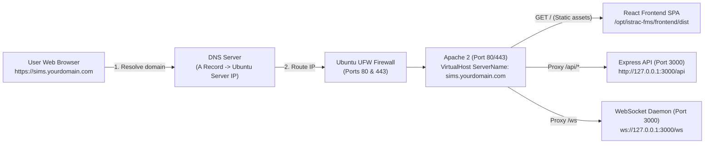

# 🛰️ ISTRAC-SIMS — Custom Domain & SSL Setup Guide for Ubuntu Server

This guide explains how to connect your **custom domain** (e.g. `sims.istrac.gov.in`, `fms.yourorganization.com`, or `portal.local`) to your ISTRAC-SIMS application running on **Ubuntu 24.04 LTS**.

---

## 1. How Domain Routing Works in This Stack



### Key Architectural Advantage:
* **Zero Frontend Rebuild Required**: The React Single Page Application is built using **relative paths** (`/api`) and dynamically detects `window.location.host` for WebSockets.
* When you attach a custom domain, **Apache reverse-proxies both the frontend and backend on the same domain and port (80 or 443)**, completely preventing CORS issues and browser cookie blocking!

---

## 2. Step 1: Route Your Domain via DNS

Before the server can receive traffic for your domain, the domain name must point to your Ubuntu server's IP address.

### Option A: Public Internet Domain (e.g. Cloudflare, GoDaddy, AWS Route 53, Namecheap)
In your DNS provider's control panel, add an **`A` Record**:
| Type | Name / Host | Value / Target | TTL |
| :--- | :--- | :--- | :--- |
| **`A`** | `@` (or `sims` for subdomain) | **Your Ubuntu Server Public IPv4** | 300 (or Auto) |
| **`CNAME`** | `www` (optional) | `sims.yourdomain.com` | Auto |

### Option B: Intranet / Private Network Domain (e.g. `sims.istrac.isro.gov.in`)
On your organization's internal DNS server (Active Directory DNS / BIND9 / dnsmasq):
* Add a forward lookup **`A` Record** pointing `sims.istrac.isro.gov.in` to the server's static LAN IP (e.g. `192.168.1.100` or `10.x.x.x`).

### Option C: Quick Local Testing (Client PC `/etc/hosts`)
To test before DNS propagation, edit the hosts file on your computer:
* **Windows**: `C:\Windows\System32\drivers\etc\hosts`
* **Linux/Mac**: `/etc/hosts`
Add the line:
```text
<UBUNTU_SERVER_IP>   sims.yourdomain.com
```

---

## 3. Step 2: Open Firewall Ports on Ubuntu

Ensure Ubuntu's UFW firewall allows standard web traffic:

```bash
sudo ufw allow 80/tcp    # HTTP
sudo ufw allow 443/tcp   # HTTPS (SSL)
sudo ufw reload
```

---

## 4. Step 3: Automated Domain Setup (1 Command)

We have created an automated utility that configures Apache, backend `.env`, CORS origins, and SSL automatically:

```bash
# Run with interactive wizard:
sudo bash /opt/istrac-fms/deploy/setup-domain.sh

# OR specify your domain directly:
# 1) HTTP only (Intranet / Offline):
sudo bash /opt/istrac-fms/deploy/setup-domain.sh sims.yourdomain.com none

# 2) Free automated Let's Encrypt HTTPS (Public domain with internet):
sudo bash /opt/istrac-fms/deploy/setup-domain.sh sims.yourdomain.com letsencrypt

# 3) HTTPS with 10-year Self-Signed Certificate (Intranet / Testing):
sudo bash /opt/istrac-fms/deploy/setup-domain.sh sims.yourdomain.com selfsigned
```

---

## 5. Manual Configuration (Step-by-Step Reference)

If you prefer to configure the domain manually, here is what is changed:

### 1. Update Apache VirtualHost on Ubuntu
Edit `/etc/apache2/sites-available/istrac-sims.conf`:

```apache
<VirtualHost *:80>
    ServerName sims.yourdomain.com
    ServerAlias www.sims.yourdomain.com
    ServerAdmin admin@yourdomain.com
    DocumentRoot "/opt/istrac-fms/frontend/dist"
    LimitRequestBody 104857600

    Header always set X-Frame-Options "SAMEORIGIN"
    Header always set X-Content-Type-Options "nosniff"
    Header always set X-XSS-Protection "1; mode=block"
    Header always set Referrer-Policy "strict-origin-when-cross-origin"

    ProxyPreserveHost On
    ProxyRequests Off
    ProxyTimeout 120
    RequestHeader set X-Forwarded-Proto "http"

    # WebSocket Proxy (/ws)
    RewriteEngine On
    RewriteCond %{HTTP:Upgrade} =websocket [NC]
    RewriteCond %{HTTP:Connection} upgrade [NC]
    RewriteRule ^/ws/(.*)           ws://127.0.0.1:3000/ws/$1 [P,L]
    RewriteRule ^/ws/?$             ws://127.0.0.1:3000/ws [P,L]

    # REST API Proxy (/api/*)
    ProxyPass        /api http://127.0.0.1:3000/api retry=0 timeout=120
    ProxyPassReverse /api http://127.0.0.1:3000/api

    # CMS Media Proxy (/media/*)
    ProxyPass        /media http://127.0.0.1:3000/media retry=0 timeout=60
    ProxyPassReverse /media http://127.0.0.1:3000/media

    # SPA Client Routing Fallback
    <Directory "/opt/istrac-fms/frontend/dist">
        Options Indexes FollowSymLinks
        AllowOverride All
        Require all granted
        RewriteEngine On
        RewriteBase /
        RewriteRule ^index\.html$ - [L]
        RewriteCond %{REQUEST_FILENAME} !-f
        RewriteCond %{REQUEST_FILENAME} !-d
        RewriteRule . /index.html [L]
    </Directory>

    ErrorLog /var/log/apache2/istrac-sims-error.log
    CustomLog /var/log/apache2/istrac-sims-access.log combined
</VirtualHost>
```

### 2. Update Backend Production `.env`
Edit `/opt/istrac-fms/backend/.env`:

```ini
APP_URL=http://sims.yourdomain.com
ALLOWED_ORIGINS=http://sims.yourdomain.com,https://sims.yourdomain.com,http://localhost,http://127.0.0.1
```

### 3. Test and Restart Services
```bash
# Test Apache configuration syntax:
sudo apache2ctl configtest

# Restart Apache and Backend:
sudo systemctl restart apache2
sudo systemctl restart istrac-backend
```

---

## 6. Setting Up HTTPS / SSL on Your Custom Domain

### Method A: Let's Encrypt (Free, Auto-Renewing SSL for Public Domains)
If your Ubuntu server is connected to the internet and your domain's DNS is pointing to the server:

```bash
# Install Certbot Apache plugin
sudo apt update
sudo apt install -y certbot python3-certbot-apache

# Request and apply certificate automatically
sudo certbot --apache -d sims.yourdomain.com

# Certbot automatically:
# 1. Obtains the SSL certificate.
# 2. Creates the Port 443 VirtualHost in Apache.
# 3. Enables HTTP -> HTTPS 301 redirection.
# 4. Sets up automatic background renewal via systemd timer.
```

### Method B: Organization / Enterprise CA Certificate (For Government / Air-Gapped Intranet)
If your organization provides official SSL certificates (`.crt` and `.key`):

1. Copy the certificates to the server:
   ```bash
   sudo cp your_domain.crt /etc/ssl/certs/istrac.crt
   sudo cp your_domain.key /etc/ssl/private/istrac.key
   sudo chmod 600 /etc/ssl/private/istrac.key
   ```
2. Enable SSL module:
   ```bash
   sudo a2enmod ssl
   ```
3. Add the `<VirtualHost *:443>` block to `/etc/apache2/sites-available/istrac-sims.conf`:
   ```apache
   <VirtualHost *:443>
       ServerName sims.yourdomain.com
       DocumentRoot "/opt/istrac-fms/frontend/dist"

       SSLEngine on
       SSLCertificateFile /etc/ssl/certs/istrac.crt
       SSLCertificateKeyFile /etc/ssl/private/istrac.key

       # Keep the same ProxyPass and Rewrite rules as the Port 80 block
   </VirtualHost>
   ```
4. Restart Apache:
   ```bash
   sudo systemctl restart apache2
   ```

---

## 7. Verification Checklist

* [ ] DNS lookup resolves to your server IP: `nslookup sims.yourdomain.com` or `ping sims.yourdomain.com`
* [ ] Apache syntax is valid: `sudo apache2ctl configtest` (Outputs: `Syntax OK`)
* [ ] Browser access: Open `http://sims.yourdomain.com` (or `https://...`)
* [ ] Health check response: `curl -i http://sims.yourdomain.com/api/health` returns HTTP 200 JSON
* [ ] WebSocket connection: Open developer tools (F12) -> Network -> WS. Verify connection to `ws://sims.yourdomain.com/ws` with HTTP 101 Switching Protocols.
