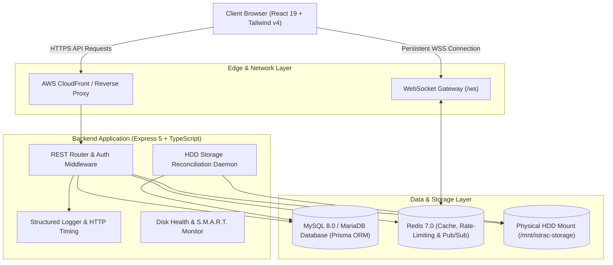

# 🛰️ ISTRAC-SIMS (ISRO Telemetry, Tracking and Command Network — Satellite Information Management System)

[](https://nodejs.org/)
[](https://react.dev/)
[](https://www.typescriptlang.org/)
[](https://www.prisma.io/)
[](https://tailwindcss.com/)
[](#)

> **ISTRAC-SIMS** is a secure, aerospace-grade file management and mission operations portal engineered specifically for telemetry ingestion, orbit dynamics ephemeris, payload commanding, and space situational awareness archives across global ISRO ground network stations (Bengaluru MOX, Sriharikota, Port Blair, Mauritius, Biak, and Byalalu Deep Space Network).

---

## 📑 Table of Contents

- [Key Architectural Highlights](#-key-architectural-highlights)
- [System Architecture](#-system-architecture)
- [Tech Stack](#-tech-stack)
- [Quick Start & Local Setup](#-quick-start--local-setup)
- [Default Seed Accounts](#-default-seed-accounts)
- [Operational Divisions & Facilities](#-operational-divisions--facilities)
- [REST API Reference & Endpoints](#-rest-api-reference--endpoints)
- [Environment Configuration](#-environment-configuration)
- [Deployment on AWS (EC2 + CloudFront + Amplify)](#-deployment-on-aws-ec2--cloudfront--amplify)
- [Documentation Index](#-documentation-index)

---

## 🚀 Key Architectural Highlights

1. **Air-Gapped Intranet Readiness:** Zero external CDN, Google Fonts, or internet analytics dependencies. All fonts, icons, maps, and visual assets are self-contained and run locally in isolated networks.
2. **Metadata-Only DB vs. Physical Storage Mount:** MySQL/MariaDB stores file metadata, SHA-256 hashes, and version chains, while raw telemetry streams and binary datasets are stored on a high-throughput physical storage volume (`env.HDD_MOUNT_PATH`).
3. **Strict 2-Tier Role Separation (RBAC):**
   - **`ADMIN`:** Full system control, file uploads, dataset deletions, CMS block editor, user access approvals, and system audit monitoring.
   - **`MEMBER`:** Read-only access to authorized departmental data, binary preview, dataset downloads, interactive passes calendar, and broadcast notifications.
4. **Public Access Gating:** Unauthenticated visitors can view public file metadata (satellite, size, checksum verification, format badges), but preview and download are strictly protected behind authentication modals and JWT security middleware.
5. **Interactive Mission Operations Calendar:** Dual-month interactive calendar displaying real-time passes, orbit burns, debris conjunction screening schedules, and downrange tracking readiness.
6. **High-Performance Structured Logging:** Color-coded console output with millisecond timestamps, request duration tracking, user correlation, and silenced raw query flooding.
7. **Real-Time WebSocket & Redis Pub/Sub:** Instant multi-operator file synchronization, broadcast notifications, and live CMS updates.
8. **Automated Storage Reconciliation (HDD Daemon):** Periodic background disk reconciliation reconciling physical disk files with database metadata records and tracking orphaned files.

---

## 🏛️ System Architecture



---

## 💻 Tech Stack

### Frontend
- **Framework:** React 19 + Vite 8 + TypeScript 5
- **Styling:** Tailwind CSS v4 + Dark Aerospace Mission Control Design System
- **State Management:** Zustand v5 (UI state) + TanStack Query v5 (Server data cache)
- **Icons:** Lucide React (bundled locally)
- **HTTP & Networking:** Axios (with automatic token rotation interceptors & chunked uploader)

### Backend
- **Runtime:** Node.js 20+ (ESM) + Express 5
- **Language:** TypeScript 5
- **ORM & Database:** Prisma 7 + MySQL 8.0 / MariaDB
- **Caching & Pub/Sub:** Redis 7.0 (`ioredis` tri-instance connection architecture)
- **Real-Time:** `ws` WebSocket Server with ping/pong heartbeats
- **Security:** Argon2/Bcrypt password hashing, short-lived JWTs (15m), HttpOnly refresh cookies (7d), and Redis token blacklist

---

## ⚡ Quick Start & Local Setup

### 1. Prerequisites
- **Node.js:** `>= 20.0.0`
- **Docker & Docker Compose** (for MySQL & Redis)
- **npm:** `>= 10.0.0`

### 2. Clone and Setup Environment
```bash
git clone https://github.com/Dev-ayansharma/istrac-fms.git
cd istrac-fms

# Copy environment template
cp .env.example .env
```

### 3. Start Database & Redis Infrastructure
```bash
docker compose up -d
```

### 4. Setup & Start Backend
```bash
cd backend
npm install

# Run database migrations & seed test data
npx prisma migrate deploy
npm run seed

# Start development server
npm run dev
```
*The backend starts at `http://localhost:3000` with structured logging.*

### 5. Setup & Start Frontend
```bash
cd ../frontend
npm install

# Start Vite development server
npm run dev
```
*The frontend is available at `http://localhost:5173`.*

---

## 👥 Default Seed Accounts

All seed accounts are initialized with the default password: **`ChangeMe123!`**

| Role | Name | Email | Clearance / Access Scope |
| :--- | :--- | :--- | :--- |
| **Super Admin** | Director MOX | `admin@istrac.local` | `ADMIN` — Full System Control & Division Access |
| **Dept Admin** | Dr. Vikram Sharma | `ttcadmin@istrac.local` | `ADMIN` — TTC Division Head & Ground Network Lead |
| **FDD Lead** | Dr. Ananya Ray | `fddlead@istrac.local` | `MEMBER` — Flight Dynamics & Trajectory Lead |
| **Operator** | Ayan Sharma | `operator@istrac.local` | `MEMBER` — MOX & TTC Console Operator |
| **NETRA Analyst**| Rohan Deshmukh | `netra@istrac.local` | `MEMBER` — Space Situational Awareness Lead |
| **Applicant** | Priya Nair | `applicant@istrac.local` | `PENDING` — Test User for Approval Queue |

---

## 🏢 Operational Divisions & Facilities

ISTRAC-SIMS models 5 core operational directorates with dedicated showcase pages, lead officers, and telemetry repositories:

1. **`/MOX` (Mission Operations Complex):** Central nerve center managing real-time spacecraft command uplink, continuous health telemetry monitoring, and multi-mission console coordination.
2. **`/FDD` (Flight Dynamics Division):** Precision trajectory design, halo/lunar orbit determination, stationkeeping maneuver planning, and attitude dynamics calculations.
3. **`/NETRA` (Network for Space Objects Tracking and Analysis):** Space Situational Awareness (SSA), low Earth orbit conjunction assessment, collision avoidance maneuver planning, and space debris tracking.
4. **`/TTC` (Telemetry, Tracking & Command Ground Stations):** Global ground antenna network providing high-rate S/X-Band telemetry downlinks, Doppler range measurements, and baseband signal demodulation.
5. **`/GSO` (Ground Support & Launch Vehicle Operations):** Downrange mobile and fixed station telemetry tracking for PSLV/GSLV launches, stage separation telemetry, and orbital injection verification.

---

## 📡 REST API Reference & Endpoints

### 🔐 Authentication & Session
- `POST /auth/login` — User authentication with rate limiting & JWT issuance
- `POST /auth/register` — Access request submission for new personnel
- `POST /auth/refresh` — Seamless token rotation using HttpOnly cookie
- `POST /auth/logout` — Instant session invalidation & Redis token blacklisting

### 🗃️ File & Telemetry Management
- `GET /files` — Filtered file search with pagination & metadata
- `GET /files/:fileId/stream` — Zero-copy kernel telemetry streaming (HTTP 206 Partial Content)
- `GET /files/:fileId/download` — Authenticated file download with SHA-256 verification
- `POST /files/upload` — Single-part file upload (`ADMIN` only)
- `POST /files/upload/chunk` — Sequential 10MB chunk uploader (`ADMIN` only)
- `POST /files/upload/complete` — Chunk reassembly & SHA-256 integrity verification (`ADMIN` only)

### 🗓️ Mission Events & Calendar
- `GET /events` — Public upcoming satellite passes & operational milestones
- `POST /admin/events` — Create scheduled pass or maneuver window (`ADMIN` only)
- `PUT /admin/events/:id` — Modify pass timing or status (`ADMIN` only)
- `DELETE /admin/events/:id` — Soft-delete scheduled event (`ADMIN` only)

### 📊 Member & Division Operations
- `GET /user/mission-overview` — Authenticated member overview KPI data & authorized divisions
- `GET /departments/public` — Public division list & operational descriptions
- `GET /departments/:deptId` — Division profile, officer in charge, and file catalog

---

## ☁️ Deployment on AWS (EC2 + CloudFront + Amplify)

### Backend (AWS EC2)
1. Launch an Amazon Linux 2023 / Ubuntu EC2 instance in the VPC.
2. Install Node.js 20, MariaDB/MySQL, and Redis.
3. Clone repository and configure `.env`:
   ```ini
   NODE_ENV=production
   PORT=3000
   ALLOWED_ORIGINS=https://*.amplifyapp.com,https://*.cloudfront.net,http://localhost:5173
   ```
4. Run migrations and start with PM2:
   ```bash
   npx prisma migrate deploy
   npm run build
   pm2 start dist/src/index.js --name istrac-backend
   ```

### CDN & API Gateway (AWS CloudFront)
- Set Origin to EC2 public DNS / IP on port 3000.
- In **Behavior Settings**, set **Origin Request Policy** to `Managed-AllViewerExceptHostHeader` to preserve `Origin` and `Authorization` headers for CORS.

### Frontend (AWS Amplify Hosting)
1. Connect Git repository to AWS Amplify.
2. Build command: `npm run build`, Output directory: `dist`.
3. In **App Settings** ➔ **Rewrites and redirects**, add SPA rewrite rule:
   ```
   Source: </^[^.]+$|\.(?!(css|gif|ico|jpg|js|png|txt|svg|woff|woff2|ttf|map|json|webp)$)([^.]+$)/>
   Target: /index.html
   Type: 200 (Rewrite)
   ```

---

## 🐧 Production Deployment on Red Hat Enterprise Linux (RHEL / Rocky / AlmaLinux)

For on-premise air-gapped ground station hosts or dedicated enterprise Linux servers, ISTRAC-SIMS provides a **1-click automated provisioning suite**:

```bash
# 1. Clone repository to /opt/istrac-fms
sudo git clone https://github.com/Dev-ayansharma/istrac-fms.git /opt/istrac-fms
cd /opt/istrac-fms

# 2. Make scripts executable and run automated setup
sudo chmod +x setup-rhel.sh manage-services-rhel.sh
sudo ./setup-rhel.sh
```

*The script automatically configures EPEL, Node.js 20, MariaDB 10.11, Redis 7, SELinux policies, Nginx reverse proxy with SPA fallback & WebSocket gateway, PM2 process management, and firewalld rules.*

### Daily Service Management
```bash
# Check status of all services
./manage-services-rhel.sh status

# Restart all services (Nginx, PM2, MariaDB, Redis)
./manage-services-rhel.sh restart

# Stream live backend API logs
./manage-services-rhel.sh logs

# Create instant compressed database backup
./manage-services-rhel.sh backup
```

---

## 📚 Documentation Index

For in-depth architectural, deployment, and configuration guides, refer to the [`documents/`](file:///D:/istrac-fms/documents) directory:

- 📄 [**Software Requirements Specification (IEEE 830 SRS)**](file:///D:/istrac-fms/documents/SOFTWARE_REQUIREMENTS_SPECIFICATION.md)
- 🌐 [**Air-Gapped Intranet Server Deployment & Operations Guide**](file:///D:/istrac-fms/documents/INTRANET_SERVER_SETUP_GUIDE.md)
- 🔑 [**Seeded Test Accounts & Credentials Reference**](file:///D:/istrac-fms/documents/TEST_CREDENTIALS_AND_ACCOUNTS.md)
- 🛡️ [**Backend Security Audit & Vulnerability Review**](file:///D:/istrac-fms/documents/BACKEND_SECURITY_AUDIT.md)
- 🛡️ [**Frontend Security Audit & Vulnerability Review**](file:///D:/istrac-fms/documents/FRONTEND_SECURITY_AUDIT.md)
- 📖 [**Backend Architecture & Technical Reference**](file:///D:/istrac-fms/documents/BACKEND_DOCUMENTATION.md)
- 🎨 [**Frontend Architecture & Technical Reference**](file:///D:/istrac-fms/documents/FRONTEND_DOCUMENTATION.md)
- 📐 [**Design System & UI Component Hierarchy**](file:///D:/istrac-fms/documents/DESIGN_SYSTEM.md)
- 🐧 [**Red Hat Enterprise Linux (RHEL) Production Deployment Guide**](file:///D:/istrac-fms/documents/RHEL_DEPLOYMENT_GUIDE.md)
- ⚙️ [**Backend Setup & Configuration Guide**](file:///D:/istrac-fms/documents/BACKEND_SETUP_AND_CONFIGURATION_GUIDE.md)
- ⚙️ [**Frontend Setup & Configuration Guide**](file:///D:/istrac-fms/documents/FRONTEND_SETUP_AND_CONFIGURATION_GUIDE.md)
- 💾 [**Storage Architecture & Edge Case Resilience Specification**](file:///D:/istrac-fms/documents/STORAGE_ARCHITECTURE_AND_EDGE_CASES.md)
- 📦 [**File Upload, Naming & Version Management Report**](file:///D:/istrac-fms/documents/FILE_UPLOAD_NAMING_AND_VERSIONING_REPORT.md)

---

## 🛡️ License

Proprietary — Designed for the **Indian Space Research Organisation (ISRO)** and **ISTRAC Ground Network**. All rights reserved.
