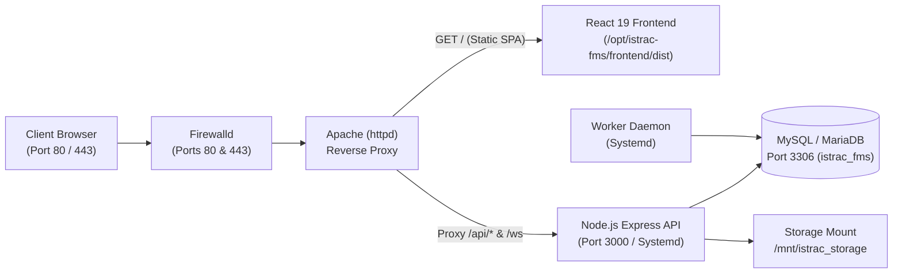

# 🛰️ ISTRAC-SIMS — Quick Start & Deployment Guide

Welcome to the **Satellite Information Management System (ISTRAC-SIMS)**.
This guide gives you the fastest path to start and run the system on **Local Windows** or deploy it to an **Air-Gapped Intranet RHEL Server via Pen Drive**.

---

## ⚡ Quick Navigation
- [Option 1: Running Locally on Windows (No Docker)](#option-1-running-locally-on-windows-no-docker)
- [Option 2: Deploying to Air-Gapped RHEL via Pen Drive (3 Steps)](#option-2-deploying-to-air-gapped-rhel-via-pen-drive-3-steps)
- [Service Management on RHEL (1 Command)](#service-management-on-rhel-1-command)
- [Administrator Credentials & Password Reset](#administrator-credentials--password-reset)
- [System Architecture & Port Reference](#system-architecture--port-reference)

---

## Option 1: Running Locally on Windows (No Docker)

You can launch the entire stack with a single click:

### A. Development Mode (Hot-Reloading)
Double-click:
```cmd
start-local.bat
```
*Automatically opens 3 separate console windows:*
* **Backend REST API**: `http://localhost:3000`
* **Worker Daemon**: Event scheduler & telemetry sync
* **Frontend Web UI**: `http://localhost:5173`

### B. Production Mode (Pre-Compiled)
Double-click:
```cmd
start-local-prod.bat
```
*Runs the compiled JavaScript binaries (`backend/dist`) and Vite production preview on `http://localhost:4173`.*

---

## Option 2: Deploying to Air-Gapped RHEL via Pen Drive (3 Steps)

For an intranet Red Hat Enterprise Linux (RHEL 8 / 9, Rocky, or AlmaLinux) server that has **Apache (`httpd`) and MySQL installed**:

### Step 1: Copy Bundle to Your Pen Drive
Copy this single file from your Windows PC to your USB pen drive:
```
D:\istrac-fms\dist-offline\istrac-fms-offline-bundle-20260915.zip
```
*(File size: ~138.7 MB. Contains all frontend/backend binaries, Node.js 20 Linux binary, offline Prisma migrations, and production node_modules).*

---

### Step 2: Extract on the RHEL Server
Plug your pen drive into the RHEL server and extract the bundle into `/opt/istrac-fms`:

```bash
# Create directory and extract
sudo mkdir -p /opt/istrac-fms
sudo unzip /path/to/pendrive/istrac-fms-offline-bundle-20260915.zip -d /opt/istrac-fms
cd /opt/istrac-fms
```

---

### Step 3: Run the Master Setup Script
Run the automated one-command setup:

```bash
sudo bash setup-rhel-offline.sh
```

#### What the Script Completes Automatically (< 60 seconds):
1. **Node.js**: Detects if Node.js is installed. If missing, auto-extracts the pre-bundled `rpms/node-v20.18.0-linux-x64.tar.xz` into `/usr/local/bin` in 3 seconds.
2. **Database**: Connects to your existing local MySQL on port 3306, creates database `istrac_fms` and user `istrac_user`.
3. **Prisma Migrations**: Applies all database schema tables offline with zero internet downloads.
4. **Seeds Admin**: Provisions the sole Super Administrator account (`admin@istrac.local`).
5. **Systemd Daemons**: Installs, enables, and starts:
   - `istrac-backend.service` (Express API on port 3000)
   - `istrac-worker.service` (Mission scheduler)
6. **Apache (`httpd`)**: Installs VirtualHost (`/etc/httpd/conf.d/istrac-sims.conf`), configures SELinux booleans, opens firewall ports (80 / 443), and restarts Apache.
7. **Health Verification**: Runs internal curl probe and prints the live status banner!

---

## Service Management on RHEL (1 Command)

Use the built-in management utility in `/opt/istrac-fms` to control all services together:

```bash
# Check status of Apache, Backend API, Worker Daemon, MySQL, and Storage
sudo /opt/istrac-fms/manage-services-rhel.sh status

# Restart all services in correct dependency order
sudo /opt/istrac-fms/manage-services-rhel.sh restart

# Start all services
sudo /opt/istrac-fms/manage-services-rhel.sh start

# Stop all services
sudo /opt/istrac-fms/manage-services-rhel.sh stop

# Create a compressed gzip backup of the MariaDB/MySQL database
sudo /opt/istrac-fms/manage-services-rhel.sh backup
```

### Viewing Live Logs:
* **Backend API Logs**:
  ```bash
  journalctl -u istrac-backend -f
  ```
* **Worker Daemon Logs**:
  ```bash
  journalctl -u istrac-worker -f
  ```
* **Apache Access & Error Logs**:
  ```bash
  tail -f /var/log/httpd/istrac-sims-error.log
  tail -f /var/log/httpd/istrac-sims-access.log
  ```

---

## Administrator Credentials & Password Reset

### Default Login
Open `http://<SERVER_IP>/` in any intranet browser:
* **Username / Email**: `admin@istrac.local`
* **Default Password**: `ChangeMe123!`
* **Role**: `ADMIN` (Sole System Administrator)

> [!IMPORTANT]
> **Single Administrator Architecture**:
> Only one system administrator exists. All operators and division personnel register through the `/register` web form and are approved in the Admin Console (`/admin/approvals`).

---

### Terminal Password Reset (Air-Gapped Direct Recovery)
Because the server operates without outbound email/SMTP, the administrator can reset credentials directly from the RHEL server terminal:

```bash
cd /opt/istrac-fms/backend
node dist/scripts/reset-admin-password.js "YourNewSecurePassword123!"
```
*This command validates password complexity, updates MariaDB with a 12-round bcrypt hash, terminates all active sessions, writes an audit log, and enforces the single-admin constraint.*

---

## System Architecture & Port Reference



| Component | Port | Managed By | Purpose |
| :--- | :---: | :--- | :--- |
| **Apache HTTP Server** | `80`, `443` | `httpd.service` | Reverse proxy, SSL, and React SPA file server |
| **Backend API Server** | `3000` | `istrac-backend.service` | REST endpoints, authentication, WebSockets |
| **Mission Event Worker** | Internal | `istrac-worker.service` | Pass tracking, telemetry reconciliation |
| **MySQL / MariaDB** | `3306` | `mariadb.service` / `mysqld` | Relational file metadata, users, audit logs |
| **Physical Storage** | Mount | `/mnt/istrac_storage` | Raw telemetry payloads, binary files, archives |

---

## Additional Documentation Links
* [**`OFFLINE_RHEL_SETUP_GUIDE.md`**](file:///D:/istrac-fms/OFFLINE_RHEL_SETUP_GUIDE.md): Exhaustive 400-line reference for custom RHEL configurations and ISO mounts.
* [**`CREDENTIALS.md`**](file:///D:/istrac-fms/CREDENTIALS.md): Detailed credential policies, RBAC roles, and OTP dispatch workflows.
* [**`Readme.md`**](file:///D:/istrac-fms/Readme.md): Project overview, division details (`/MOX`, `/FDD`, `/NETRA`, `/TTC`, `/GSO`), and REST API endpoints.
