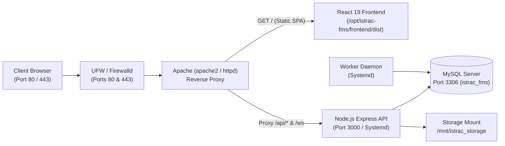

# 🛰️ ISTRAC-SIMS — Quick Start & Deployment Guide

Welcome to the **Satellite Information Management System (ISTRAC-SIMS)**.
This guide gives you the fastest path to start and run the system on **Local Windows**, deploy to an **Air-Gapped Intranet Ubuntu 24.04 / RHEL Server via Pen Drive**, and **attach your custom domain**.

---

## ⚡ Quick Navigation
- [Option 1: Running Locally on Windows (No Docker)](#option-1-running-locally-on-windows-no-docker)
- [Option 2: Deploying to Air-Gapped Ubuntu 24.04 LTS or RHEL via Pen Drive (3 Steps)](#option-2-deploying-to-air-gapped-ubuntu-2404-lts-or-rhel-via-pen-drive-3-steps)
- [Option 3: Attaching a Custom Domain & SSL (1 Command)](#option-3-attaching-a-custom-domain--ssl-1-command)
- [Service Management (Ubuntu & RHEL)](#service-management-ubuntu--rhel)
- [Administrator Credentials & Password Reset](#administrator-credentials--password-reset)
- [System Architecture & Port Reference](#system-architecture--port-reference)

---

## Option 1: Running Locally on Windows (No Docker)

You can launch the entire stack with a single click:

### A. Development Mode (Hot-Reloading)
Double-click:
```cmd
start-local.bat
```
*Automatically opens 3 separate console windows:*
* **Backend REST API**: `http://localhost:3000`
* **Worker Daemon**: Event scheduler & telemetry sync
* **Frontend Web UI**: `http://localhost:5173`

### B. Production Mode (Pre-Compiled)
Double-click:
```cmd
start-local-prod.bat
```
*Runs the compiled JavaScript binaries (`backend/dist`) and Vite production preview on `http://localhost:4173`.*

---

## Option 2: Deploying to Air-Gapped Ubuntu 24.04 LTS or RHEL via Pen Drive (3 Steps)

Tested and verified on **Ubuntu 24.04.1 LTS (`SIMS-SRV`)** with **MySQL 8.0** and **Apache 2.4**, as well as **RHEL 8 / 9**.

### Step 1: Copy Bundle to Your Pen Drive
Copy the offline deployment archive from your Windows PC to your USB pen drive:
```
D:\istrac-fms\dist-offline\istrac-fms-offline-bundle-*.zip
```
*(Contains all frontend/backend binaries, Node.js 24 Linux x64 binary, offline database migrations, and production node_modules).*

---

### Step 2: Extract on the Server
Plug your pen drive into the server and extract the bundle into `/opt/istrac-fms`:

```bash
# Create target directory and extract
sudo mkdir -p /opt/istrac-fms
sudo unzip /path/to/pendrive/istrac-fms-offline-bundle-*.zip -d /opt/istrac-fms
cd /opt/istrac-fms
```

---

### Step 3: Run the Universal Setup Script
Run the automated one-command setup:

```bash
sudo bash setup-offline.sh
```
*(Or `sudo bash setup-rhel-offline.sh`)*

#### What the Script Completes Automatically (< 60 seconds):
1. **OS Detection**: Auto-detects whether the host is **Ubuntu/Debian** (`apache2`, `mysql.service`, `ufw`) or **RHEL/Rocky** (`httpd`, `mariadb.service`, `firewalld`).
2. **Node.js**: Detects if Node.js is present; if missing, auto-extracts the pre-bundled `rpms/node-v24.*-linux-x64.tar.xz` into `/usr/local/bin` in 3 seconds.
3. **Database**: Connects to your existing local MySQL on port 3306, prompts for the root password, creates database `istrac_fms`, and grants full privileges to `istrac_user`.
4. **Prisma Migrations & Schema**: Applies all database schema tables offline with zero internet downloads (with fallback to `backup_before_v1.sql`).
5. **Seeds Admin**: Provisions the sole Super Administrator account (`admin@istrac.local`).
6. **Systemd Daemons**: Installs, enables, and starts:
   - `istrac-backend.service` (Express API on port 3000)
   - `istrac-worker.service` (Mission scheduler & sync)
7. **Apache Web Server**: Installs VirtualHost (`/etc/apache2/sites-available/istrac-sims.conf` on Ubuntu or `/etc/httpd/conf.d/` on RHEL), activates proxy modules (`proxy`, `proxy_http`, `proxy_wstunnel`, `rewrite`, `headers`), and restarts Apache.
8. **Health Verification**: Runs internal curl probe and prints the live status banner!

---

## Option 3: Attaching a Custom Domain & SSL (1 Command)

The frontend is built with **relative API routing (`/api`)** and dynamic host inspection (`window.location.host`), so **zero frontend rebuilds are needed** to attach any domain!

Run the automated domain setup utility:

```bash
# 1) Intranet / HTTP Only:
sudo bash /opt/istrac-fms/deploy/setup-domain.sh yourdomain.com none

# 2) Public Domain with Free Automated Let's Encrypt HTTPS:
sudo bash /opt/istrac-fms/deploy/setup-domain.sh yourdomain.com letsencrypt

# 3) Intranet HTTPS with 10-Year Self-Signed Certificate:
sudo bash /opt/istrac-fms/deploy/setup-domain.sh yourdomain.com selfsigned
```

*This automatically updates `ServerName` in Apache, sets `ALLOWED_ORIGINS` & `APP_URL` in `/opt/istrac-fms/backend/.env`, and restarts all services.*

> [!TIP]
> Make sure your DNS server (or client `/etc/hosts` file) has an **A Record** pointing `yourdomain.com` to your Ubuntu server IP!

---

## Service Management (Ubuntu & RHEL)

Use the built-in management utility in `/opt/istrac-fms` to control all services together:

```bash
# Check status of Apache, Backend API, Worker Daemon, MySQL, and Storage
sudo /opt/istrac-fms/manage-services-rhel.sh status

# Restart all services in correct dependency order
sudo /opt/istrac-fms/manage-services-rhel.sh restart

# Start all services
sudo /opt/istrac-fms/manage-services-rhel.sh start

# Stop all services
sudo /opt/istrac-fms/manage-services-rhel.sh stop

# Create a compressed gzip backup of the MySQL database
sudo /opt/istrac-fms/manage-services-rhel.sh backup
```

### Viewing Live Logs:
* **Backend API Logs**:
  ```bash
  sudo journalctl -u istrac-backend -f
  ```
* **Worker Daemon Logs**:
  ```bash
  sudo journalctl -u istrac-worker -f
  ```
* **Apache Access & Error Logs**:
  * On Ubuntu:
    ```bash
    tail -f /var/log/apache2/istrac-sims-error.log
    tail -f /var/log/apache2/istrac-sims-access.log
    ```
  * On RHEL:
    ```bash
    tail -f /var/log/httpd/istrac-sims-error.log
    tail -f /var/log/httpd/istrac-sims-access.log
    ```

---

## 🛡️ Firewall Configuration (UFW on Ubuntu)

If you enable Ubuntu's UFW firewall, make sure to allow SSH, HTTP, and HTTPS:

```bash
sudo ufw allow 22/tcp    # SSH (Important: allow first before enabling)
sudo ufw allow 80/tcp    # HTTP
sudo ufw allow 443/tcp   # HTTPS
sudo ufw reload
```

---

## Administrator Credentials & Password Reset

### Default Login
Open `http://<SERVER_IP>/` or `http://yourdomain.com/`:
* **Username / Email**: `admin@istrac.local`
* **Default Password**: `ChangeMe123!`
* **Role**: `ADMIN` (Sole System Administrator)

> [!IMPORTANT]
> **Single Administrator Architecture**:
> Only one system administrator exists. All operators and division personnel register through the `/register` web form and are approved in the Admin Console (`/admin/approvals`).

---

### Terminal Password Reset (Air-Gapped Direct Recovery)
Because the server operates without outbound email/SMTP, the administrator can reset credentials directly from the server terminal:

```bash
cd /opt/istrac-fms/backend
node dist/scripts/reset-admin-password.js "YourNewSecurePassword123!"
```
*This command validates password complexity, updates MySQL with a 12-round bcrypt hash, terminates all active sessions, writes an audit log, and enforces the single-admin constraint.*

---

## System Architecture & Port Reference



| Component | Port | Managed By | Purpose |
| :--- | :---: | :--- | :--- |
| **Apache HTTP Server** | `80`, `443` | `apache2.service` (Ubuntu) / `httpd.service` (RHEL) | Reverse proxy, SSL, and React SPA file server |
| **Backend API Server** | `3000` | `istrac-backend.service` | REST endpoints, authentication, WebSockets |
| **Mission Event Worker** | Internal | `istrac-worker.service` | Pass tracking, telemetry reconciliation |
| **MySQL Server** | `3306` | `mysql.service` / `mariadb.service` | Relational file metadata, users, audit logs |
| **Physical Storage** | Mount | `/mnt/istrac_storage` | Raw telemetry payloads, binary files, archives |

---

## Additional Documentation Links
* [**`UBUNTU_24_OFFLINE_SETUP_GUIDE.md`**](file:///D:/istrac-fms/UBUNTU_24_OFFLINE_SETUP_GUIDE.md): Complete setup and verification guide for Ubuntu 24.04 LTS (`SIMS-SRV`).
* [**`CUSTOM_DOMAIN_SETUP_GUIDE.md`**](file:///D:/istrac-fms/CUSTOM_DOMAIN_SETUP_GUIDE.md): DNS routing, reverse proxy VirtualHost, and SSL certificate setup.
* [**`OFFLINE_RHEL_SETUP_GUIDE.md`**](file:///D:/istrac-fms/OFFLINE_RHEL_SETUP_GUIDE.md): Reference for custom RHEL configurations and ISO mounts.
* [**`CREDENTIALS.md`**](file:///D:/istrac-fms/CREDENTIALS.md): Detailed credential policies, RBAC roles, and OTP dispatch workflows.
* [**`Readme.md`**](file:///D:/istrac-fms/Readme.md): Project overview, division details (`/MOX`, `/FDD`, `/NETRA`, `/TTC`, `/GSO`), and REST API endpoints.
