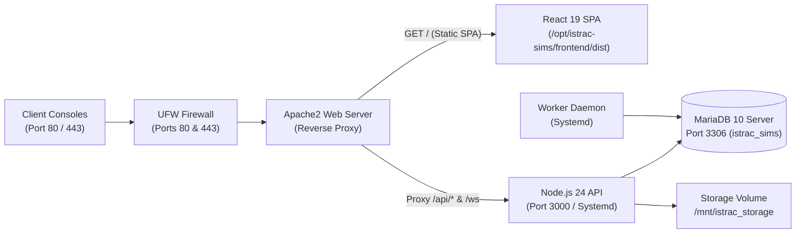

# 🛰️ ISTRAC-SIMS — Ubuntu Linux Deployment & Operations Guide
## Indian Space Research Organisation — ISTRAC Satellite Information Management System

> **Target OS:** Ubuntu Linux 22.04 LTS & 24.04 LTS Server / Desktop (x86_64)  
> **Environment:** Air-Gapped Intranet Server / Zero Public Internet  
> **Classification:** Restricted — ISRO Internal Ground Network  
> **Version:** 2.0.0 Production Baseline  

---

## 📑 Table of Contents

1. [System Architecture on Ubuntu](#1-system-architecture-on-ubuntu)
2. [Hardware Prerequisites & Network Ports](#2-hardware-prerequisites--network-ports)
3. [Air-Gapped Pen Drive Deployment (3 Steps)](#3-air-gapped-pen-drive-deployment-3-steps)
4. [Service Management CLI (`manage-services-ubuntu.sh`)](#4-service-management-cli-manage-services-ubuntush)
5. [Attaching an Intranet Custom Domain & SSL](#5-attaching-an-intranet-custom-domain--ssl)
6. [Database Backup & Recovery Runbook](#6-database-backup--recovery-runbook)
7. [Administrator Credentials & Password Recovery](#7-administrator-credentials--password-recovery)
8. [Ubuntu Security & Firewall Hardening (UFW)](#8-ubuntu-security--firewall-hardening-ufw)

---

## 1. System Architecture on Ubuntu

All application components run natively on the Ubuntu host:


```mermaid
flowchart LR
    Browser["Client Consoles\n(Port 80 / 443)"] --> Firewall["UFW Firewall\n(Ports 80 & 443)"]
    Firewall --> Apache["Apache2 Web Server\n(Reverse Proxy)"]
    Apache -->|"GET / (Static SPA)"| Frontend["React 19 SPA\n(/opt/istrac-sims/frontend/dist)"]
    Apache -->|"Proxy /api/* & /ws"| Backend["Node.js 24 API\n(Port 3000 / Systemd)"]
    Backend --> DB[("MariaDB 10 Server\nPort 3306 (istrac_sims)")]
    Backend --> Storage["Storage Volume\n/mnt/istrac_storage"]
    Worker["Worker Daemon\n(Systemd)"] --> DB
```

### Network Port Allocation:
| Port | Protocol | Binding | Service | Scope |
|:---|:---|:---|:---|:---|
| **80** | TCP | `0.0.0.0` | Apache2 HTTP | Ground Station Subnet |
| **443** | TCP | `0.0.0.0` | Apache2 HTTPS | Ground Station Subnet |
| **3000** | TCP | `127.0.0.1` | Node.js Backend API | Localhost Only (Internal Proxy) |
| **3306** | TCP | `127.0.0.1` | MariaDB Database | Localhost Only |
| **6379** | TCP | `127.0.0.1` | Redis Cache (Optional) | Localhost Only |

---

## 2. Hardware Prerequisites & Network Ports

| Parameter | Minimum Specification | Recommended (Mission Production) |
|:---|:---|:---|
| **Operating System** | Ubuntu 22.04 LTS | Ubuntu 24.04 LTS Server (`x86_64`) |
| **Processor (CPU)** | 4 Cores | 8 to 16 Cores (Intel Xeon / AMD EPYC) |
| **System RAM** | 8 GB | 16 GB to 32 GB ECC DDR4/DDR5 |
| **System Drive (OS)** | 60 GB SSD | 120 GB NVMe / SAS SSD |
| **Telemetry Volume** | 100 GB (`/mnt/istrac_storage`) | 2 TB to 20 TB RAID-6 / Enterprise SAN |
| **Network Interface** | 1 Gbps Virtual / Physical NIC | Dual 10 Gbps Bonded NICs (LACP) |

---

## 3. Air-Gapped Pen Drive Deployment (3 Steps)

### Step 1: Copy Bundle from USB to `/opt/istrac-sims`
```bash
sudo mkdir -p /opt/istrac-sims
sudo cp -r /path/to/usb/bundle/* /opt/istrac-sims/
cd /opt/istrac-sims
```

---

### Step 2: Run the Automated Setup Script
```bash
chmod +x install.sh deploy/setup-ubuntu.sh manage-services-ubuntu.sh
sudo ./install.sh
```

#### What the Script Completes Automatically:
1. **System User**: Creates dedicated non-login system account `istrac`.
2. **Storage Path**: Creates `/mnt/istrac_storage` owned by `istrac:istrac` (`chmod 770`).
3. **Node.js 24**: Extracts standalone Node 24 runtime to `/opt/node` and links to `/usr/bin/node`.
4. **MariaDB**: Starts service, creates database `istrac_sims`, and grants permissions to `istrac_user`.
5. **Prisma Migrations**: Deploys all 5 versioned SQL migrations completely offline.
6. **Admin Provisioning**: Creates the sole Super Administrator (`admin@istrac.local`).
7. **Systemd Services**: Installs and starts `istrac-backend.service` and `istrac-worker.service`.
8. **Apache2 VirtualHost**: Enables `proxy`, `proxy_http`, `proxy_wstunnel`, `rewrite`, `headers` modules, and activates `/etc/apache2/sites-available/istrac-sims.conf`.
9. **UFW Rules**: Opens ports 80 and 443 in the firewall.
10. **Liveness Verification**: Probes `http://127.0.0.1:3000/api/health` and displays the status banner.

---

### Step 3: Open in Browser
Navigate to:
```
http://<UBUNTU_SERVER_IP>/   or   http://localhost/
```

---

## 4. Service Management & Server Control (`manage-services-ubuntu.sh`)

### Automated Control via Management CLI:
```bash
# Check live health status across all daemons, ports, and disk mount
sudo /opt/istrac-sims/manage-services-ubuntu.sh status

# Start whole server stack in dependency order (MySQL -> Backend -> Worker -> Apache)
sudo /opt/istrac-sims/manage-services-ubuntu.sh start

# Stop application processes (Apache, Worker, Backend)
sudo /opt/istrac-sims/manage-services-ubuntu.sh stop

# Stop the WHOLE server stack completely (including MySQL & Redis)
sudo /opt/istrac-sims/manage-services-ubuntu.sh stop-all

# Restart all services cleanly
sudo /opt/istrac-sims/manage-services-ubuntu.sh restart

# Stream live backend API logs in real-time
sudo /opt/istrac-sims/manage-services-ubuntu.sh logs

# Take a timestamped database SQL backup
sudo /opt/istrac-sims/manage-services-ubuntu.sh backup
```

### Manual Control via Native Ubuntu Systemd:
```bash
# Stop Whole Server Stack Cleanly:
sudo systemctl stop apache2 istrac-worker istrac-backend mysql redis-server 2>/dev/null || true

# Start Whole Server Stack in Dependency Order:
sudo systemctl start mysql
sudo systemctl start redis-server 2>/dev/null || true
sudo systemctl start istrac-backend
sudo systemctl start istrac-worker
sudo systemctl start apache2

# Enable / Disable Auto-Start on System Boot:
sudo systemctl enable mysql apache2 istrac-backend istrac-worker
sudo systemctl disable istrac-backend istrac-worker apache2
```

---

## 5. Attaching an Intranet Custom Domain & SSL

The application utilizes relative `/api` paths and dynamic hostname resolution, allowing any domain to be attached with zero code rebuilds:

```bash
# 1) Intranet / HTTP Only:
sudo bash /opt/istrac-sims/deploy/setup-domain.sh sims.istrac.gov.in none

# 2) Public Domain with Automated Let's Encrypt HTTPS:
sudo bash /opt/istrac-sims/deploy/setup-domain.sh sims.istrac.gov.in letsencrypt

# 3) Intranet HTTPS with 10-Year Self-Signed Certificate:
sudo bash /opt/istrac-sims/deploy/setup-domain.sh sims.istrac.gov.in selfsigned
```

---

## 6. Database Backup & Recovery Runbook

### Creating a Manual Backup:
```bash
sudo mkdir -p /var/backups/istrac-sims
mysqldump -u istrac_user -p"IstracSecurePass123!" istrac_sims > \
  /var/backups/istrac-sims/istrac_sims_backup_$(date +%Y%m%d_%H%M%S).sql
```

### Restoring from Backup:
```bash
# 1. Stop application daemons
sudo systemctl stop istrac-backend istrac-worker

# 2. Import SQL dump
mysql -u istrac_user -p"IstracSecurePass123!" istrac_sims < /path/to/backup.sql

# 3. Restart daemons
sudo systemctl start istrac-backend istrac-worker
```

---

## 7. Administrator Credentials & Password Recovery

### Default Administrator Login:
* **Email:** `admin@istrac.local`
* **Password:** `ChangeMe123!`
* **Role:** `ADMIN` (Sole System Administrator)

### Offline Terminal Password Reset:
From the Ubuntu terminal:
```bash
cd /opt/istrac-sims/backend
npm run admin:reset-password -- "YourNewSecurePassword123!"
```
*Alternatively, request a reset on `/forgot-password` and retrieve the 6-digit OTP from `sudo journalctl -u istrac-backend -n 20`.*

---

## 8. Ubuntu Security & Firewall Hardening (UFW)

```bash
# Ensure SSH remains accessible
sudo ufw allow 22/tcp

# Allow intranet web traffic
sudo ufw allow 80/tcp
sudo ufw allow 443/tcp

# Enable firewall
sudo ufw enable
```

---

## 9. Troubleshooting & Diagnostic Runbook

### Backend API Stopped / Health Probe Failed:
If `./manage-services-ubuntu.sh status` reports `Backend API (Systemd): STOPPED`:

```bash
# 1. Inspect exit status and error codes
sudo systemctl status istrac-backend

# 2. View recent backend logs
sudo journalctl -u istrac-backend -n 30 --no-pager
# or live stream:
sudo ./manage-services-ubuntu.sh logs

# 3. Start or restart service
sudo ./manage-services-ubuntu.sh start
# or:
sudo systemctl restart istrac-backend istrac-worker

# 4. Direct console execution (see immediate stack trace)
cd /opt/istrac-sims/backend
sudo -u istrac /usr/bin/node dist/src/index.js
```

### Database Service Name Resolution:
If running Oracle MySQL (`mysql.service`):
```bash
sudo systemctl status mysql
sudo systemctl enable --now mysql
```
Test credentials:
```bash
mysql -u istrac_user -pIstracSecurePass123! -h 127.0.0.1 -D istrac_sims -e "SELECT 1;"
```

### Apache 403 Forbidden:
Ensure the web server user (`www-data`) has read permissions:
```bash
sudo chmod 755 /opt /opt/istrac-sims /opt/istrac-sims/frontend
sudo chmod -R 755 /opt/istrac-sims/frontend/dist
sudo usermod -a -G istrac www-data
sudo systemctl restart apache2
```
