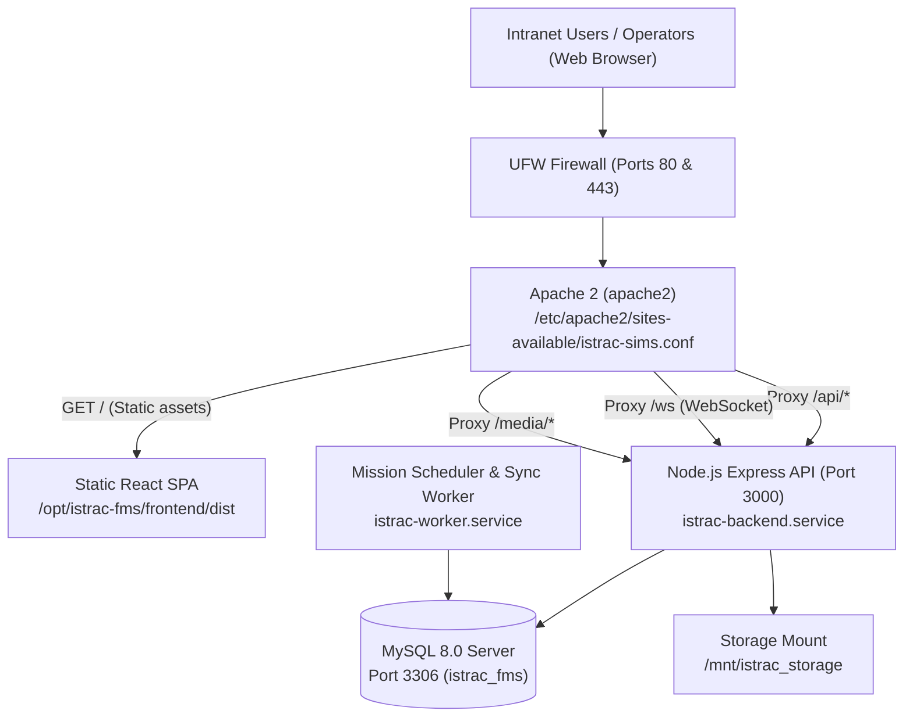

# 🛰️ ISTRAC-SIMS — Ubuntu 24.04 LTS (Noble) Air-Gapped Setup Guide

This guide details the deployment of the **Satellite Information Management System (ISTRAC-SIMS)** on an **offline intranet server running Ubuntu 24.04 LTS (Noble Numbat)**.

---

## 1. Verified Architecture on Your Server (`SIMS-SRV`)

Based on your terminal environment:
* **Operating System**: Ubuntu 24.04.1 LTS (`x86_64`, Kernel `7.0.0-28-generic`)
* **Database**: MySQL Server 8.0 (`8.0.46-0ubuntu0.24.04.3`) — **Already Installed & Verified Active**
* **Web Server**: Apache 2 (`apache2`) on Port 80 (Reverse Proxy + Static SPA Host)
* **Application Services**: Node.js Backend API (Port 3000) & Mission Sync Worker supervised by native **Systemd**



---

## 2. Compatibility Assessment (RHEL vs. Ubuntu 24.04)

| Component | Status on Ubuntu 24.04 | Notes / Handled by Automated Installer |
| :--- | :--- | :--- |
| **Kernel & OS** | ✅ **100% Compatible** | Linux x86_64 standard POSIX architecture. |
| **MySQL 8.0** | ✅ **Already Verified** | MySQL 8.0.46 is active on your server. Uses `mysql.service`. |
| **Node.js Runtime** | ✅ **100% Compatible** | Pre-bundled Node.js v24 Linux x64 glibc binary extracts to `/usr/local`. |
| **Native Addons (`bcrypt`)** | ✅ **100% Compatible** | Pre-bundled with `bcrypt.glibc.node` for Linux x64 (zero compilation needed). |
| **Prisma ORM** | ✅ **100% Compatible** | Pure JS driver adapter (`@prisma/adapter-mariadb`) connects directly to MySQL. |
| **Apache Web Server** | ⚠️ **Requires `apache2`** | Service is `apache2` (not `httpd`). Installer automatically enables modules `proxy`, `proxy_http`, `proxy_wstunnel`, `rewrite`, `headers`. |
| **Firewall** | ✅ **Auto-Configured** | Configures UFW (`ufw allow 80/tcp`) if UFW is enabled. |

---

## 3. Quick Apache2 Check on Your Ubuntu Server

Before running the installer, verify whether Apache2 is installed on your Ubuntu server:

```bash
which apache2 || apache2 -v
```

### If Apache2 is not yet installed:
* **Option A (If server has temporary internet or local apt mirror):**
  ```bash
  sudo apt update && sudo apt install -y apache2
  ```
* **Option B (If completely air-gapped with Ubuntu 24.04 DVD/ISO):**
  Mount your Ubuntu 24.04 ISO to `/media/ubuntu-iso`:
  ```bash
  sudo mkdir -p /media/ubuntu-iso
  sudo mount -o loop /path/to/ubuntu-24.04-*.iso /media/ubuntu-iso
  sudo apt-get install -y apache2
  ```

---

## 4. Automated Offline Deployment (3 Steps)

### Step 1: Copy Bundle to USB Pen Drive
Copy the offline deployment bundle from your Windows machine to your USB stick:
* File: `dist-offline\istrac-fms-offline-bundle-<DATE>.zip`

### Step 2: Extract on `SIMS-SRV`
Plug the USB drive into the Ubuntu server and extract to `/opt/istrac-fms`:
```bash
sudo mkdir -p /opt/istrac-fms
sudo unzip /media/ubuntu/PENDRIVE/istrac-fms-offline-bundle-*.zip -d /opt/istrac-fms
cd /opt/istrac-fms
```

### Step 3: Run the Universal Setup Script
```bash
sudo bash setup-offline.sh
```

**What the installer does automatically:**
1. ✅ Detects Ubuntu 24.04 and verifies MySQL and Node.js.
2. ✅ Extracts the standalone Node.js Linux binary to `/usr/local/bin`.
3. ✅ Prompts for your MySQL `root` password to create database `istrac_fms` and database user `istrac_user`.
4. ✅ Initializes the full database schema and default admin seed.
5. ✅ Generates production backend `.env` configuration.
6. ✅ Registers and starts `istrac-backend` and `istrac-worker` Systemd daemons.
7. ✅ Configures Apache2 VirtualHost (`/etc/apache2/sites-available/istrac-sims.conf`), enables required proxy modules, and starts `apache2`.
8. ✅ Executes automated health probe.

---

## 5. Web Portal Access & Credentials

* **Web Portal URL**: `http://<SERVER_IP>/` or `http://localhost/`
* **Default Administrator**:
  * Email: `admin@istrac.local`
  * Password: `ChangeMe123!`

### Reset Administrator Password via Terminal CLI:
```bash
cd /opt/istrac-fms/backend
node dist/scripts/reset-admin-password.js 'YourNewPassword123!'
```

---

## 6. Daily Service Management on Ubuntu

```bash
# Check complete status of Apache, Backend, Worker, and MySQL:
sudo /opt/istrac-fms/manage-services-rhel.sh status

# Restart all services:
sudo /opt/istrac-fms/manage-services-rhel.sh restart

# Stream live backend API logs:
sudo journalctl -u istrac-backend -f -n 50

# Create an instant database backup:
sudo /opt/istrac-fms/manage-services-rhel.sh backup
```
