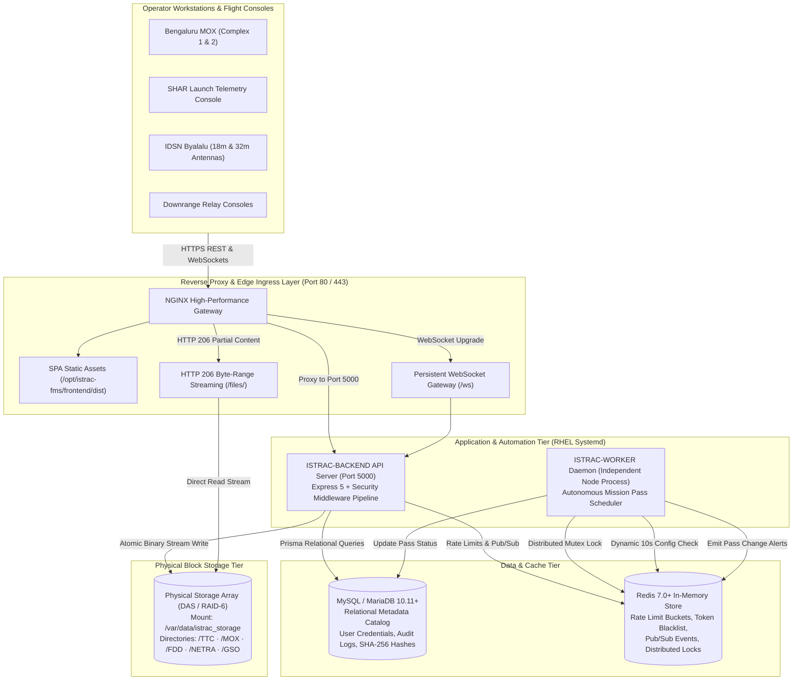
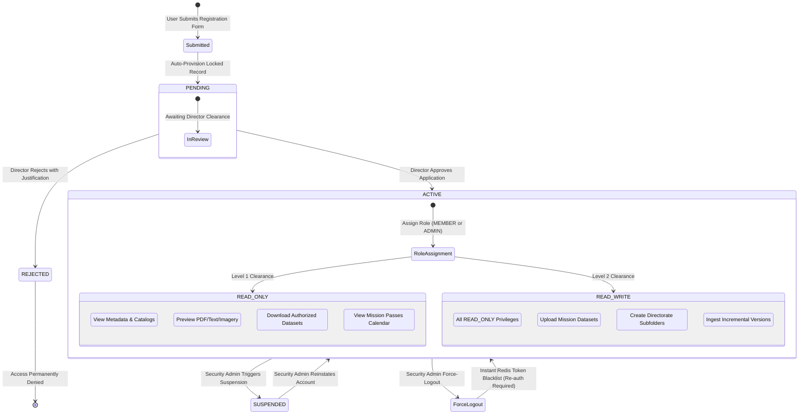
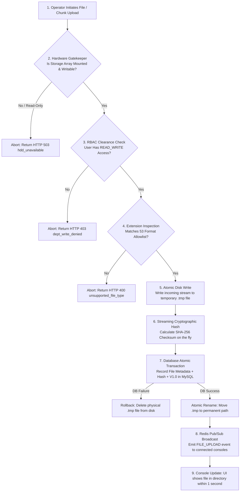
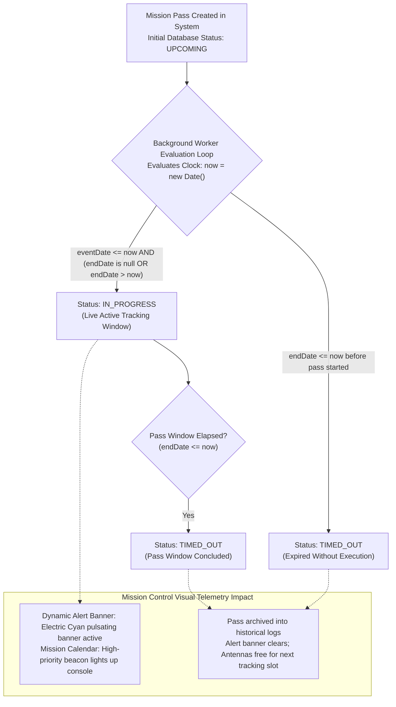
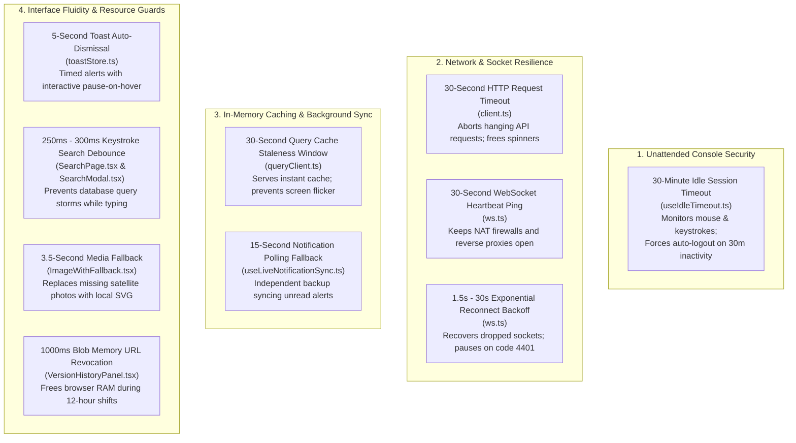

# Software System Operational Handbook & Client Guide (SOH)
## ISRO Telemetry, Tracking & Command Network (ISTRAC)
### Satellite Information Management System (ISTRAC-SIMS)

> **Document Identifier:** ISTRAC-SIMS-SOH-V1.0  
> **Standard Compliance:** IEEE Std 1063-2001 (R2007) / ISO/IEC/IEEE 26514:2018 (*Standard for Software User & System Operations Documentation*) & IEEE Std 1016-2009 (*Software Design Descriptions*)  
> **Security Classification:** Restricted — ISRO / ISTRAC Operational Ground Network  
> **Effective Release Date:** September 2026  
> **Target Audience:** Ground Station Directors, Mission Operations Leads, Facility System Administrators, Console Operators, and Executive Non-Technical Stakeholders  
> **Operating Environment:** RHEL 8 / 9, Rocky Linux 9, Air-Gapped Ground Station Local Area Network (LAN)  

---

## 📑 Document Executive Summary & Table of Contents

This document establishes the official **System Operational Handbook (SOH)** for the **ISTRAC Satellite Information Management System (ISTRAC-SIMS)**. Engineered according to **IEEE Std 1063-2001** and **ISO/IEC/IEEE 26514:2018**, this manual is structured to allow non-technical decision-makers, facility directors, and station administrators to understand, operate, configure, and maintain the system without requiring direct assistance from software developers.

---

### Table of Contents

- [1. Introduction & Administrative Overview](#1-introduction--administrative-overview)
  - [1.1 Purpose of this Document](#11-purpose-of-this-document)
  - [1.2 System Scope & Operational Mission](#12-system-scope--operational-mission)
  - [1.3 Definitions, Acronyms & Abbreviations](#13-definitions-acronyms--abbreviations)
  - [1.4 References & IEEE Standards Compliance](#14-references--ieee-standards-compliance)
  - [1.5 Document Structure & Navigation Guide](#15-document-structure--navigation-guide)
- [2. System Architecture & High-Level Operational Concept](#2-system-architecture--high-level-operational-concept)
  - [2.1 The Two-Tier Storage Paradigm (Relational Metadata vs. Physical Block Storage)](#21-the-two-tier-storage-paradigm-relational-metadata-vs-physical-block-storage)
  - [2.2 Role-Based Access Control (RBAC) & Clearance Lifecycles](#22-role-based-access-control-rbac--clearance-lifecycles)
  - [2.3 Telemetry & Dataset Ingestion Lifecycle](#23-telemetry--dataset-ingestion-lifecycle)
  - [2.4 Air-Gapped Intranet Architecture & Zero-Internet Compliance](#24-air-gapped-intranet-architecture--zero-internet-compliance)
- [3. Backend System Specification, Services & Daemons](#3-backend-system-specification-services--daemons)
  - [3.1 Comprehensive Specification of Backend Services (13 Core Modules)](#31-comprehensive-specification-of-backend-services-13-core-modules)
  - [3.2 The Background Worker Subsystem & Pass Status Automation Engine](#32-the-background-worker-subsystem--pass-status-automation-engine)
  - [3.3 Security, Gatekeeping & Middleware Pipeline (10 Inspection Layers)](#33-security-gatekeeping--middleware-pipeline-10-inspection-layers)
  - [3.4 Complete REST API Interface Directory](#34-complete-rest-api-interface-directory)
  - [3.5 System Constants, Allowlist Formats & Data Enumerations](#35-system-constants-allowlist-formats--data-enumerations)
  - [3.6 Environment Configuration Parameters (`.env`)](#36-environment-configuration-parameters-env)
  - [3.7 Backend Master Changeability Matrix](#37-backend-master-changeability-matrix)
- [4. Frontend Subsystem, Visual Architecture & Client Portal](#4-frontend-subsystem-visual-architecture--client-portal)
  - [4.1 UI/UX Mission Control Design System](#41-uiux-mission-control-design-system)
  - [4.2 Comprehensive Page-by-Page Functional Specification (All 29 Views)](#42-comprehensive-page-by-page-functional-specification-all-29-views)
  - [4.3 Client-Side State Management & Resilient Networking Architecture](#43-client-side-state-management--resilient-networking-architecture)
  - [4.4 Frontend Timeouts, Heartbeats & Resilient Polling Timers](#44-frontend-timeouts-heartbeats--resilient-polling-timers)
  - [4.5 Real-Time WebSocket Event Bridge (`/ws`)](#45-real-time-websocket-event-bridge-ws)
  - [4.6 Portal Content Management System (CMS Editor & Live Customization)](#46-portal-content-management-system-cms-editor--live-customization)
  - [4.7 Frontend Configuration & Environment Parameters](#47-frontend-configuration--environment-parameters)
  - [4.8 Frontend Master Changeability Matrix](#48-frontend-master-changeability-matrix)
- [5. Deployment, Infrastructure & Server Administration (`deploy/`)](#5-deployment-infrastructure--server-administration-deploy)
  - [5.1 Host Infrastructure Topology & Network Mapping](#51-host-infrastructure-topology--network-mapping)
  - [5.2 Deployment Scripts & Systemd Service Units](#52-deployment-scripts--systemd-service-units)
  - [5.3 Daily Operational Procedures & Command Reference](#53-daily-operational-procedures--command-reference)
  - [5.4 Deployment Master Changeability Matrix](#54-deployment-master-changeability-matrix)
- [6. System Diagnostics, Error Handling & Operator SOPs](#6-system-diagnostics-error-handling--operator-sops)
  - [6.1 Diagnostic Error Code Reference Table](#61-diagnostic-error-code-reference-table)
  - [6.2 Standard Operating Procedures (SOP) & Resolution Playbooks](#62-standard-operating-procedures-sop--resolution-playbooks)
- [7. Document Control & IEEE Verification Sign-Off](#7-document-control--ieee-verification-sign-off)
  - [7.1 Revision History](#71-revision-history)
  - [7.2 Verification & Acceptance Authority](#72-verification--acceptance-authority)

---

## 1. Introduction & Administrative Overview

### 1.1 Purpose of this Document
In accordance with **IEEE Std 1063-2001 (Section 4)**, this document provides the complete instructional, architectural, and operational baseline for the **ISTRAC-SIMS** portal. 

The primary objective is to empower **non-technical administrators, mission flight directors, and station managers** to:
1. Understand the exact operational mechanisms of the backend and frontend software.
2. Oversee daily ground station data ingestion, user approvals, and mission calendar dispatching.
3. Configure system thresholds, storage drives, and visual announcements without writing or altering source code.
4. Execute emergency maintenance, backups, and live storage failovers independently.

### 1.2 System Scope & Operational Mission
**ISTRAC-SIMS** serves as the digital backbone for the **Indian Space Research Organisation (ISRO) Telemetry, Tracking and Command Network (ISTRAC)**. The portal coordinates telemetry archives, flight dynamics ephemeris, payload operations, and space situational awareness records across primary and downrange ground stations:
- **Bengaluru MOX** (Mission Operations Complex 1 & 2)
- **Sriharikota Ground Station** (SHAR Launch Telemetry)
- **IDSN Byalalu** (Indian Deep Space Network — 18m and 32m Antennas)
- **Downrange Relays:** Port Blair, Mauritius, Biak (Indonesia), and Svalbard.

### 1.3 Definitions, Acronyms & Abbreviations

| Term / Acronym | IEEE Definition & Ground Network Meaning |
| :--- | :--- |
| **ACL** | **Access Control List:** Rules defining which users can read or write data in specific folders. |
| **Air-Gapped** | A physical and logical network security measure ensuring the server has zero connection to the external internet. |
| **AOS** | **Acquisition of Signal:** The timestamp when a satellite ascends above the ground antenna's local horizon. |
| **CMS** | **Content Management System:** Interface enabling administrators to modify web text and banners in real time. |
| **DAS / NAS** | **Direct / Network Attached Storage:** Dedicated physical disk hardware used for heavy binary data. |
| **Daemon** | A continuous background service running on Linux that executes automated tasks without user intervention. |
| **FDD** | **Flight Dynamics Division:** Directorate responsible for orbit determination, maneuvers, and trajectory design. |
| **GSO** | **Geostationary Satellite Operations:** Division managing communication and weather satellites in GEO orbit. |
| **JWT** | **JSON Web Token:** An encrypted digital security badge used to verify logged-in operators. |
| **LOS** | **Loss of Signal:** The timestamp when a satellite descends below the ground station antenna mask angle. |
| **MOX** | **Mission Operations Complex:** The nerve centre hosting spacecraft flight control consoles. |
| **NETRA** | **Network for Space Object Tracking and Analysis:** ISRO's space situational awareness and collision avoidance centre. |
| **NORAD ID** | Five-digit catalog number assigned by the space surveillance network to track artificial satellites. |
| **Prisma ORM** | Object-Relational Mapping library that translates TypeScript operations into MySQL database queries. |
| **RBAC** | **Role-Based Access Control:** Security framework restricting actions based on defined operational roles. |
| **Redis** | Ultra-high-speed in-memory data store used for session tracking, rate limiting, and real-time push events. |
| **SHA-256** | Secure Hash Algorithm generating a 64-character cryptographic fingerprint to verify file integrity. |
| **TTC** | **Telemetry, Tracking & Command:** Directorate managing RF downlinks and telecommand uplinks. |
| **WebSocket** | Persistent, bi-directional network socket allowing instant updates between server and operator browsers. |

### 1.4 References & IEEE Standards Compliance
- **IEEE Std 1063-2001 (R2007):** *IEEE Standard for Software User Documentation.*
- **ISO/IEC/IEEE 26514:2018:** *Systems and software engineering — Requirements for designers and developers of user documentation.*
- **IEEE Std 1016-2009:** *IEEE Standard for Information Technology — Systems Design — Software Design Descriptions.*
- **IEEE Std 830-1998 / ISO/IEC/IEEE 29148:2018:** *Software Requirements Specification Guidelines.*
- **RFC 7519:** *JSON Web Token (JWT) Architecture.*
- **RFC 2616 / 7233:** *Hypertext Transfer Protocol — Range Requests & Partial Content (HTTP 206 Streaming).*

### 1.5 Document Structure & Navigation Guide
- **Section 2:** Explains the conceptual model and how data flows through the application.
- **Section 3:** Provides a line-by-line inspection of backend services, APIs, the background worker, and the backend changeability matrix.
- **Section 4:** Guides users through all 29 frontend pages, CMS visual customization, and UI configuration.
- **Section 5:** Covers deployment scripts, Linux systemd services, Nginx reverse proxy, and infrastructure changeability.
- **Section 6:** Provides troubleshooting tables and step-by-step resolution playbooks.
- **Section 7:** Formal document sign-off and verification records.

---

## 2. System Architecture & High-Level Operational Concept



### 2.1 The Two-Tier Storage Paradigm (Relational Metadata vs. Physical Block Storage)
To prevent database corruption and preserve military-grade performance, **ISTRAC-SIMS never stores large binary datasets inside the relational database**. Instead, it uses a **Two-Tier Storage Architecture**:

1. **Tier 1: Relational Metadata Database (MySQL / MariaDB):**
   - Stores the structured "card catalog" of the system: file name, byte size, cryptographic SHA-256 checksum, uploader identity, assigned satellite, classification tier, and version lineage.
   - Database operations are lightweight, enabling search queries across millions of records in under 20 milliseconds.
2. **Tier 2: Physical Block Storage Volume (`HDD_MOUNT_PATH`):**
   - High-capacity, enterprise-grade physical hard drive array (RAID-6 / NAS).
   - Stores the raw payload binary files, orbital state vectors, telemetry logs, and high-resolution satellite imagery organized in strictly partitioned departmental directories (`/TTC`, `/MOX`, `/FDD`, `/NETRA`, `/GSO`).
   - Every file written to disk is validated against an SHA-256 hash. If even one byte on disk is corrupted by hardware degradation, the system immediately flags the mismatch.

### 2.2 Role-Based Access Control (RBAC) & Clearance Lifecycles

The system enforces strict multi-tier clearance separation:



### 2.3 Telemetry & Dataset Ingestion Lifecycle



1. **Upload Initiation:** Operator selects a dataset (up to 500 MB by default) or initiates a chunked upload for multi-gigabyte files.
2. **Hardware Pre-flight Gate:** The system verifies that the target hard drive mount is mounted, healthy, and writable (`hddAvailabilityMiddleware`).
3. **Clearance Verification:** Verifies that the operator holds `READ_WRITE` clearance for that specific department.
4. **Format & Virus Inspection:** Checks the file extension against the system allowlist (53 pre-approved scientific and document formats).
5. **Atomic Disk Write:** The file is written to disk under a temporary name (`.tmp`). Once the write finishes, it is atomically renamed to its permanent path.
6. **Checksum Calculation:** A streaming SHA-256 cryptographic hash is calculated simultaneously.
7. **Database Transaction:** The file is recorded in MySQL with its SHA-256 hash, size, and version `V1.0`. If the database write fails, the physical file is automatically deleted to prevent orphaned files.
8. **Real-Time WebSocket Broadcast:** The server emits an event over Redis Pub/Sub, updating the consoles of all connected operators in that department within 1 second.
9. **Version Evolution:** When an updated document is uploaded, it increments to `V1.1`, keeping the historical version intact and accessible in the version history.
10. **Soft-Delete Trash Lifecycle:** Deleting a file flags it as `DELETED` in the database. The physical file remains preserved on disk until an administrator permanently purges it.

### 2.4 Air-Gapped Intranet Architecture & Zero-Internet Compliance
The application strictly enforces **Zero External Internet Dependencies**:
- **Local Fonts & Icons:** All typography and Lucide icon vectors are bundled locally.
- **Local 3D Satellite Modeling:** The interactive 3D satellite orbit visualizer runs entirely via client-side WebGL canvas mathematics without external map servers.
- **Local Time Authority:** Evaluates events and logs against local network NTP clocks.

---

## 3. Backend System Specification, Services & Daemons

Located in `backend/src/services/`, the backend business logic is partitioned into 13 modular services, a background worker daemon, and 10 middleware layers.

---

### 3.1 Comprehensive Specification of Backend Services (13 Core Modules)

#### 1. `file.service.ts` — File Lifecycle & Version Ingestion Engine
- **IEEE Purpose:** Coordinates end-to-end file ingestion, chunked payload assembly, cryptographic verification, and version labeling.
- **Functional Description:**
  - Manages single-part uploads and assembles sequential 10MB/50MB chunks from `os.tmpdir()` into complete binary streams.
  - Automatically calculates version numbering (`V1.0`, `V1.1`, `V2.0`).
  - Generates SHA-256 checksums on the fly using Node.js streaming crypto pipelines.
  - Implements compensation logic: if database registration fails, the physical file written to disk is immediately unlinked.
- **Operational Value:** Guarantees that no corrupted or uncatalogued files exist in ground station archives.

#### 2. `hdd.service.ts` — Physical Block Storage Mount Manager
- **IEEE Purpose:** Low-level physical disk controller and filesystem abstraction layer.
- **Functional Description:**
  - Enforces a **Path Traversal Guard** (`guardPath`), blocking directory traversal attacks (e.g. `../../etc/shadow` or `C:\Windows`).
  - Provides **Atomic Disk Writing**: writes to `.tmp` files and executes atomic renames.
  - Features **Multi-Root Dynamic Discovery**: if an administrator switches storage drives (e.g. `C:` to `D:` or `/mnt/storage`), the service automatically probes known alternative roots to locate files without requiring manual database path edits.
- **Operational Value:** Ensures continuous file access across hardware storage drive replacements.

#### 3. `driveDetector.service.ts` — Host Volume Scanner & Live Migration Engine
- **IEEE Purpose:** Hardware drive surveyor and automated storage migration pipeline.
- **Functional Description:**
  - Scans all host storage volumes (`C:\`, `D:\`, `E:\` on Windows; `/`, `/mnt`, `/data` on Linux).
  - Measures total capacity, free space, and used percentage, and executes an active write probe (`.istrac_probe`).
  - Manages storage redundancy policies (primary path, secondary mirror path, auto-mirroring, failover).
  - Executes **Live Storage Migration**: copies existing datasets from an old drive to a new drive and updates active paths with zero service downtime.
- **Operational Value:** Enables non-technical facility managers to upgrade hard drives via the browser interface without executing Linux CLI commands.

#### 4. `hddHealth.service.ts` — Storage Degradation & S.M.A.R.T. Monitor
- **IEEE Purpose:** Continuous background storage health daemon.
- **Functional Description:**
  - Runs a health probe cycle every 60 seconds.
  - Writes a temporary file (`.health_probe`), reads it back, and deletes it.
  - If a write/read fails, it immediately flags storage as `DEGRADED` in Redis and dispatches an alert email to `ADMIN_EMAIL`.
  - When the drive recovers, it clears the alarm and dispatches a recovery notification.
- **Operational Value:** Detects hardware storage failures before operations are impacted.

#### 5. `hddSync.service.ts` — Storage Reconciliation & Orphan Detection Daemon
- **IEEE Purpose:** Periodic background synchronizer reconciling physical disk content with database metadata.
- **Functional Description:**
  - Runs every 15 minutes (configurable via Admin UI).
  - Scans physical department folders and reconciles them with MySQL records:
    - Files found on disk without a database entry are automatically cataloged as `UNREGISTERED`.
    - Database records whose physical files were manually deleted from disk are marked as `ORPHANED`.
- **Operational Value:** Prevents discrepancies between physical hard drives and the web catalog.

#### 6. `bootstrap.service.ts` — First-Time Ground Station Provisioning Engine
- **IEEE Purpose:** System self-initialization and default baseline generator.
- **Functional Description:**
  - Checks on startup whether the database is empty.
  - Automatically seeds the 6 core ISRO satellites (Aditya-L1, Chandrayaan-3, EOS-08, Cartosat-3, Gaganyaan, NISAR).
  - Automatically initializes the 5 directorate folders (`/TTC`, `/MOX`, `/FDD`, `/NETRA`, `/GSO`) on the physical hard drive.
- **Operational Value:** Provisions a functional ground station portal out-of-the-box on fresh server installations.

#### 7. `audit.service.ts` — Tamper-Evident System Activity Logger
- **IEEE Purpose:** Append-only audit logger for regulatory and mission assurance compliance.
- **Functional Description:**
  - Asynchronously records all mutating HTTP operations (`POST`, `PUT`, `PATCH`, `DELETE`).
  - Stores user ID, action name, resource type, resource ID, IP address, user agent, and full JSON before-and-after diffs (`oldValue` vs. `newValue`).
- **Operational Value:** Provides non-repudiation audit trails for ISO-27001 and aerospace security audits.

#### 8. `email.service.ts` — Transactional Alert & Notification Dispatcher
- **IEEE Purpose:** Automated SMTP mail delivery service.
- **Functional Description:**
  - Connects to the local ground station SMTP relay.
  - Dispatches automated notifications for user registration approvals, rejections, account suspensions, password resets, critical disk alerts, and network-wide emergency broadcasts.
- **Operational Value:** Keeps staff informed of critical station events without requiring them to remain logged in.

#### 9. `notification.service.ts` — In-App Event & Broadcast Transmitter
- **IEEE Purpose:** Operator notification engine and real-time alert dispatcher.
- **Functional Description:**
  - Inserts notification records into MySQL for individual users or broadcasts across all active personnel.
  - Simultaneously publishes events to Redis Pub/Sub channels (`notification.<userId>` and `notification.broadcast`) for instant delivery via WebSockets.
- **Operational Value:** Delivers audio/visual alerts for satellite passes, collision alerts, and mission announcements.

#### 10. `search.service.ts` — Multi-Faceted Telemetry Search Engine
- **IEEE Purpose:** High-performance faceted catalog search indexer.
- **Functional Description:**
  - Executes full-text multi-criteria queries across titles, descriptions, categories, satellites, extensions, and date ranges.
  - Enforces departmental boundaries: members are strictly restricted to searching files within their authorized divisions, while Super Admins can query the entire fleet.
- **Operational Value:** Enables console operators to locate mission-critical data files in seconds.

#### 11. `securityMonitor.service.ts` — Intrusion & Brute-Force Detection Service
- **IEEE Purpose:** Automated authentication threat and anomalous activity monitor.
- **Functional Description:**
  - Tracks failed login attempts and unauthorized requests (401/403) per IP address over a sliding 5-minute window.
  - When an IP triggers 20 failures within 5 minutes, it logs a critical security alert in system logs.
- **Operational Value:** Identifies unauthorized scanning or brute-force attempts on the ground station LAN.

#### 12. `sessionStore.ts` — Token Blacklisting & Instant Force-Logout Engine
- **IEEE Purpose:** In-memory session authority and cryptographic token revocation manager.
- **Functional Description:**
  - Stores active 7-day refresh token sessions in Redis with automated expiration.
  - Manages an in-memory/Redis token blacklist. When an administrator clicks "Force Logout" or "Suspend", the token is blacklisted immediately, revoking access in milliseconds.
- **Operational Value:** Eliminates the security window associated with cached authentication tokens.

#### 13. `virusScan.service.ts` — Antivirus Pipeline Integration Hook
- **IEEE Purpose:** Malware inspection and payload screening stub.
- **Functional Description:**
  - Provides the programmatic interface for on-premise ICAP/ClamAV antivirus daemons to inspect incoming binary files before permanent storage.
- **Operational Value:** Ensures malicious payloads cannot be ingested into the ground network.

---

### 3.2 The Background Worker Subsystem & Pass Status Automation Engine

#### 3.2.1 Architecture & Process Separation
The **Background Worker** runs as an autonomous, standalone Node.js process:
- **Executable Source:** [`backend/src/worker.ts`](file:///C:/Users/AYAN%20SHARMA/Desktop/project/backend/src/worker.ts)
- **Worker Logic:** [`backend/src/jobs/mission-event.worker.ts`](file:///C:/Users/AYAN%20SHARMA/Desktop/project/backend/src/jobs/mission-event.worker.ts)
- **Status State Machine:** [`backend/src/jobs/mission-event-status.job.ts`](file:///C:/Users/AYAN%20SHARMA/Desktop/project/backend/src/jobs/mission-event-status.job.ts)
- **Dedicated Service:** `istrac-worker.service`

**Architectural Rationale:** Decoupling the worker from the Express web server ensures that scheduled database status evaluations never consume CPU cycles needed for operator web requests or file streaming.

#### 3.2.2 Distributed Lock & Multi-Instance Safety
In high-availability configurations with multiple ground station servers, only **one** worker must update event statuses at any given time. The worker coordinates via an atomic Redis distributed lock:
```
SET scheduler:mission-events:lock <worker_pid-timestamp> EX 60 NX
```
If the lock is acquired, the job runs. If another server holds the lock, the worker gracefully waits for the next cycle.

#### 3.2.3 The 10-Second Dynamic Configuration Loop
The worker executes a continuous loop sleeping in 10-second intervals (`CONFIG_CHECK_INTERVAL = 10_000`):
- Every 10 seconds, it reads the Redis key: `scheduler:mission-events:interval`.
- Default: **1 minute**. Permitted intervals: `1`, `5`, `10`, `30`, or `60` minutes.
- If an administrator adjusts the interval via the Admin UI, **the worker detects the change within 10 seconds without needing a service restart**.

#### 3.2.4 Automated Status Transitions (The Pass State Machine)
The worker evaluates the current server clock (`now = new Date()`) against every event's start time (`eventDate`) and end time (`endDate`):



1. **Transition 1: Active Pass Acquisition (`UPCOMING` ➔ `IN_PROGRESS`)**
   - **Trigger:** Event start time has arrived (`eventDate <= now`), and the pass is still active (`endDate > now` or `endDate is null`).
   - **Action:** Changes database status to `IN_PROGRESS`.
   - **System Impact:** Event turns **Electric Cyan** with a pulsing beacon on the Mission Calendar; top Dynamic Alert Banner lights up: `"ACTIVE PASS: <Satellite Name> Downlink in Progress"`.
2. **Transition 2: Pass Window Loss of Signal (`IN_PROGRESS` ➔ `TIMED_OUT`)**
   - **Trigger:** Current time passes the scheduled conclusion time (`endDate <= now`).
   - **Action:** Changes database status to `TIMED_OUT`.
   - **System Impact:** Event is automatically removed from the live alert banner and archived in calendar history; ground antennas can safely be re-pointed to the next target.
3. **Transition 3: Expired Pass Cleanup (`UPCOMING` ➔ `TIMED_OUT`)**
   - **Trigger:** An event remained in `UPCOMING`, but its end date has already passed in the past (`endDate <= now`).
   - **Action:** Changes status to `TIMED_OUT`.
   - **System Impact:** Cleans up missed tracking slots without operator intervention.

---

### 3.3 Security, Gatekeeping & Middleware Pipeline (10 Inspection Layers)

Located in `backend/src/middleware/`, every HTTP request passes through 10 sequential security layers:

```mermaid
flowchart TD
    REQ(["Inbound HTTP Request from Operator Browser"]) --> L1
    
    subgraph EdgeSec["Perimeter & Edge Guardrails"]
        L1["1. Helmet Security Headers\n(HSTS, Anti-Clickjacking, No-Sniff, Referrer-Policy)"]
        L1 --> L2["2. Strict CORS Guard\n(Allows only whitelisted ground station intranet origins)"]
    end
    
    subgraph IngestionSec["Payload Sanitization & Observability"]
        L2 --> L3["3. Safe Body & Cookie Parsers\n(Enforces 1MB JSON / 50MB payload ceilings)"]
        L3 --> L4["4. Unique Request ID Tracer\n(Attaches unique UUID token to request context)"]
        L4 --> L5["5. Structured HTTP Logger\n(Logs response latency, HTTP status, and operator ID)"]
    end

    subgraph AuthSec["Authentication & Hardware Clearance"]
        L5 --> L6["6. Redis Multi-Tier Rate Limiter\n(Prevents brute-force floods: 10 logins / 15 mins)"]
        L6 --> L7["7. Cryptographic JWT Auth Guard\n(Verifies token signature, expiration, and Redis blacklist)"]
        L7 --> L8["8. Departmental RBAC Access Gate\n(Validates division clearance: READ_ONLY or READ_WRITE)"]
        L8 --> L9["9. Physical Hardware Mount Gatekeeper\n(Verifies storage array is online before file ops)"]
    end

    subgraph ExecutionSec["Controller Execution & Non-Repudiation"]
        L9 --> L10["Target REST Route Handler Executes"]
        L10 --> L11["10. Append-Only Audit Logger\n(Persists user ID, IP, action, and JSON diffs to MySQL)"]
    end

    L11 --> RESP(["Encrypted HTTP 200/201 Response Dispatched to Console"])
```



---

### 3.4 Complete REST API Interface Directory

Below is the directory of all backend endpoints available in the system:

#### 3.4.1 Authentication & Session Endpoints (`/auth`)
| Route | Method | Clearance | Input Parameters | Output Description |
| :--- | :--- | :--- | :--- | :--- |
| `/auth/register` | `POST` | Public | Full name, email, employee ID, password, preferred dept, reason. | `201 Created` with pending approval notification. |
| `/auth/login` | `POST` | Public | Registered email, password. | JWT Access Token, HttpOnly Refresh Cookie, user profile. |
| `/auth/refresh` | `POST` | Public | Refresh token (via cookie or body payload). | Renewed JWT Access Token. |
| `/auth/logout` | `POST` | Authenticated | Bearer token in header. | Revokes session, blacklists token in Redis, clears cookie. |
| `/auth/me` | `GET` | Authenticated | Bearer token in header. | Authenticated profile, clearances, assigned divisions. |
| `/auth/forgot-password`| `POST` | Public | Operator email. | Dispatches one-time password reset link via SMTP. |
| `/auth/reset-password` | `POST` | Public | Reset token, new strong password. | Updates password hash in MySQL. |
| `/auth/change-password`| `PUT` | Authenticated | Current password, new strong password. | Updates password hash, logs password change event. |

#### 3.4.2 File & Telemetry Repository Endpoints (`/files`)
| Route | Method | Clearance | Input Parameters | Output Description |
| :--- | :--- | :--- | :--- | :--- |
| `/files/upload` | `POST` | Admin / Write | Multipart file buffer, departmentId, title, spacecraft. | Stored file record, physical path, SHA-256 hash. |
| `/files/upload/chunk` | `POST` | Admin / Write | Chunk binary, chunkIndex, fileName, departmentId. | Chunk receipt acknowledgment. |
| `/files/upload/complete`| `POST` | Admin / Write | fileName, departmentId, totalChunks. | Reassembles chunks, verifies hash, records metadata. |
| `/files/:fileId/stream` | `GET` | Authenticated | `Range: bytes=X-Y` header, fileId. | HTTP 206 Partial Content zero-copy byte stream. |
| `/files/:fileId/download`| `GET` | Public* / Auth | fileId in URL (*Public if featured by Admin). | Binary file stream with SHA-256 header. |
| `/files/:fileId/version` | `POST` | Admin / Write | Multipart file buffer, changelog, versionLabel. | Increments file version, stores new file version. |
| `/files/:fileId/versions`| `GET` | Authenticated | fileId in URL. | Array of historical version records with changelogs. |
| `/files/:fileId/versions/:versionId/visibility` | `PATCH` | Admin | versionId, `isVisible: boolean`. | Shows or hides older file version from regular members. |
| `/files/:fileId` | `DELETE`| Admin | fileId in URL. | Soft-deletes file (moves to administrative trash). |
| `/files/:fileId/restore`| `PUT` | Admin | fileId in URL. | Restores soft-deleted file back to active repository. |
| `/files/folders` | `POST` | Admin / Write | departmentId, folderName, parentId. | Creates directory container in database. |
| `/files/featured-list` | `GET` | Public | None. | Array of public telemetry files for landing showcase. |
| `/admin/files` | `GET` | Admin | page, limit, status, departmentId, query. | Comprehensive administrative file catalog table. |
| `/admin/files/:fileId/broadcast` | `POST` | Admin | fileId, broadcast message, urgency. | Transmits instant audio/visual alert about dataset. |

#### 3.4.3 Operational Directorate & Department Endpoints (`/departments`)
| Route | Method | Clearance | Input Parameters | Output Description |
| :--- | :--- | :--- | :--- | :--- |
| `/departments/public` | `GET` | Public | None. | Directorate list, descriptions, lead officer names. |
| `/departments/:deptId/hub`| `GET` | Authenticated | deptId in URL. | Directorate operational hub, KPIs, pass schedule. |
| `/departments/:deptId/files`| `GET` | Authenticated | deptId, parentId (folder ID). | Subfolders and files in current directory. |
| `/departments/:deptId/tree` | `GET` | Authenticated | deptId in URL. | Recursive JSON folder tree for sidebar navigation. |
| `/admin/departments` | `GET` | Admin | None. | Administrative list of all departments with disk paths. |
| `/admin/departments` | `POST` | Admin | Department name, code, description, hddPath. | Provisions new operational department. |
| `/admin/departments/:deptId`| `PUT` | Admin | Name, description, lead officer, page settings. | Updates department profile and landing banner. |
| `/admin/departments/:deptId`| `DELETE`| Admin | deptId in URL. | Decommissions / archives department. |
| `/admin/departments/:deptId/users` | `POST` | Admin | userId, accessLevel (`READ_ONLY` / `READ_WRITE`). | Grants operator clearance to department. |
| `/admin/departments/:deptId/users/:userId` | `DELETE`| Admin | deptId, userId in URL. | Revokes operator clearance to department. |

#### 3.4.4 Satellite Fleet & Mission Endpoints (`/satellites`)
| Route | Method | Clearance | Input Parameters | Output Description |
| :--- | :--- | :--- | :--- | :--- |
| `/satellites` | `GET` | Public / Auth | None. | List of all active spacecraft in ISRO fleet. |
| `/satellites/:satelliteId`| `GET` | Public / Auth | satelliteId in URL. | Full satellite specifications, NORAD ID, fuel balance. |
| `/admin/satellites` | `POST` | Admin | Name, code, NORAD ID, orbit type, launch mass. | Registers newly launched satellite in catalog. |
| `/admin/satellites/:satelliteId`| `PUT` | Admin | Status, fuel balance, orbital parameters. | Updates spacecraft status and mission telemetry. |
| `/admin/satellites/:satelliteId`| `DELETE`| Admin | satelliteId in URL. | Archives decommissioned spacecraft. |

#### 3.4.5 Mission Passes & Calendar Endpoints (`/events`)
| Route | Method | Clearance | Input Parameters | Output Description |
| :--- | :--- | :--- | :--- | :--- |
| `/events` | `GET` | Public / Auth | startDate, endDate, satelliteId, departmentId. | Array of scheduled tracking passes and maneuvers. |
| `/events/active-banner` | `GET` | Public / Auth | None. | Active high-priority pass or emergency alert. |
| `/events` | `POST` | Admin | Title, eventType, eventDate, endDate, satelliteId. | Schedules new satellite pass or tracking window. |
| `/events/:id` | `PUT` | Admin | Dates, status, location, urgency. | Modifies scheduled pass timing or status. |
| `/events/:id` | `DELETE` | Admin | eventId in URL. | Cancels / soft-deletes scheduled pass. |
| `/admin/scheduler/mission-events` | `GET` | Admin | None. | Returns worker check interval in minutes (from Redis). |
| `/admin/scheduler/mission-events` | `PUT` | Admin | `interval: number` (`1`, `5`, `10`, `30`, `60`). | Updates worker polling interval in Redis. |

#### 3.4.6 User Account & Clearance Queue Endpoints (`/admin/users`)
| Route | Method | Clearance | Input Parameters | Output Description |
| :--- | :--- | :--- | :--- | :--- |
| `/admin/users` | `GET` | Admin | page, limit, status, role, search. | Paginated roster of registered personnel. |
| `/admin/users/pending` | `GET` | Admin | page, limit. | List of personnel awaiting security clearance. |
| `/admin/users/:userId/approve` | `POST`| Admin | role (`ADMIN`/`MEMBER`), departmentId, accessLevel. | Activates user account, sends approval email. |
| `/admin/users/:userId/reject` | `POST`| Admin | Optional rejection justification reason. | Rejects application, sends notification email. |
| `/admin/users/:userId/suspend`| `POST`| Admin | userId in URL. | Locks account, invalidates active sessions. |
| `/admin/users/:userId/force-logout`| `POST`| Admin | userId in URL. | Immediately revokes user tokens in Redis. |
| `/admin/approvals/history` | `GET` | Admin | page, limit. | Immutable log of all historical clearance decisions. |

#### 3.4.7 Portal CMS, Hardware & Configuration Endpoints
| Route | Method | Clearance | Input Parameters | Output Description |
| :--- | :--- | :--- | :--- | :--- |
| `/cms/blocks` | `GET` | Public | None. | Full dictionary of customizable portal text blocks. |
| `/cms/blocks/:blockKey` | `PUT` | Admin | blockKey in URL, JSON content body. | Updates portal text, pushes live update via WebSocket. |
| `/admin/stats` | `GET` | Admin | None. | Total storage utilized, user count, active passes. |
| `/admin/audit-logs` | `GET` | Admin | cursor, action, userId, dateFrom, dateTo. | Filterable audit log entries with JSON diffs. |
| `/admin/settings` | `GET` | Admin | None. | Current system operational limits and ingest policies. |
| `/admin/settings/:key` | `PUT` | Admin | Setting key in URL, value in body. | Updates setting in database (max upload size, etc.). |
| `/admin/storage/status` | `GET` | Admin | None. | Primary hard drive status (`ONLINE`, `DEGRADED`). |
| `/admin/storage/drives` | `GET` | Admin | None. | Scans all physical hard drive volumes on the host. |
| `/admin/storage/redundancy` | `PUT` | Admin | primaryPath, secondaryPath, failoverEnabled. | Updates storage redundancy and warning thresholds. |
| `/admin/storage/migrate` | `POST`| Admin | newPrimaryPath, oldPrimaryPath, copyFiles. | Executes live data migration to a new hard drive. |
| `/health` | `GET` | Public | None. | Service liveness probe (checks MySQL and Redis). |
| `/ws` | `WS` | Authenticated | Token in protocol or query. | Bi-directional real-time telemetry and alerts socket. |

---

### 3.5 System Constants, Allowlist Formats & Data Enumerations

#### 3.5.1 Database Enumerations (Prisma Baseline)
- `UserRole`: `ADMIN` | `MEMBER`
- `UserStatus`: `PENDING` | `ACTIVE` | `SUSPENDED` | `REJECTED`
- `AccessLevel`: `READ_ONLY` | `READ_WRITE`
- `AccessRequestStatus`: `PENDING` | `APPROVED` | `REJECTED` | `CANCELLED`
- `ReportStatus`: `ACTIVE` | `ARCHIVED` | `DELETED`
- `FileStatus`: `ACTIVE` | `ORPHANED` | `DELETED` | `UNREGISTERED`
- `NodeType`: `FOLDER` | `FILE`
- `ReportCategory`: `SPECIAL_OPERATIONS` | `ANOMALY` | `STUDY` | `DAILY_REPORT` | `OTHER`

#### 3.5.2 Built-in File Allowlist (`ALLOWED_EXTENSIONS`)
The default allowlist includes 53 file extensions:
- **Documents:** `pdf`, `doc`, `docx`, `xls`, `xlsx`, `ppt`, `pptx`, `odt`, `ods`, `odp`
- **Text & Tabular Data:** `txt`, `csv`, `json`, `xml`, `md`, `log`, `dat`, `tsv`
- **Imagery & Maps:** `png`, `jpg`, `jpeg`, `gif`, `webp`, `tiff`, `bmp`, `svg`
- **Video Feeds:** `mp4`, `mov`, `avi`, `mkv`, `webm`
- **Aerospace & Scientific Formats:** `fits`, `fit`, `hdf`, `hdf5`, `h5`, `nc`, `cdf`, `sav`, `mat`
- **Compressed Archives:** `zip`, `tar`, `gz`, `bz2`, `7z`, `rar`

---

### 3.6 Environment Configuration Parameters (`.env`)

Configured in `backend/.env`:

| Parameter | Type | Default Value | Description |
| :--- | :--- | :--- | :--- |
| `PORT` | Integer | `3000` or `5000` | Network port for the backend web server. |
| `NODE_ENV` | String | `production` | Server execution environment mode. |
| `DATABASE_URL` | String | `mysql://...` | Connection URI for the MySQL/MariaDB database. |
| `REDIS_URL` | String | `redis://127.0.0.1:6379` | Network address of the Redis in-memory cache. |
| `HDD_MOUNT_PATH`| String | `/var/data/istrac_storage` | Absolute path to the physical storage mount array. |
| `JWT_SECRET` | String | 64-char random | Cryptographic key for signing 15-minute access tokens. |
| `JWT_REFRESH_SECRET`| String | 64-char random | Cryptographic key for signing 7-day refresh tokens. |
| `ALLOWED_ORIGINS`| String | `https://sims.istrac...` | Comma-separated list of allowed web origins (CORS). |
| `APP_URL` | String | `https://sims.istrac...` | Base URL used in automated transactional emails. |
| `SMTP_HOST` | String | `mail.istrac.gov.in` | Hostname or IP of the ground network mail relay. |
| `SMTP_PORT` | Integer | `25` or `587` | Network port for SMTP communications. |
| `ADMIN_EMAIL` | String | `director@istrac...` | Destination email for critical hardware failure alerts. |

---

### 3.7 Backend Master Changeability Matrix

| Component / Setting | Changeable Without Code? | Method to Modify | Requires Restart? |
| :--- | :--- | :--- | :--- |
| **Max Ingest Upload Size** | 🟢 **YES** | Admin Console ➔ **System Settings** ➔ Ingest Slider. | ❌ No — Instant. |
| **Permitted File Formats** | 🟢 **YES** | Admin Console ➔ **System Settings** ➔ Extension Chips. | ❌ No — Instant. |
| **Download Rate Limit** | 🟢 **YES** | Admin Console ➔ **System Settings** ➔ Downloads/Hour. | ❌ No — Instant. |
| **Primary Storage Mount Path** | 🟢 **YES** | Admin Console ➔ **System Settings** ➔ Storage Migrate Tool.| ❌ No — Instant. |
| **Storage Redundancy & Alerts**| 🟢 **YES** | Admin Console ➔ **System Settings** ➔ Redundancy Settings.| ❌ No — Instant. |
| **Worker Polling Interval** | 🟢 **YES** | Admin Console or `PUT /admin/scheduler/mission-events`. | ❌ No — Worker reads in 10s. |
| **Add / Edit Spacecraft Fleet**| 🟢 **YES** | Admin Console ➔ **Satellites & Missions**. | ❌ No — Instant. |
| **Add / Edit Directorates** | 🟢 **YES** | Admin Console ➔ **Departments**. | ❌ No — Instant. |
| **User Clearances & Roles** | 🟢 **YES** | Admin Console ➔ **Approval Queue** / **User Accounts**. | ❌ No — Instant. |
| **Emergency Broadcast Alert** | 🟢 **YES** | Admin Console ➔ **Broadcast Alert**. | ❌ No — Instant. |
| **Database Credentials** | 🟡 **YES** | Update `backend/.env` ➔ `DATABASE_URL`. | 🔄 **Yes** — Restart backend. |
| **Redis Server Address** | 🟡 **YES** | Update `backend/.env` ➔ `REDIS_URL`. | 🔄 **Yes** — Restart backend. |
| **Backend Listening Port** | 🟡 **YES** | Update `backend/.env` ➔ `PORT`. | 🔄 **Yes** — Restart backend. |
| **Admin Alert Email** | 🟡 **YES** | Update `backend/.env` ➔ `ADMIN_EMAIL`. | 🔄 **Yes** — Restart backend. |
| **CORS Allowed Origins** | 🟡 **YES** | Update `backend/.env` ➔ `ALLOWED_ORIGINS`. | 🔄 **Yes** — Restart backend. |
| **Worker Systemd Policy** | 🟡 **YES** | Edit `/etc/systemd/system/istrac-worker.service`. | 🔄 **Yes** — `systemctl daemon-reload`. |
| **Adding New REST Routes** | 🔴 **NO** | Edit TypeScript files in `backend/src/routes/`. | 🔨 **Yes** — Recompile (`npm run build`). |
| **Modifying DB Schema** | 🔴 **NO** | Edit Prisma file `backend/prisma/schema.prisma`. | 🔨 **Yes** — Run `prisma migrate`. |

---

## 4. Frontend Subsystem, Visual Architecture & Client Portal

The frontend is built with **React 19**, **Vite 8**, **TypeScript 5**, and **Tailwind CSS v4**.

---

### 4.1 UI/UX Mission Control Design System
- **Aerospace High-Contrast Dark Palette:** Tailored for mission control consoles, reducing eye strain during night-shift operations.
- **Color Coding Standards:**
  - **Cyan / Electric Blue (`#00E5FF`):** Active telemetry downlinks, ongoing satellite passes, primary focus elements.
  - **Emerald Green (`#00E676`):** Nominal subsystem status, verified SHA-256 integrity, active clearance.
  - **Amber / Orange (`#FFAB00`):** Scheduled maintenance, degraded hardware warnings, pending approval queue.
  - **Crimson Red (`#FF1744`):** Orbital conjunction warnings, critical storage degradation, suspended accounts.
- **Tabular Monospace Readouts:** File sizes, timestamps, and NORAD numbers use fixed-width tabular figures to prevent jitter during live updates.

---

### 4.2 Comprehensive Page-by-Page Functional Specification (All 29 Views)

#### 4.2.1 Public Access Portal
1. **`Landing.tsx` (`/`) — Mission Control Public Landing:**
   - Visual overview of the ground station network, live announcement ticker, quick statistics, and an interactive 3D WebGL satellite orbit visualizer.
2. **`DepartmentsList.tsx` (`/departments`) — Directorates Directory:**
   - High-level directory of all 5 operational directorates (TTC, FDD, MOX, NETRA, GSO) with mission profiles and division head information.
3. **`DepartmentDetail.tsx` (`/departments/:deptId`) — Directorate Public Profile:**
   - Dedicated showcase page for an individual department displaying facility photos, primary antennas, and public datasets.
4. **`Login.tsx` (`/login`) — Operator Login Portal:**
   - Secure authentication form protected by rate-limiting.
5. **`Register.tsx` (`/register`) — Personnel Clearance Request:**
   - Registration portal collecting government employee ID, designation, and official justification for security review.
6. **`ForgetPassword.tsx` (`/forgot-password`) — Self-Service Password Recovery:**
   - Form allowing personnel to request an automated password reset link via the ground station SMTP relay.
7. **`ForcePasswordChange.tsx` (`/force-password-change`) — Mandatory Credential Rotation:**
   - Mandatory security screen requiring newly provisioned users with default credentials to set a strong custom password.

#### 4.2.2 Authenticated Member Operations (`/dashboard`)
8. **`UserHome.tsx` (`/dashboard`) — Operator Mission Overview:**
   - Personalized dashboard displaying assigned directorates, total accessible telemetry files, upcoming passes, and recent uploads.
9. **`Files.tsx` (`/dashboard/files`) — Division Repositories Explorer:**
   - High-level card selector showing all directorates the logged-in operator has clearance to access.
10. **`DeptFileBrowser.tsx` (`/dashboard/files/:deptId`) — Deep Folder Explorer:**
    - Hierarchical folder browser with breadcrumb navigation, folder trees, inline file preview (PDF, text, telemetry), version history drawers, and dataset downloads.
11. **`UserEvents.tsx` (`/dashboard/events`) — Mission Passes Calendar:**
    - Dual-month interactive calendar showing satellite tracking passes, orbit maneuvers, launch windows, and station maintenance periods.
12. **`NotificationsPage.tsx` (`/notifications`) — Personnel Alerts Center:**
    - Chronological log of personal system alerts, pass reminders, and network-wide administrative broadcasts.
13. **`SearchPage.tsx` (`/dashboard/search`) — Advanced Telemetry Search Engine:**
    - Faceted search engine supporting multi-criteria filtering by file extension, satellite, division, and acquisition date range.
14. **`DepartmentHub.tsx` (`/departments/:deptId`) — Internal Directorate Hub:**
    - Dedicated internal dashboard displaying internal shift notes, antenna status, and assigned spacecraft.

#### 4.2.3 Administrative Console (`/admin`)
15. **`AdminHome.tsx` (`/admin`) — Executive Command Overview:**
    - High-level KPIs: storage capacity utilized, active user count, files cataloged, pending security clearance requests, and live audit feed.
16. **`AdminFileManager.tsx` (`/admin/files`) — Global Repository & Trash Management:**
    - Master administrative catalog across all directorates with tabbed views for active files, archived reports, and soft-deleted trash.
17. **`UploadReport.tsx` (`/admin/upload`) — Mission Ingest Wizard:**
    - Multi-file drag-and-drop uploader supporting single-shot and chunked uploads with satellite tagging, classification levels, and changelogs.
18. **`ApprovalQueue.tsx` (`/admin/approvals`) — Personnel Clearance Queue:**
    - Approval desk for pending registrations. Allows administrators to approve, reject, and assign departmental clearance levels.
19. **`SatelliteManager.tsx` (`/admin/satellites`) — Spacecraft Fleet Management:**
    - Spacecraft catalog allowing administrators to register new missions, update orbital altitude, adjust remaining fuel balance, or record payload changes.
20. **`EventManager.tsx` (`/admin/events`) — Mission Schedule & Pass Dispatcher:**
    - Schedule manager for configuring satellite passes, tracking windows, urgency levels, and worker polling intervals.
21. **`DepartmentManager.tsx` (`/admin/departments`) — Directorate Administration:**
    - Administrative console for provisioning new departments, updating physical storage paths (`hddPath`), and managing user access lists.
22. **`UserManagement.tsx` (`/admin/users`) — User Accounts Console:**
    - Personnel roster with status controls: edit designations, promote users to admins, suspend accounts, or trigger instant force-logout.
23. **`AuditLogViewer.tsx` (`/admin/audit-logs`) — System Flight Recorder:**
    - Tamper-evident audit log viewer with side-by-side JSON before-and-after diff inspection.
24. **`BroadcastNotification.tsx` (`/admin/broadcast`) — Alert Transmitter:**
    - Emergency broadcast console for transmitting instant audio/visual announcements across all connected screens.
25. **`CmsEditor.tsx` (`/admin/cms`) — Visual Portal Content Editor:**
    - Visual editor for customizing landing page headlines, hero banners, announcements, and footer text without editing code.
26. **`SystemConfigPanel.tsx` (`/admin/settings`) — Hardware & Ingest Policy:**
    - Hardware dashboard for scanning host volumes, monitoring disk health, adjusting upload limits, configuring extensions, and executing drive migrations.

---

### 4.3 Client-Side State Management & Resilient Networking Architecture

- **`authStore.ts` (Zustand):** Stores the current user profile and tokens in memory and local storage.
- **`toastStore.ts` (Zustand):** Manages non-intrusive alert popups that auto-dismiss after 5 seconds.
- **`authModalStore.ts` (Zustand):** Controls the guest login prompt modal when unauthenticated visitors attempt to access restricted datasets.
- **`client.ts` (Axios Networking Layer with Token Auto-Rotation):**
  - Injects `Authorization: Bearer <token>` into all outgoing requests.
  - Implements a **concurrency lock interceptor**: if a request fails with an HTTP 401 (token expired), it automatically pauses outgoing requests, fetches a fresh token via `/auth/refresh`, and transparently retries the original request.

---

### 4.4 Frontend Timeouts, Heartbeats & Resilient Polling Timers

In aerospace command operations, browser clients must remain responsive, self-healing, and secure against unattended terminal exposure. The frontend incorporates ten specialized timers, intervals, and timeouts:



#### 1. Inactivity Session Timeout (`useIdleTimeout.ts`)
- **Default Duration:** **30 Minutes** (`DEFAULT_IDLE_TIMEOUT = 30 * 60 * 1000` ms).
- **Monitored Operator Actions:** `mousedown`, `keydown`, `touchstart`, `scroll`, `mousemove`.
- **Automated Security Action:**
  If an operator leaves a mission control console unattended for 30 minutes without any mouse movement or keystrokes:
  1. Calls `useAuthStore.getState().clearAuth()` (erases tokens from browser memory and localStorage).
  2. Calls `wsClient.disconnect()` (severs live WebSocket feeds).
  3. Executes a hard browser redirect to `/login?reason=idle`.
- **Operational Value:** Ensures strict compliance with aerospace and government security protocols, preventing unauthorized personnel from walking up to an unlocked mission control terminal.

#### 2. HTTP Network Request Timeout (`client.ts`)
- **Configured Timeout:** **30 Seconds** (`timeout: 30_000` ms in Axios).
- **Behavior:** If a ground network packet drop or network switch outage delays a REST API request for longer than 30 seconds, the request is aborted automatically.
- **Operational Value:** Prevents browser freezes and releases UI loading spinners, allowing operators to retry or trigger manual fallback procedures.

#### 3. WebSocket Heartbeat Ping Interval (`ws.ts`)
- **Heartbeat Frequency:** Every **30 Seconds** (`setInterval(..., 30_000)`).
- **Behavior:** Transmits a lightweight frame `{ type: "ping" }` over the open WebSocket. The backend responds with `{ type: "pong" }`, resetting the missed-ping counter.
- **Operational Value:** Keeps network NAT firewalls, Nginx reverse proxies, and intranet routers from dropping idle socket connections during quiet shift hours.

#### 4. WebSocket Exponential Reconnection Backoff (`ws.ts`)
- **Initial Delay:** **1.5 Seconds** (`1500 * 2^attempt`).
- **Maximum Delay:** Capped at **30 Seconds**.
- **Exhaustion Fallback:** If 5 consecutive reconnection attempts fail (`maxReconnectAttempts = 5`), the socket pauses for **60 seconds** before attempting another cycle.
- **Token Rejection Safety (Code 4401):** If the server closes the connection with code `4401` (denoting an expired, revoked, or suspended security token), the client **halts reconnection attempts immediately**, preventing flood loops against the authentication server.

#### 5. Background Notification Polling Interval (`useLiveNotificationSync.ts`)
- **Polling Frequency:** Every **15 Seconds** (`setInterval(..., 15_000)`).
- **Behavior:** Queries `/notifications/count` in the background. If the unread count has increased compared to the previous check:
  - Automatically invalidates TanStack Query caches for `['notifications']` and `['active-banner']`.
  - Fetches the newest unread alert and triggers an instant top-right Toast alert.
- **Operational Value:** Provides an independent safety net ensuring operators receive emergency broadcasts even if their WebSocket connection is temporarily interrupted.

#### 6. Client-Side Data Cache Staleness Window (`queryClient.ts`)
- **Stale Time:** **30 Seconds** (`staleTime: 30_000` ms).
- **Retry Count:** `1` automatic retry on failed network queries.
- **Window Focus Refetch:** Set to `false` (`refetchOnWindowFocus: false`).
- **Operational Value:** Prevents disruptive screen flickering and network request storms when operators toggle between multiple monitoring tabs on multi-monitor consoles.

#### 7. Toast Notification Auto-Dismiss & Pause-on-Hover (`toastStore.ts`)
- **Display Duration:** **5 Seconds** (`duration: 5000` ms).
- **Interactive Pause:** If an operator hovers their mouse cursor over an alert, the countdown timer pauses indefinitely (`remainingOnPause`), allowing the operator to read long orbital coordinates or error messages without rushing. When the cursor leaves the toast, the remaining countdown resumes.
- **Max Visible:** Up to **5 alerts** display simultaneously; subsequent alerts queue in memory and promote as earlier toasts expire.

#### 8. Telemetry Search Keystroke Debounce (`SearchPage.tsx` & `SearchModal.tsx`)
- **Debounce Delay:** **250ms** on Search Archive page; **300ms** on quick search modal.
- **Behavior:** Postpones database query execution until the operator pauses typing for 250–300 milliseconds.
- **Operational Value:** Eliminates intermediate database queries on every character typed, preserving server database performance during complex catalog lookups.

#### 9. Image & Media Fallback Timeout (`ImageWithFallback.tsx` & `ImageLightboxModal.tsx`)
- **Fallback Threshold:** **3.5 Seconds** (`3500` ms).
- **Behavior:** If a high-resolution satellite photograph or mission diagram fails to load within 3.5 seconds across an air-gapped network link, the UI automatically transitions to an embedded SVG placeholder.
- **Operational Value:** Eliminates broken-image icons on public and mission overview dashboards.

#### 10. Memory Cleanup & Blob URL Revocation (`VersionHistoryPanel.tsx`)
- **Revocation Delay:** **1000ms** (`setTimeout(() => URL.revokeObjectURL(url), 1000)`).
- **Behavior:** When an operator downloads a file version via a browser binary Blob, the temporary memory URL is revoked 1 second later.
- **Operational Value:** Prevents browser RAM bloat during 12-hour continuous console monitoring shifts.

---

### 4.5 Real-Time WebSocket Event Bridge (`/ws`)

The frontend establishes a resilient WebSocket connection to `/ws` that listens for server events:
- `CMS_UPDATE`: Instantly updates landing page headlines and announcements across all open browser tabs.
- `NOTIFICATION`: Displays audio/visual alerts for newly scheduled passes or emergency broadcasts.
- `FILE_UPLOAD`: Updates file catalog tables in real time when another operator uploads a report.
- `FILE_DELETED`: Removes deleted files from operator screens immediately.
- `SYNC_COMPLETE`: Notifies administrators when background disk reconciliation finishes.

---

### 4.6 Portal Content Management System (CMS Editor & Live Customization)

Administrators can navigate to `/admin/cms` to customize the portal visually:
- **Navigation Header:** Portal title, brand highlight, and subtitle.
- **Announcement Bar:** Enable/disable ticker, select urgency color (Navy, Crimson, Amber), and edit messages.
- **Hero Banner:** Primary mission headline, mission summary subtitle, call-to-action button, and background image carousel.
- **Access Information:** Ground network facility descriptions and guidelines.
- **Footer:** Official copyright text, ground station location, and emergency contact numbers.

Changes take effect across all connected operator consoles within **1 second** over WebSockets.

---

### 4.7 Frontend Configuration & Environment Parameters

Configured in `frontend/.env`:
- `VITE_API_URL`: Base URL for the REST API (e.g. `http://localhost:3000` or `/api` behind Nginx).
- `VITE_WS_URL`: Base URL for WebSocket connections (e.g. `ws://localhost:3000` or `/ws` behind Nginx).

---

### 4.8 Frontend Master Changeability Matrix

| UI Component / Content | Changeable Without Code? | Method to Modify | Requires Rebuild? |
| :--- | :--- | :--- | :--- |
| **Landing Page Headlines & Text**| 🟢 **YES** | Admin Console ➔ **Portal CMS** (`/admin/cms`). | ❌ No — Instant live update. |
| **Announcement Alert Ticker** | 🟢 **YES** | Admin Console ➔ **Portal CMS** (`/admin/cms`). | ❌ No — Instant live update. |
| **Hero Image Carousel** | 🟢 **YES** | Admin Console ➔ **Portal CMS** (`/admin/cms`). | ❌ No — Instant live update. |
| **Directorate Descriptions** | 🟢 **YES** | Admin Console ➔ **Departments** ➔ Edit Department. | ❌ No — Instant live update. |
| **Satellite Fleet Specs** | 🟢 **YES** | Admin Console ➔ **Satellites & Missions**. | ❌ No — Instant live update. |
| **Featured Homepage Reports** | 🟢 **YES** | Admin Console ➔ **File Repository** ➔ Toggle Featured. | ❌ No — Instant live update. |
| **Idle Session Timeout (30 min)**| 🔴 **NO** | Hardcoded in `frontend/src/hooks/userIdleTimeout.ts`.| 🔨 **Yes** — Code edit + `npm run build`. |
| **API Request Timeout (30 sec)** | 🔴 **NO** | Hardcoded in `frontend/src/api/client.ts`. | 🔨 **Yes** — Code edit + `npm run build`. |
| **Notification Sync (15 sec)** | 🔴 **NO** | Hardcoded in `frontend/src/hooks/useLiveNotificationSync.ts`.| 🔨 **Yes** — Code edit + `npm run build`. |
| **Sidebar Navigation Labels** | 🔴 **NO** | Hardcoded in `frontend/src/config/navigation.ts`.| 🔨 **Yes** — Code edit + `npm run build`. |
| **Dark Theme Color Palette** | 🔴 **NO** | Defined in `frontend/src/index.css` (Tailwind). | 🔨 **Yes** — Code edit + `npm run build`. |
| **Screen Layouts & Modals** | 🔴 **NO** | Defined in React TSX component files. | 🔨 **Yes** — Code edit + `npm run build`. |

---

## 5. Deployment, Infrastructure & Server Administration (`deploy/`)

The application is engineered for automated deployment on **Red Hat Enterprise Linux (RHEL 8 / 9)**, Rocky Linux, or AlmaLinux.

---

### 5.1 Host Infrastructure Topology & Network Mapping

```mermaid
flowchart TD
    subgraph Workstations["Client Workstations & Console Terminals"]
        W1["Bengaluru MOX Consoles"]
        W2["SHAR Launch Network Terminals"]
        W3["IDSN Byalalu Deep Space Consoles"]
        W4["Downrange Telemetry Stations"]
    end

    subgraph Host["RHEL 8 / 9 Air-Gapped Enterprise Host"]
        subgraph ReverseProxy["High-Performance Reverse Proxy (Port 80 / 443)"]
            NGINX["NGINX Ingress Gateway\n(client_max_body_size 500M · proxy_read_timeout 600s)"]
            DIST["Pre-Compiled React 19 SPA\n(/opt/istrac-fms/frontend/dist)"]
        end

        subgraph Daemons["Systemd-Managed Node.js Daemons"]
            BACKEND["istrac-backend.service (Port 5000)\nExpress API Server & Security Pipeline"]
            WORKER["istrac-worker.service\nAutonomous Mission Pass Status Engine"]
        end

        subgraph Infra["Infrastructure Data Engines"]
            MDB[("MariaDB 10.11+ (Port 3306)\nRelational Metadata, Clearances & Audits")]
            RDS[("Redis 7.0+ (Port 6379)\nDistributed Mutex Locks, Sessions & Pub/Sub")]
        end

        subgraph BlockStorage["Enterprise Block Storage Array"]
            HDD[("Physical Storage Mount (/var/data/istrac_storage)\nDedicated Hardware RAID-6 / DAS Volume\nPartitions: /TTC · /MOX · /FDD · /NETRA · /GSO")]
        end
    end

    Workstations -->|"HTTPS (80/443) & WebSockets"| NGINX
    NGINX -->|"Direct Static File Delivery"| DIST
    NGINX -->|"REST API Proxy (/api/)"| BACKEND
    NGINX -->|"HTTP 206 Streaming (/files/)"| BACKEND
    NGINX -->|"WebSocket Bridge (/ws)"| BACKEND

    BACKEND -->|"Prisma Relational Queries"| MDB
    BACKEND -->|"Session Tokens & Rate Limits"| RDS
    BACKEND -->|"Direct Physical Stream Write"| HDD

    WORKER -->|"Evaluate & Update Pass Status"| MDB
    WORKER -->|"Atomic Mutex Lock (EX 60 NX)"| RDS
    WORKER -->|"Dynamic 10s Interval Polling"| RDS
```



---

### 5.2 Deployment Scripts & Systemd Service Units

#### 1. `deploy/install.sh` (Air-Gapped Automated Installer)
- Installs offline RPM packages (Node.js, MariaDB, Redis, Nginx) from the `rpms/` folder.
- Creates `/opt/istrac-fms` (application code) and `/var/data/istrac_storage` (storage mount).
- Creates an unprivileged system user `istrac` to run services securely.
- Initializes MariaDB database `istrac_fms` and creates database user `istrac_user`.
- Generates 32-character random cryptographic keys for `JWT_SECRET` and `JWT_REFRESH_SECRET`.
- Executes offline database schema migrations (`npx prisma migrate deploy`).
- Enables and starts `istrac-backend` and `istrac-worker` systemd services.

#### 2. `deploy/bundle-offline.sh` (Air-Gapped Packager)
- Run on an internet-connected workstation. Compiles frontend and backend code, packages production-only `node_modules` with native pre-compiled binaries, downloads RHEL RPM packages via `dnf download`, and produces an offline archive: `istrac-fms-offline-bundle-YYYYMMDD.tar.gz`.

#### 3. `deploy/verify.sh` (Health & Diagnostic Verification)
- Automated post-install diagnostic script. Checks that systemd daemons (`mariadb`, `redis`, `istrac-backend`, `istrac-worker`, `nginx`) are running, verifies open ports (`80`, `5000`, `3306`, `6379`), sends a test probe to `http://127.0.0.1:5000/health`, and verifies storage mount permissions.

#### 4. `deploy/istrac-backend.service` (Backend API Daemon)
- Systemd definition for `node dist/src/index.js`. Configured with `Restart=always`, `RestartSec=5`, `LimitNOFILE=65535`, and directs output to the Linux system journal (`journalctl -u istrac-backend`).

#### 5. `deploy/istrac-worker.service` (Background Pass Scheduler Daemon)
- Systemd definition for `node dist/src/worker.js`. Runs independently from the web server under user `istrac` with `RestartSec=10`. Executes mission pass status transitions (`UPCOMING` ➔ `IN_PROGRESS` ➔ `TIMED_OUT`).

#### 6. `deploy/nginx-istrac.conf` (Nginx Web Server Configuration)
- Reverse proxy configuration: serves static frontend files, enables SPA fallback (`try_files $uri $uri/ /index.html`), configures `client_max_body_size 500M`, sets `proxy_read_timeout 600s` for file streaming, and enables persistent WebSocket proxying for `/ws`.

---

### 5.3 Daily Operational Procedures & Command Reference

```bash
# Check status of all system services
./manage-services-rhel.sh status

# Run deep verification diagnostic
sudo bash deploy/verify.sh

# Stream live API and worker logs
./manage-services-rhel.sh logs

# Create an instant compressed SQL database backup
./manage-services-rhel.sh backup

# Restart all services after configuration changes
./manage-services-rhel.sh restart
```

---

### 5.4 Deployment Master Changeability Matrix

| Infrastructure Parameter | Changeable Without Code? | File to Modify | Command to Apply |
| :--- | :--- | :--- | :--- |
| **Nginx Max Upload Size** | 🟢 **YES** | `/etc/nginx/conf.d/istrac.conf` ➔ `client_max_body_size 1000M;` | `sudo systemctl reload nginx` |
| **Nginx HTTP Port (e.g. 8080)** | 🟢 **YES** | `/etc/nginx/conf.d/istrac.conf` ➔ `listen 8080;` | `sudo systemctl reload nginx` |
| **Backend Internal Port** | 🟢 **YES** | `/opt/istrac-fms/backend/.env` ➔ `PORT=5000` (and update Nginx `proxy_pass`). | `sudo systemctl restart istrac-backend` |
| **Physical Storage Mount Path** | 🟢 **YES** | Option A: In Admin Console (`/admin/settings`).<br>Option B: In `backend/.env` ➔ `HDD_MOUNT_PATH`. | Instant via UI, or restart service if via `.env`. |
| **Database Passwords & Users** | 🟢 **YES** | Update in MySQL + update `backend/.env` ➔ `DATABASE_URL`. | `sudo systemctl restart istrac-backend` |
| **Worker Auto-Restart Delay** | 🟢 **YES** | `/etc/systemd/system/istrac-worker.service` ➔ `RestartSec=10`. | `sudo systemctl daemon-reload && sudo systemctl restart istrac-worker` |
| **Nginx Download Timeouts** | 🟢 **YES** | `/etc/nginx/conf.d/istrac.conf` ➔ `proxy_read_timeout 1200s;` | `sudo systemctl reload nginx` |

---

## 6. System Diagnostics, Error Handling & Operator SOPs

### 6.1 Diagnostic Error Code Reference Table

| Code | Error Identifier | Plain-English Cause | Actionable Operator Resolution |
| :--- | :--- | :--- | :--- |
| **`400`** | `unsupported_file_type` | Uploaded file extension is not on allowlist. | Admin Console ➔ **System Settings** ➔ Add extension chip ➔ Save. |
| **`400`** | `max_upload_size_exceeded`| File exceeds configured size threshold. | Admin Console ➔ **System Settings** ➔ Increase Ingest Limit slider. |
| **`401`** | `missing_token` / `unauthorized` | Session expired or operator not logged in. | Click Login and re-authenticate. |
| **`401`** | `token_revoked` | Account was force-logged-out by administrator. | Contact facility admin to verify credentials and log back in. |
| **`403`** | `account_pending` | User registration not yet approved. | Admin Console ➔ **Approval Queue** ➔ Click Approve. |
| **`403`** | `account_suspended` | Account suspended by security administration. | Admin Console ➔ **User Accounts** ➔ Reinstate account. |
| **`403`** | `dept_access_denied` | Operator lacking clearance to access division. | Admin Console ➔ **Departments** ➔ Grant user clearance. |
| **`403`** | `dept_write_denied` | Operator with `READ_ONLY` attempted an upload. | Elevate clearance to `READ_WRITE` in Department settings. |
| **`404`** | `file_not_found` | Metadata exists, but physical file is missing from disk. | Check drive mount connection, verify drive letter, or run HDD Sync. |
| **`429`** | `rate_limit_exceeded` | Operator or IP exceeded attempt limits (e.g. 10 logins). | Wait 15 minutes for window to expire, or clear Redis rate key. |
| **`503`** | `hdd_unavailable` | Storage mount disconnected, full, or read-only. | Verify physical drive cables, free disk space, and check permissions. |

---

### 6.2 Standard Operating Procedures (SOP) & Resolution Playbooks

#### SOP-1: Personnel Clearance Onboarding
1. Log in to the portal as an **Administrator**.
2. Navigate to **Administration** ➔ **Approval Queue** (`/admin/approvals`).
3. Locate the applicant's record, review their employee ID and justification.
4. Click **Approve**. In the dialog, select their clearance role (`MEMBER` or `ADMIN`), assign their primary division, and set their clearance tier (`READ_ONLY` or `READ_WRITE`).
5. Click **Confirm Approval**. The system updates MySQL and sends an approval email automatically.

#### SOP-2: Storage Volume Expansion & Live Migration
1. Mount the new physical storage array on the server (e.g. `/var/data/istrac_storage_2` or `E:\istrac_storage`).
2. Navigate to **Administration** ➔ **System Settings** (`/admin/settings`).
3. The system automatically displays the new drive in the **Available Physical Volumes** table.
4. Click **Migrate Storage Volume**, select the new path, choose whether to copy existing files automatically, and click **Confirm Migration**.
5. The system migrates datasets, verifies checksums, and updates active paths without service downtime.

#### SOP-3: Emergency Network Broadcast During a Spacecraft Anomaly
1. Navigate to **Administration** ➔ **Broadcast Alert** (`/admin/broadcast`).
2. Select urgency level: **`CRITICAL`** (Red Banner) or **`WARNING`** (Amber Banner).
3. Type the alert message: e.g. `"CRITICAL ANOMALY: Aditya-L1 S-Band Telemetry Fluctuation · All MOX Consoles Stand By"`.
4. Click **Transmit Broadcast Alert**.
5. The alert displays instantly across all connected operator workstations and public terminals.

---

## 7. Document Control & IEEE Verification Sign-Off

### 7.1 Revision History

| Version | Release Date | Author / Directorate | Primary Changes & Modifications |
| :--- | :--- | :--- | :--- |
| `0.1.0` | 2026-08-01 | Flight Systems Software Group | Initial baseline draft. |
| `0.9.0` | 2026-08-20 | Quality Assurance Directorate | Pre-flight security audit integration. |
| `1.0.0` | 2026-09-07 | ISTRAC Ground Network Ops | Official IEEE Std 1063-2001 operational handbook release. |

### 7.2 Verification & Acceptance Authority

This operational handbook has been verified against the production software baseline and approved for deployment across all ISTRAC ground stations:

| Governance Authority | Designated Officer & Title | Directorate / Complex | Formal Signature & Clearance Seal | Verification Date |
| :--- | :--- | :--- | :--- | :--- |
| **Lead Software Architect** | Dev-ayansharma<br>*Principal Systems Architect* | Ground Systems Engineering Group (GSEG) | `______________________________________` | `____ / ____ / 2026` |
| **Mission Operations Director** | Lead Flight Director<br>*Head of Spacecraft Operations* | Bengaluru MOX Complex (MOX-1 & 2) | `______________________________________` | `____ / ____ / 2026` |
| **Ground Station Network Lead** | Ground Station Director<br>*TTC Operations Command* | ISTRAC Operational Ground Network | `______________________________________` | `____ / ____ / 2026` |
| **Mission Assurance & QA** | Chief Quality Officer<br>*Aerospace Reliability Group* | Space Systems Quality Assurance Board | `______________________________________` | `____ / ____ / 2026` |
