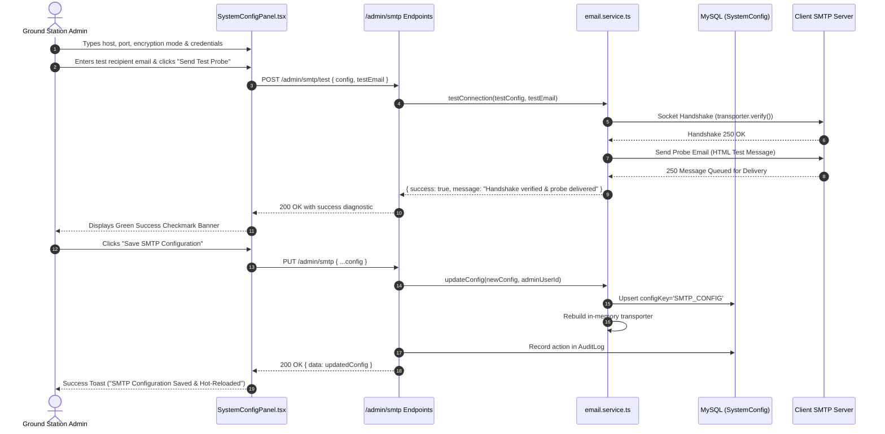
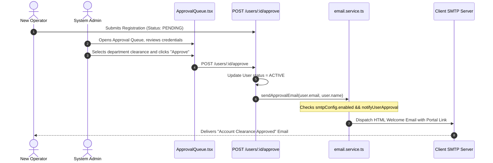
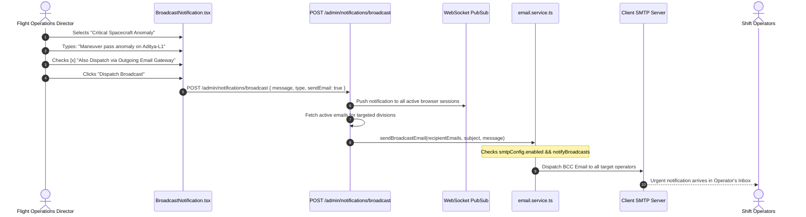
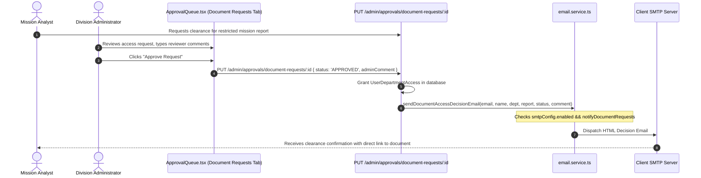
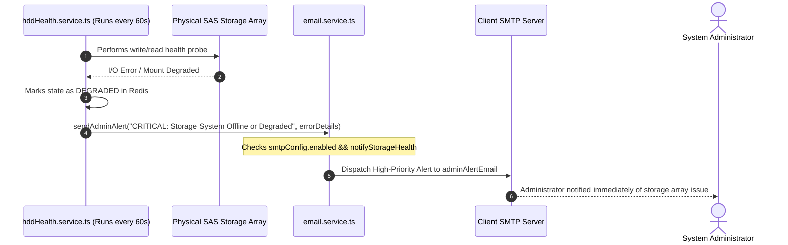

# ISTRAC-FMS Configurable Email Service: Architecture, Full Flow & Operational Guide

> **Document Identifier:** ISTRAC-FMS-EMAIL-GUIDE-V1.0  
> **Target Audience:** System Administrators, Ground Station Controllers, Developers, and Clients  
> **Classification:** ISTRAC Mission Control Internal Documentation  
> **System:** ISTRAC Flight Management & Telemetry System (ISTRAC-FMS)  
> **Last Updated:** September 2026  

---

## 📌 Executive Summary

Historically, sending emails in ISTRAC-FMS required developers to SSH into the Linux server terminal, edit a hidden `.env` file, and restart the backend system daemon. Any change of credentials, ports, or SMTP relays resulted in system downtime and manual engineering effort.

The system now features a **Dynamic, Web-Configurable Outgoing Mail Gateway**. Administrators can update the SMTP server, authentication credentials, security encryption protocols, and notification event policies directly from their web browser in the **System Configuration** panel.

- **Zero Downtime:** Updates are hot-reloaded into memory immediately. No server restart is needed.
- **Pre-Flight Verification:** Admins can test server handshakes and dispatch test probe emails before committing changes.
- **Air-Gapped Intranet Support:** Full support for unauthenticated internal relays on port 25 and self-signed TLS certificates common to secure ISRO ground networks.
- **Granular Dispatch Matrix:** Admins can selectively enable or disable individual automated email categories (approvals, password resets, hardware alerts, broadcasts, and document clearances).

---

## 1. System Architecture & Component Breakdown

### What Is Used & Why It Is Used

```
┌──────────────────────────────────────────────────────────────────────────────────────────────────┐
│                                   ISTRAC-FMS WEB FRONTEND                                        │
│  • SystemConfigPanel.tsx (SMTP Gateway Card & Test Tool)   • BroadcastNotification.tsx (BCC Relay)│
│  • ApprovalQueue.tsx (User & Document Clearance)           • ForgetPassword.tsx (Reset Dispatch) │
└────────────────────────────────────────────────┬─────────────────────────────────────────────────┘
                                                 │ HTTPS / JSON API
                                                 ▼
┌──────────────────────────────────────────────────────────────────────────────────────────────────┐
│                                    BACKEND API CONTROLLERS                                       │
│  • /admin/smtp (GET / PUT)                     • /admin/smtp/test (POST Live Probe)              │
│  • /admin/notifications/broadcast (POST)       • /admin/approvals/document-requests/:id (PUT)    │
└────────────────────────────────────────────────┬─────────────────────────────────────────────────┘
                                                 │
                                                 ▼
┌──────────────────────────────────────────────────────────────────────────────────────────────────┐
│                                    EMAIL SERVICE CORE ENGINE                                     │
│                                (backend/src/services/email.service.ts)                           │
│  • Dynamic Config Resolver (SystemConfig -> DB Cache -> .env fallback)                          │
│  • In-Memory Transporter Factory (Lazy loaded, hot-reloads on update)                             │
│  • Credential Masker (Guarantees passwords never return to browser)                              │
│  • Socket Verifier (transporter.verify() with timeout safeguards)                                │
└───────────────────────┬──────────────────────────────────────────┬───────────────────────────────┘
                        │                                          │
                        ▼                                          ▼
┌─────────────────────────────────────────────────┐      ┌─────────────────────────────────────────┐
│              PERSISTENT STORAGE                 │      │        OUTGOING MAIL GATEWAYS           │
│  • MySQL (SystemConfig: 'SMTP_CONFIG')          │      │  • Microsoft 365 / Outlook (STARTTLS)   │
│  • MySQL (AuditLog: Records who changed config) │      │  • Google Workspace / Gmail (SSL / TLS) │
│                                                 │      │  • Air-Gapped ISRO Postfix Relay (Port 25)
└─────────────────────────────────────────────────┘      └─────────────────────────────────────────┘
```

| Component | File / Location | Why It Is Used |
| :--- | :--- | :--- |
| **`SystemConfig` Table** | MySQL Database (`backend/prisma/schema.prisma`) | Stores SMTP settings as a JSON payload (`SMTP_CONFIG`). Eliminates hardcoded `.env` files and survives server restarts without schema migrations. |
| **Nodemailer Engine** | `backend/src/services/email.service.ts` | Industry standard SMTP client for Node.js. Handles TLS/STARTTLS handshakes, connection timeouts, MIME formatting, and HTML email templating. |
| **Hot-Reload Cache** | `backend/src/services/email.service.ts` | Keeps the active mail transporter in memory so emails send instantly without re-reading the database every time. When an admin updates settings, the transporter is re-built in real-time. |
| **Credential Masking** | `backend/src/services/email.service.ts` | `getPublicConfig()` masks the raw password (`hasPassword: true`) so browser inspect tools cannot compromise mail server passwords. |
| **Admin SMTP Endpoints** | `backend/src/routes/smtp.routes.ts` | Protected REST endpoints (`/admin/smtp` and `/admin/smtp/test`) secured by `authMiddleware` and `adminMiddleware` for fetching, updating, and testing configurations. |
| **SMTP Gateway UI** | `frontend/src/pages/SystemConfigPanel.tsx` | Dedicated web console interface for administrators to manage host, port, security, credentials, live probes, and event notification policies. |
| **Broadcast Relay Toggle** | `frontend/src/pages/BroadcastNotification.tsx` | Allows shift flight directors to blast critical operational notices simultaneously via WebSockets and email BCC. |

---

## 2. Complete End-to-End Email Service Flows

### Flow 1: Administrator Configures & Tests SMTP Gateway



---

### Flow 2: Operator Account Approval Workflow



---

### Flow 3: Critical Operations Broadcast Dispatch



---

### Flow 4: Document & Report Access Clearance



---

### Flow 5: Automated Physical Storage Degradation Alert



---

## 3. Where the Administrator Can Change Settings

Administrators configure all mail services from a single web screen:

1. **Log in** with an administrator account (`ADMIN` role).
2. Click **System Settings** in the navigation bar (or navigate directly to `/admin/system-config`).
3. Scroll to **Section 4: Outgoing Mail Gateway (SMTP) & Alert Relay Center**.

### Available Configuration Controls:

| Control Field | Description | Example Values |
| :--- | :--- | :--- |
| **Enable Outgoing Email Gateway** | Master toggle to turn email dispatch ON or OFF globally. | `Checked (ON)` / `Unchecked (OFF)` |
| **Server Host / IP** | Hostname or local intranet IP of the outgoing mail server. | `smtp.office365.com`, `smtp.gmail.com`, or `10.20.0.15` |
| **Port Number** | Outgoing SMTP listening port. | `587` (STARTTLS), `465` (SSL), `25` (Plain relay) |
| **Security Protocol** | Handshake security type. | `STARTTLS`, `SSL / TLS`, or `Plain / None` |
| **Allow Self-Signed Certificates** | Bypasses public certificate authority verification for private intranet mail servers. | `Checked` (for air-gapped ISRO relays) |
| **SMTP Username** | Login account for authenticated SMTP servers. | `alerts@client.org` (can be blank for open IP relays) |
| **SMTP Password** | Secret password or App Password. Masked once saved. | Enter new secret, or leave blank to keep saved secret |
| **Sender Display Name** | The name that appears in recipient inboxes. | `ISTRAC Mission Control` |
| **Sender Email Address** | The `From:` header email address. | `alerts@istrac.gov.in` |
| **Admin Alert Recipient Email** | Inbox that receives storage degradation alerts and system failure notices. | `director.istrac@isro.gov.in` |
| **Automated Dispatch Matrix** | 5 independent checkboxes for individual notification triggers. | Approvals, Password Resets, Storage Alerts, Broadcasts, Clearances |

---

## 4. How the Administrator Can Test All Email Services

### Test 1: Handshake & Live Test Probe (Built-in Verification Tool)
1. In the **Outgoing Mail Gateway** card, locate **3. Live Handshake & Verification Probe**.
2. Type an active email address into the **Test recipient email** box (e.g., your own work email).
3. Click **Send Test Probe & Verify**.
4. **Expected Result:**
   - The button shows a spinner while testing.
   - Within 1–3 seconds, a green banner appears:  
     `✅ Verification Handshake Succeeded: Handshake verified and test probe delivered to <your-email>`.
   - Check your inbox for the branded test email titled `[ISTRAC-FMS] SMTP Gateway Verification Probe`.

---

### Test 2: User Account Approval & Rejection Emails
1. Register a dummy user from the public `/register` page.
2. Log in as Admin and open `/admin/approvals` (**Approval Queue**).
3. Under the **Pending Approvals** tab, locate the user.
4. Click **Approve Clearance**, select role and divisions, and confirm.
5. **Expected Result:** The user receives an onboarding email containing an immediate login button to the portal.
6. Repeat with a second registration and click **Reject Registration**, supplying a reason. The user receives an email detailing the rejection reason.

---

### Test 3: Password Reset Email Flow
1. Open the portal login page (`/login`) and click **Forgot Password**.
2. Type the registered email address of an active user and click **Send Reset Link**.
3. **Expected Result:** A password reset email arrives with a secure 15-minute token link:  
   `http://<server-ip>:5173/reset-password?token=...`

---

### Test 4: Operations Broadcast Email Relay
1. Open **Operations Broadcast & Alert Center** (`/admin/broadcast`).
2. Select priority (e.g., `Ground Station Alert`).
3. Type a message in the composer.
4. Select target audience (e.g., `Specific Operational Divisions` -> `TTC`).
5. Check the box **[x] Also Dispatch via Outgoing Email Gateway**.
6. Click **Dispatch Broadcast**.
7. **Expected Result:** All active operators assigned to the selected division receive a BCC copy of the operational bulletin in their inbox.

---

### Test 5: Document Access Clearance Decision Email
1. Log in as a Member account, browse a restricted department or report, and submit an access request with a reason.
2. Log in as Admin, go to `/admin/approvals`, and click the **Document Requests** tab.
3. Click **Decide / Process**, enter an optional comment, and click **Approve** or **Reject**.
4. **Expected Result:** The requesting member receives an automated notification email detailing the clearance status and the administrator's comment.

---

## 5. Real-World Client Setup Scenarios

### Scenario A: Microsoft 365 / Exchange Online
- **Server Host:** `smtp.office365.com`
- **Port:** `587`
- **Security Protocol:** `STARTTLS`
- **Allow Self-Signed Certs:** `Unchecked`
- **Username:** `notifications@client-organization.com`
- **Password:** Office 365 App Password (generate in Microsoft Entra Security)
- **Sender Email:** `notifications@client-organization.com`

---

### Scenario B: Google Workspace / Gmail
- **Server Host:** `smtp.gmail.com`
- **Port:** `587` (or `465`)
- **Security Protocol:** `STARTTLS` (or `SSL / TLS` for 465)
- **Allow Self-Signed Certs:** `Unchecked`
- **Username:** `mission-alerts@your-domain.edu`
- **Password:** 16-character Google Workspace App Password
- **Sender Email:** `mission-alerts@your-domain.edu`

---

### Scenario C: ISRO Air-Gapped Intranet Relay (Internal Postfix / Exchange)
- **Server Host:** Internal IP or Hostname (e.g., `10.20.4.15` or `mailrelay.istrac.lan`)
- **Port:** `25` (or `587`)
- **Security Protocol:** `Plain / None` (or `STARTTLS`)
- **Allow Self-Signed Certs:** `Checked`
- **Username & Password:** Leave blank if the internal relay authenticates based on source server IP.
- **Sender Email:** `alerts@istrac.gov.in`

---

## 6. Common Diagnostics & Troubleshooting

| Symptom / Error | Cause | Resolution |
| :--- | :--- | :--- |
| `ETIMEDOUT` / Connection Timed Out | Outgoing firewall blocks port 587/465 or IP is incorrect. | Ensure Linux server firewall allows outbound traffic: `sudo ufw allow out 587/tcp` or verify security group rules. |
| `EAUTH` / Authentication Failed | Invalid username or password; or 2-factor authentication blocked standard password. | For Office 365 or Gmail, generate an **App Password** instead of using the primary personal account password. |
| `SELF_SIGNED_CERT_IN_CHAIN` | Private internal mail server uses custom or self-signed SSL certificate. | Enable the **"Allow Self-Signed Certificates"** checkbox in the Admin screen. |
| Emails send, but sender displays `no-reply@istrac.gov.in` | Sender Email field was not configured. | Set **Sender Email Address** and **Sender Display Name** to match the authenticated domain. |
| Specific email notifications not arriving | Corresponding trigger in the notification matrix is disabled. | Check the **Automated Email Dispatch Matrix** in System Settings and ensure the relevant checkbox is enabled. |

---

## 7. Verification Checklist

- [x] Dynamic database resolver implemented in `backend/src/services/email.service.ts`
- [x] Transporter hot-reload without server restarts
- [x] REST endpoints mounted in `backend/src/routes/smtp.routes.ts`
- [x] Full UI configuration and live probe test card added to `frontend/src/pages/SystemConfigPanel.tsx`
- [x] Email dispatch toggle added to `frontend/src/pages/BroadcastNotification.tsx`
- [x] Document clearance email notifications hooked into `backend/src/routes/user.routes.ts`
- [x] Full TypeScript compilation passed on both backend and frontend (`tsc` code 0)
