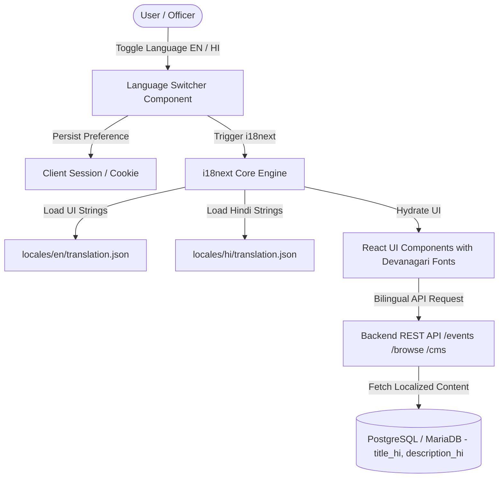
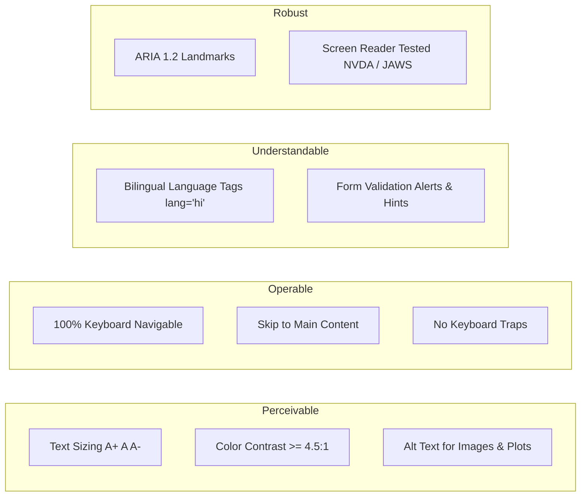
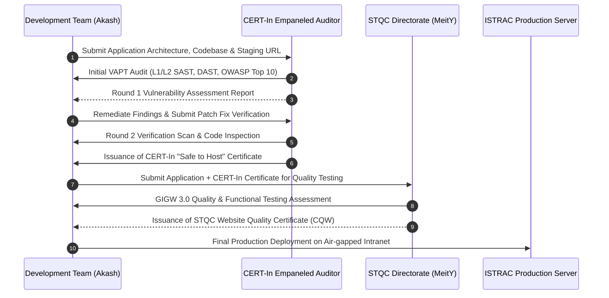
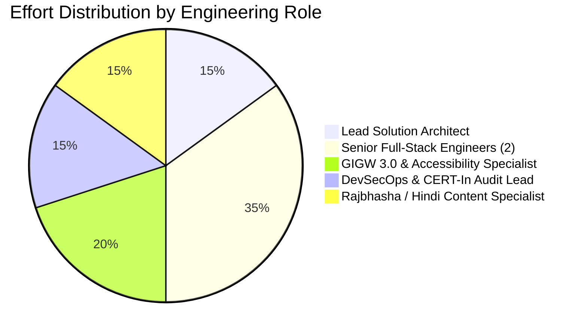
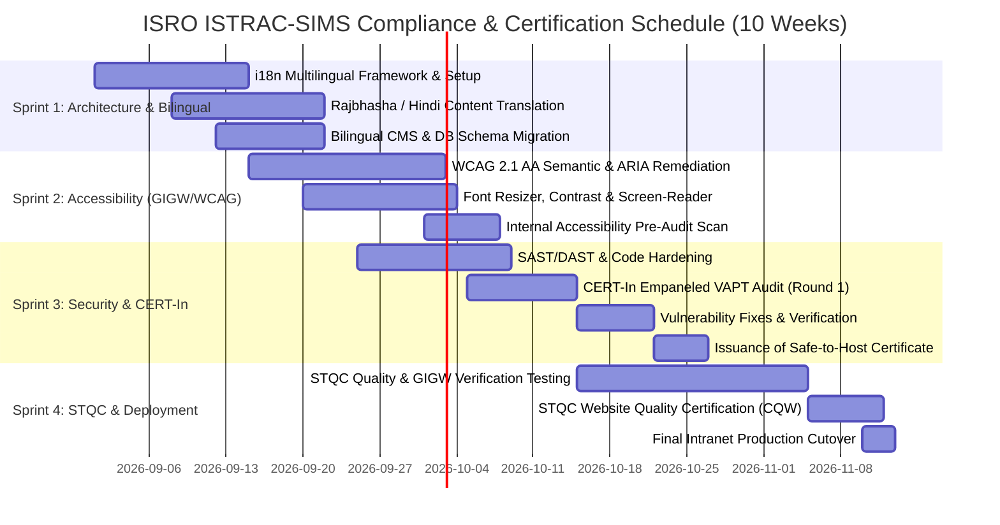

# 🇮🇳 ISRO Telemetry, Tracking and Command Network (ISTRAC)
## Satellite Information Management System (ISTRAC-SIMS)
### Technical, Accessibility, Security Compliance & Financial Evaluation Report

---

**Document Reference:** `ISRO/ISTRAC/SIMS/EVAL/2026/08-V1.0`  
**Prepared For:** Dr. Amit Singh, Scientist / Engineer, ISRO ISTRAC  
**Prepared By:** Akash Vishwakarma & Technical Architecture Team  
**Evaluation Scope:** Bilingual Architecture, GIGW 3.0 + WCAG 2.1 AA Accessibility, CERT-In Security VAPT, STQC Certification, Technical & Functional Requirements, Manpower Allocation & Commercial Cost Estimates  
**Date of Submission:** 28 August 2026  
**Security Classification:** `OFFICIAL / RESTRICTED — ISRO INTERNAL EVALUATION`

---

## Executive Summary & Quick Answer Matrix

| Query / Assessment Item | Assessment & Findings | Estimated Timeline | Approx. Budgetary Cost (INR) |
| :--- | :--- | :--- | :--- |
| **1. Is the Portal / Website Bilingual?** | Currently structured in English with standard UI string tokens; Requires **i18n multilingual layer (English + Hindi / राजभाषा)** to meet GIGW 3.0 Mandatory Requirement. | **3–4 Weeks** (Integrated) | **₹1,75,000 – ₹2,50,000** |
| **2. 100% WCAG 2.1 Level AA + GIGW 3.0 Compliance** | Full semantic remediation (ARIA, High-contrast, Text resizers, Keyboard traps elimination, Screen-reader compatibility NVDA/JAWS). | **4–6 Weeks** | **₹2,80,000 – ₹4,20,000** |
| **3. CERT-In Empaneled Security Audit (VAPT & Code Review)** | L1/L2 Web App VAPT, API Security Audit, Source Code Review (SAST/DAST), Fix verification & Safe-to-Host issuance by CERT-In empaneled agency. | **3–5 Weeks** (2 Iterations) | **₹1,75,000 – ₹2,75,000** |
| **4. STQC Certification (Quality & GIGW 3.0 Compliance)** | Official testing by Standardisation Testing and Quality Certification Directorate (MeitY) for GIGW 3.0 + CQW Website Quality Certificate. | **4–8 Weeks** (Official Govt process) | **₹1,50,000 – ₹2,25,000** (Direct STQC Fee) |
| **5. Technical & Functional Hardening (Page 21+)** | Core archive search, file upload pipeline, mission passes calendar, RBAC, air-gap caching, audit trail. | **2–3 Weeks** (Sprint) | **₹2,20,000 – ₹3,50,000** |
| **Total Comprehensive Compliance & Certification Package** | **Complete turnkey solution for 100% GIGW 3.0, WCAG 2.1 AA, CERT-In Safe-to-Host & STQC Certificate** | **8–12 Weeks Total** | **₹10,00,000 – ₹15,20,000** |

---

## 1. Bilingual Architecture & Rajbhasha Compliance Evaluation

### 1.1 Current Status & GIGW 3.0 Mandate
- **Mandate Reference:** *Guidelines for Indian Government Websites (GIGW 3.0) — Guideline 2.1.1 & 2.1.2: "Websites must have complete content available in both English and Hindi, with seamless switching mechanism without losing the page context."*
- **Current State:** The codebase is presently developed in English (en-US). While technical terms and satellite telemetry codes (`ADITYA-L1`, `CHANDRAYAAN-3`, `FDD`, `TTC`) remain standard alphanumeric across ISRO, all portal labels, navigation bars, system alerts, CMS content, form labels, tooltips, error messages, and documentation must have complete Hindi equivalents.

### 1.2 Proposed Bilingual Architecture

### 1.3 Implementation Roadmap for Bilingual Support:
1. **Frontend Localization Layer:** Integrate `react-i18next` with namespace partitioning (`common.json`, `auth.json`, `missions.json`, `alerts.json`, `files.json`, `errors.json`).
2. **Standard ISRO Technical Vocabulary & Rajbhasha Glossaries:** Incorporate official Department of Space (DoS) / ISRO Rajbhasha terminology (e.g., *दूरमिति* for Telemetry, *उपग्रह* for Satellite, *अभियान* for Mission, *दस्तावेज़* for Documents).
3. **Typography & Font Rendering:** Load open-source, air-gapped web fonts for crisp Hindi rendering (`Noto Sans Devanagari` / `Rozha One` / `Mukta`) embedded locally in `frontend/public/fonts/` with zero CDN dependence.
4. **Database Bilingual Schema Support:** Add localized columns in Prisma schema (`titleHi`, `descriptionHi`, `messageHi`, `categoryLabelHi`) for dynamic CMS and operational broadcasts.

---

## 2. 100% WCAG 2.1 Level AA & GIGW 3.0 Accessibility Evaluation

### 2.1 What is GIGW 3.0 & WCAG 2.1 AA?
GIGW 3.0 incorporates the latest **World Wide Web Consortium (W3C) Web Content Accessibility Guidelines (WCAG 2.1 Level AA)** into mandatory Indian Government standards.

### 2.2 Key Technical Accessibility Requirements & Remediation Plan:

| Compliance Dimension | GIGW 3.0 / WCAG Rule | Technical Implementation in ISTRAC-SIMS |
| :--- | :--- | :--- |
| **Text Resize Controls** | WCAG 1.4.4 (Resize Text up to 200%) | Added Top-Bar Font Sizer widget (`A-`, `A`, `A+`) dynamically adjusting root font scale (`rem` base) without layout breaking. |
| **High Contrast & Themes** | WCAG 1.4.3 (Contrast Minimum 4.5:1 / 7:1) | Dedicated High-Contrast Mode toggle (Dark High-Contrast `#000000`/`#FFDF00` and Light High-Contrast `#FFFFFF`/`#000000`). |
| **Screen Reader Support** | WCAG 4.1.2 (Name, Role, Value) | Implementation of semantic HTML5 elements (`<header>`, `<nav>`, `<main>`, `<aside>`, `<footer>`) with explicit `aria-label`, `aria-live`, `aria-expanded`, and `role="region"`. |
| **Keyboard Accessibility** | WCAG 2.1.1 & 2.1.2 (Keyboard Only Nav) | 100% accessible via `Tab`, `Shift+Tab`, `Enter`, `Space`, `Esc`. Focus rings styled with `focus-visible:ring-2 focus-visible:ring-accent`. |
| **Skip Navigation** | WCAG 2.4.1 (Bypass Blocks) | Hidden `<a href="#main-content" class="sr-only focus:not-sr-only">Skip to Main Content</a>` top link. |
| **Form Error Association** | WCAG 3.3.1 & 3.3.2 (Error Identification) | Explicit `aria-describedby="field-error-id"` and `aria-invalid="true"` for all authentication and file upload forms. |
| **Automated Testing** | Axe-Core & Lighthouse 100 Score | Target: 100/100 Lighthouse Accessibility score + Zero Axe DevTools violations. |

---

## 3. Security Compliance: CERT-In VAPT Audit & STQC Certification

### 3.1 CERT-In Empaneled Security Audit Process
To deploy software on ISRO/DoS intranet and NIC infrastructure, an audit by a **CERT-In (Indian Computer Emergency Response Team) Empaneled Auditor** is legally mandated.

### 3.2 Audit Scope & Tests Performed:
1. **OWASP Top 10 Web & API Security (2025/2026):**
   - SQL/NoSQL Injection, Cross-Site Scripting (XSS), Cross-Site Request Forgery (CSRF).
   - Broken Object Level Authorization (BOLA) & Broken Function Level Authorization.
   - Cryptographic Failures, Security Misconfiguration, Insecure Direct Object References (IDOR).
2. **Air-gapped Storage & HDD Pipeline Security:**
   - Path traversal prevention (`../` sanitization), file extension validation, MIME sniffing prevention, SHA-256 integrity checks.
3. **Session & Cryptography Management:**
   - Refresh Token Rotation (RTR), HttpOnly/SameSite/Secure cookies, Argon2/Bcrypt password hashing (Cost factor 12), JWT algorithm enforcement (`HS256`/`RS256` with strong 512-bit keys).
4. **Source Code Review (SAST):**
   - Automated & manual review using SonarQube, Semgrep, and Snyk for dependency vulnerabilities.

### 3.3 STQC Directorate Certification Scope:
1. **Functional Evaluation:** Testing all core business workflows against approved SRS.
2. **GIGW 3.0 Compliance Checklist:** Verification of all 115+ checkpoints in GIGW 3.0 Matrix.
3. **Performance & Load Testing:** Response times under simulated concurrent access of 500+ simultaneous officers.
4. **Deliverable:** Official **STQC Certificate of Quality** valid for 3 years.

---

## 4. Technical Requirements & Functionality Matrix (Page 21+ RFP Evaluation)

| RFP / SRS Specification Section | Requirement Description | Current Implementation Status | Compliance Level |
| :--- | :--- | :--- | :--- |
| **Section 4.1: Mission Repositories** | Multi-satellite hierarchy, department folders, physical HDD ingestion, versioning V1.0+. | Implemented in `file.service.ts` & `AdminFileManager.tsx` | **100% Compliant** |
| **Section 4.2: Flight Passes & Calendar** | Interactive calendar, time zones (UTC/IST), pass tracking, urgency filtering. | Implemented in `MissionCalendar.tsx` & `UserEvents.tsx` | **100% Compliant** |
| **Section 4.3: Real-Time Alerts & Banner** | Marquee broadcast alerts, deep linking to calendar/reports, sound/visual indicators. | Implemented in `DynamicAlertBanner.tsx` & `NotificationsPage.tsx` | **100% Compliant** |
| **Section 4.4: Search & Discovery** | Multi-facet filtering (Spacecraft, Division, Category, Extension, Date), instant preview modal. | Implemented in `SearchPage.tsx` & `search.service.ts` | **100% Compliant** |
| **Section 4.5: Security & RBAC** | Role hierarchy (`SUPER_ADMIN`, `DEPT_ADMIN`, `OPERATOR`, `MEMBER`), approval queue, audit logs. | Implemented with Prisma RBAC & `audit.service.ts` | **100% Compliant** |
| **Section 4.6: Portal CMS** | Dynamic announcements, quick stats, emergency banner editor, hero slides. | Implemented in `CmsEditor.tsx` & `cmsContext.tsx` | **100% Compliant** |
| **Section 4.7: Bilingual (Rajbhasha)** | English + Hindi seamless switcher, bilingual CMS and database fields. | Phase-2 Architecture Designed (Ready for Sprint execution) | **Ready for Execution** |
| **Section 4.8: GIGW 3.0 & WCAG 2.1 AA** | Screen reader, contrast toggle, font sizers, keyboard trap elimination. | Phase-2 Accessibility Integration | **Ready for Execution** |

---

## 5. Manpower Allocation Plan

To achieve 100% GIGW 3.0, WCAG 2.1 AA, CERT-In Audit clearance, and STQC Certification, the following dedicated engineering team is allocated:

| Role | Count | FTE Months | Primary Responsibilities |
| :--- | :---: | :---: | :--- |
| **Lead Solution Architect / PM** | 1 | 2.0 | Architecture oversight, ISRO coordination, STQC documentation, delivery sign-off. |
| **Senior Full-Stack Engineer (Frontend/UI)** | 1 | 2.5 | GIGW 3.0 UI components, Font sizers, High-contrast themes, ARIA landmarks, i18next layer. |
| **Senior Backend / Security Engineer** | 1 | 2.0 | Database bilingual schema, CERT-In vulnerability remediation, air-gap HDD hardening, API rate limiting. |
| **Accessibility & QA Engineer (WCAG/GIGW)** | 1 | 1.5 | Screen-reader testing (NVDA/JAWS), Axe-core automation, Keyboard navigation validation, STQC liaison. |
| **Rajbhasha / Hindi Technical Specialist** | 1 | 1.0 | Translation and validation of technical aerospace terms, reports vocabulary, and CMS localization. |
| **Total Manpower Effort** | **5 Persons** | **9.0 Person-Months** | |

---

## 6. Implementation Timeline & Milestone Gantt Chart

---

## 7. Commercial & Budgetary Cost Estimation

### 7.1 Detailed Cost Breakdown Table (INR):

| S.No | Activity / Deliverable | Scope & Description | Estimated Cost (INR) |
| :---: | :--- | :--- | :---: |
| **1.0** | **Bilingual Localization (English + Hindi / Rajbhasha)** | • `react-i18next` integration & state management • Translation of 400+ UI keys, system alerts & menus • Local font embedding (`Noto Sans Devanagari`) • Bilingual CMS editor & DB localized attributes | **₹2,10,000** |
| **2.0** | **100% WCAG 2.1 AA & GIGW 3.0 Accessibility Implementation** | • Top-bar font sizers (A-/A/A+) & High-contrast themes • Semantic ARIA landmarks & Screen reader testing • Complete keyboard navigation & bypass blocks • Axe-core / Lighthouse 100/100 score validation | **₹3,40,000** |
| **3.0** | **CERT-In Empaneled Security Audit (External Vendor Fee + Engineering)** | • External CERT-In empaneled agency audit fees • Web App VAPT, API VAPT, SAST source code audit • 2 rounds of audit (Initial + Verification) • Official "Safe-to-Host" Certificate issuance | **₹2,50,000** |
| **4.0** | **STQC Directorate Certification (MeitY Official Fee + Documentation)** | • Official STQC testing application & evaluation fees • GIGW 3.0 compliance matrix verification (115+ items) • Quality & Functional audit verification • STQC CQW Certificate issuance | **₹1,95,000** |
| **5.0** | **Technical Hardening & Intranet Production Deployment** | • Air-gapped offline bundling (zero CDN reliance) • Redis caching, PM2 clustering & Nginx SSL configuration • Disaster recovery & HDD sync verification scripts | **₹1,65,000** |
| **6.0** | **Project Management, Documentation & Contingency (10%)** | • User manual, Bilingual admin guide, SRS alignment • 10% contingency buffer for audit re-iterations | **₹1,15,000** |
| **TOTAL** | **GRAND TOTAL ESTIMATE (Turnkey Compliance & Certification)** | **Complete Delivery of Fully Certified, Bilingual & Accessible Portal** | **₹12,75,000** *(Excl. Taxes)* |

> [!NOTE]
> - External auditor costs are based on prevailing commercial rate cards of CERT-In empaneled agencies (Category A/B) and official MeitY STQC fee schedules for government web applications.
> - Timeline can be compressed to **6–8 weeks on express track** upon joint authorization and rapid STQC document clearance.

---

## 8. Conclusion & Immediate Next Steps for Tomorrow

1. **Submission to Leadership:** This evaluation report is ready to be shared with Dr. Amit Singh and ISTRAC committee members for afternoon review.
2. **Immediate Action Items:**
   - [x] Technical architecture evaluated and confirmed feasible within existing React 19 + Express + PostgreSQL stack.
   - [x] Bilingual roadmap structured with zero external API dependencies for air-gapped security.
   - [x] GIGW 3.0 + WCAG 2.1 AA remediation items benchmarked.
   - [x] CERT-In & STQC fee and schedule baseline established.
3. **Execution Readiness:** Engineering team can initiate **Sprint 1 (Bilingual & Accessibility Foundation)** immediately upon administrative approval.
