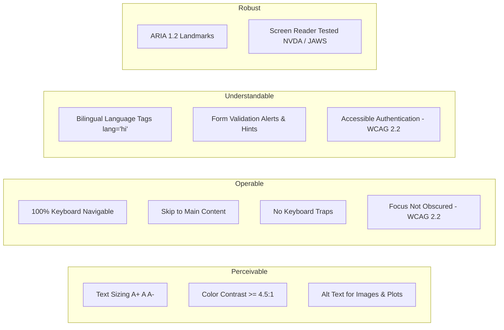
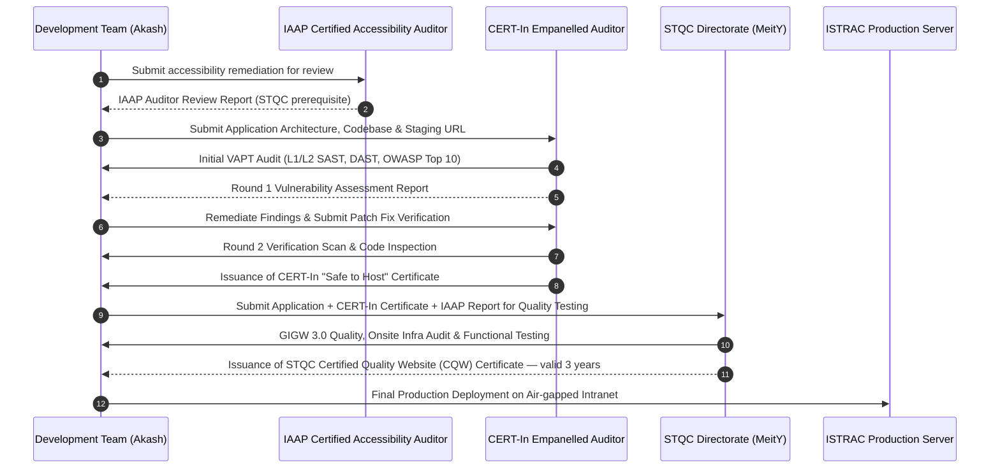
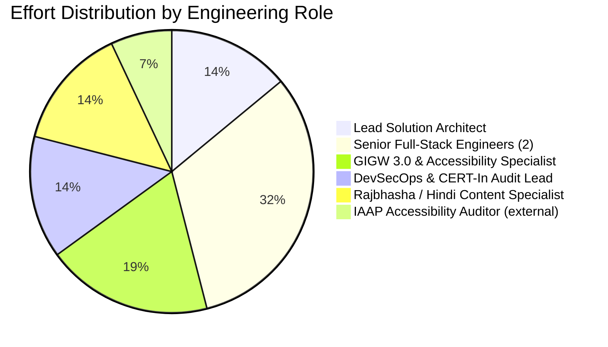
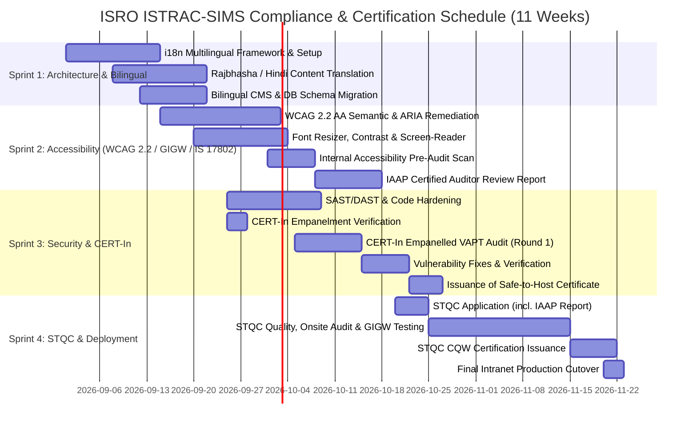

# 🇮🇳 ISRO Telemetry, Tracking and Command Network (ISTRAC)
## Satellite Information Management System (ISTRAC-SIMS)
### Technical, Accessibility, Security Compliance & Financial Evaluation Report

---

**Document Reference:** `ISRO/ISTRAC/SIMS/EVAL/2026/08-V2.0`
**Prepared For:** Dr. Amit Singh, Scientist / Engineer, ISRO ISTRAC
**Prepared By:** Akash Vishwakarma & Technical Architecture Team
**Evaluation Scope:** Bilingual Architecture, GIGW 3.0 + WCAG 2.2 AA Accessibility, IS 17802, CERT-In Security VAPT, STQC Certification, Technical & Functional Requirements, Manpower Allocation & Commercial Cost Estimates
**Date of Submission:** 28 August 2026
**Revision Note:** V2.0 updates V1.0 against the current GIGW 3.0 framework, published STQC fee schedule, and 2026 audit practice (WCAG 2.2 alignment, IAAP prerequisite, CERT-In empanelment verification).
**Security Classification:** `OFFICIAL / RESTRICTED — ISRO INTERNAL EVALUATION`

---

## Executive Summary & Quick Answer Matrix

| Query / Assessment Item | Assessment & Findings | Estimated Timeline | Approx. Budgetary Cost (INR) |
| :--- | :--- | :--- | :--- |
| **1. Is the Portal / Website Bilingual?** | Currently structured in English with standard UI string tokens; requires an **i18n multilingual layer (English + Hindi / राजभाषा)** to meet GIGW 3.0's language-inclusivity checkpoints. GIGW 3.0's own guidance is written for multi-language support broadly — EN+HI is the practical minimum scope for an ISTRAC intranet tool, but this should be recorded as a deliberate scoping decision, not a full GIGW language requirement. | **3–4 Weeks** (Integrated) | **₹1,75,000 – ₹2,50,000** |
| **2. WCAG 2.2 Level AA + GIGW 3.0 + IS 17802 Compliance** | Full semantic remediation (ARIA, high-contrast, text resizers, keyboard-trap elimination, screen-reader compatibility with NVDA/JAWS). **Target raised from WCAG 2.1 to WCAG 2.2 AA** — see Section 2.0 note. | **4–6 Weeks** | **₹2,80,000 – ₹4,20,000** |
| **3. CERT-In Empanelled Security Audit (VAPT & Code Review)** | L1/L2 Web App VAPT, API security audit, source code review (SAST/DAST), fix verification & Safe-to-Host issuance by a **currently empanelled** CERT-In auditor (category-verified — see Section 3.1). | **3–5 Weeks** (2 Iterations) | **₹1,75,000 – ₹2,75,000** |
| **4. IAAP Accessibility Auditor Review Report (NEW PREREQUISITE)** | STQC now requires an **IAAP-credentialed auditor's review report as a pre-condition for GIGW/STQC application** — this was not tracked in V1.0 and must be scheduled ahead of STQC submission. | **1–2 Weeks** (parallel with Sprint 2) | **₹60,000 – ₹90,000** |
| **5. STQC Certification (Quality & GIGW 3.0 Compliance)** | Official testing by the STQC Directorate (MeitY) for GIGW 3.0 + Certified Quality Website (CQW) mark, valid 3 years. **Official government fee is separate and far smaller than commercial prep cost** — see Section 3.3. | **4–8 Weeks** (Official Govt process, includes onsite audit) | **₹40,000 (official STQC fee)** + **₹1,10,000 – ₹1,85,000** (prep/consulting) |
| **6. Technical & Functional Hardening (Page 21+)** | Core archive search, file upload pipeline, mission passes calendar, RBAC, air-gap caching, audit trail. | **2–3 Weeks** (Sprint) | **₹2,20,000 – ₹3,50,000** |
| **Total Comprehensive Compliance & Certification Package** | **Complete turnkey solution for GIGW 3.0, WCAG 2.2 AA, IS 17802, CERT-In Safe-to-Host & STQC CQW Certificate** | **9–13 Weeks Total** | **₹10,60,000 – ₹15,70,000** |

---

## 1. Bilingual Architecture & Rajbhasha Compliance Evaluation

### 1.1 Current Status & GIGW 3.0 Mandate
- **Current framework:** GIGW 3.0, developed by the National Informatics Centre (NIC) with input from CERT-In and the STQC Directorate, superseded GIGW 2.0 in 2024 and is now the operative standard for all central and state government websites and apps — this report has been re-baselined against 3.0 accordingly.
- **Language scope:** GIGW 3.0's inclusivity guidance is written broadly around India's linguistic diversity, not just an English/Hindi pair. For ISTRAC-SIMS — an internal, air-gapped intranet tool for ISRO officers rather than a public citizen-facing portal — English + Hindi is a defensible scoping decision, but it should be explicitly minuted as such rather than assumed to satisfy the full GIGW language checkpoint by default.
- **Current State:** The codebase is presently developed in English (en-US). While technical terms and satellite telemetry codes (`ADITYA-L1`, `CHANDRAYAAN-3`, `FDD`, `TTC`) remain standard alphanumeric across ISRO, all portal labels, navigation bars, system alerts, CMS content, form labels, tooltips, error messages, and documentation must have complete Hindi equivalents.

### 1.2 Proposed Bilingual Architecture

### 1.3 Implementation Roadmap for Bilingual Support:
1. **Frontend Localization Layer:** Integrate `react-i18next` with namespace partitioning (`common.json`, `auth.json`, `missions.json`, `alerts.json`, `files.json`, `errors.json`).
2. **Standard ISRO Technical Vocabulary & Rajbhasha Glossaries:** Incorporate official Department of Space (DoS) / ISRO Rajbhasha terminology (e.g., *दूरमिति* for Telemetry, *उपग्रह* for Satellite, *अभियान* for Mission, *दस्तावेज़* for Documents).
3. **Typography & Font Rendering:** Load open-source, air-gapped web fonts for crisp Hindi rendering (`Noto Sans Devanagari` / `Rozha One` / `Mukta`) embedded locally in `frontend/public/fonts/` with zero CDN dependence.
4. **Database Bilingual Schema Support:** Add localized columns in the Prisma schema (`titleHi`, `descriptionHi`, `messageHi`, `categoryLabelHi`) for dynamic CMS and operational broadcasts.

---

## 2. WCAG 2.2 Level AA, GIGW 3.0 & IS 17802 Accessibility Evaluation

### 2.1 What is GIGW 3.0, WCAG & IS 17802?
GIGW 3.0 incorporates World Wide Web Consortium (W3C) accessibility guidance into mandatory Indian government standards. GIGW 3.0 defines **88 mandatory checkpoints across four domains — Quality, Accessibility, Cybersecurity, and Lifecycle Management** — a correction from the 115+ figure cited in the prior revision of this report.

> **⚠️ Target updated: WCAG 2.1 → WCAG 2.2 AA.**
> WCAG 2.1 Level AA remains the formally published minimum, but STQC and empanelled auditors are evaluating submissions against **WCAG 2.2 alignment in practice** as of 2026. Building only to 2.1 risks findings/rework during the STQC review cycle. This report now scopes remediation to WCAG 2.2 AA.
>
> Separately, **IS 17802** — the Bureau of Indian Standards' national web accessibility standard, aligned with WCAG 2.1 AA — applies to government and PSU systems and is checked by auditors alongside GIGW. Because IS 17802's baseline is 2.1, meeting WCAG 2.2 AA automatically satisfies it; no separate remediation track is needed, but it should be named explicitly in audit documentation since auditors will look for it.

### 2.2 Key Technical Accessibility Requirements & Remediation Plan:

| Compliance Dimension | Rule Reference | Technical Implementation in ISTRAC-SIMS |
| :--- | :--- | :--- |
| **Text Resize Controls** | WCAG 1.4.4 (Resize Text up to 200%) | Top-bar font sizer widget (`A-`, `A`, `A+`) dynamically adjusting root font scale (`rem` base) without layout breaking. |
| **High Contrast & Themes** | WCAG 1.4.3 (Contrast Minimum 4.5:1 / 7:1) | Dedicated high-contrast mode toggle (dark high-contrast `#000000`/`#FFDF00` and light high-contrast `#FFFFFF`/`#000000`). |
| **Screen Reader Support** | WCAG 4.1.2 (Name, Role, Value) | Semantic HTML5 elements (`<header>`, `<nav>`, `<main>`, `<aside>`, `<footer>`) with explicit `aria-label`, `aria-live`, `aria-expanded`, `role="region"`. |
| **Keyboard Accessibility** | WCAG 2.1.1 & 2.1.2 | 100% accessible via `Tab`, `Shift+Tab`, `Enter`, `Space`, `Esc`. Focus rings styled with `focus-visible:ring-2 focus-visible:ring-accent`. |
| **Focus Not Obscured** *(new in 2.2)* | WCAG 2.4.11 | Sticky headers/banners audited so focused elements are never fully hidden behind fixed UI (alert banner, nav bar). |
| **Accessible Authentication** *(new in 2.2)* | WCAG 3.3.8 | Login flow avoids cognitive-function tests (e.g., puzzle CAPTCHA) without an accessible alternative; supports password managers/paste. |
| **Skip Navigation** | WCAG 2.4.1 (Bypass Blocks) | Hidden `<a href="#main-content" class="sr-only focus:not-sr-only">Skip to Main Content</a>` link. |
| **Form Error Association** | WCAG 3.3.1 & 3.3.2 | Explicit `aria-describedby="field-error-id"` and `aria-invalid="true"` on all authentication and file upload forms. |
| **Automated + Manual Testing** | Axe-Core, Lighthouse, IAAP review | Target: 100/100 Lighthouse Accessibility score, zero Axe DevTools violations, **plus a signed-off IAAP auditor review report (see Section 3.1a)**. |

---

## 3. Security Compliance: CERT-In VAPT Audit & STQC Certification

### 3.0a Empanelment Verification (do this before vendor selection)
CERT-In empanelment is **category-specific** — a firm listed for one audit category (e.g., ISO 27001 implementation) is not automatically authorized for Web/API VAPT. Two checks before any vendor is engaged:
1. Confirm the firm appears on CERT-In's current published empanelled-auditor list.
2. Confirm the listing covers the **specific category** required here — Web Application VAPT / API Security Audit — not just a general cybersecurity listing.
Using a non-empanelled or wrongly-categorized auditor risks the Safe-to-Host report being rejected downstream at STQC, which would cost an entire audit cycle in rework.

### 3.1 CERT-In Empanelled Security Audit Process
To deploy software on ISRO/DoS intranet and NIC infrastructure, an audit by a **CERT-In (Indian Computer Emergency Response Team) empanelled auditor** is mandated.

### 3.1a NEW: IAAP Accessibility Auditor Review Report (STQC prerequisite)
STQC has introduced a **mandatory requirement for an IAAP (International Association of Accessibility Professionals) Certified Auditor Review Report as a pre-requisite for organisations applying for GIGW/STQC certification.** This was not part of the V1.0 audit flow and must now be scheduled as its own step — an IAAP-credentialed auditor reviews the accessibility remediation (Section 2) and issues a formal report, which STQC requires on file **before it will accept the certification application.** This sits between internal accessibility QA and STQC submission in the flow below.

### 3.2 Audit Scope & Tests Performed:
1. **OWASP Top 10 Web & API Security (2025/2026):**
   - SQL/NoSQL Injection, Cross-Site Scripting (XSS), Cross-Site Request Forgery (CSRF).
   - Broken Object Level Authorization (BOLA) & Broken Function Level Authorization.
   - Cryptographic Failures, Security Misconfiguration, Insecure Direct Object References (IDOR).
2. **Air-gapped Storage & HDD Pipeline Security:**
   - Path traversal prevention (`../` sanitization), file extension validation, MIME sniffing prevention, SHA-256 integrity checks.
3. **Session & Cryptography Management:**
   - Refresh Token Rotation (RTR), HttpOnly/SameSite/Secure cookies, Argon2/Bcrypt password hashing (Cost factor 12), JWT algorithm enforcement (`HS256`/`RS256` with strong 512-bit keys).
4. **Source Code Review (SAST):**
   - Automated & manual review using SonarQube, Semgrep, and Snyk for dependency vulnerabilities.

### 3.3 STQC Directorate Certification Scope & Real Fee Schedule
1. **Functional Evaluation:** Testing all core business workflows against approved SRS.
2. **GIGW 3.0 Compliance Checklist:** Verification against the **88 mandatory checkpoints** in the current GIGW 3.0 matrix.
3. **Onsite Infrastructure Audit:** STQC certification includes an onsite audit of IT and security infrastructure as part of the multi-stage evaluation — not just a remote document review. Plan physical/logistics access for the audit team.
4. **Performance & Load Testing:** Response times under simulated concurrent access of 500+ simultaneous officers.
5. **Deliverable:** Official **STQC Certified Quality Website (CQW) Certificate**, valid **3 years**.

> **Corrected fee structure.** STQC's own published Website Quality Certification fee schedule is:
> - Application fee: **₹10,000 + GST**
> - Audit testing & certification charge: **₹30,000 + GST**
> - Re-verification charge (per cycle, if required): **₹10,000 + GST**
>
> This is materially lower than the ₹1,50,000–2,25,000 figure carried in V1.0's Section 4.4 line item, which conflated the government fee with internal prep/consulting effort. V2.0 splits these: **~₹40,000 (incl. GST) as the direct STQC government fee**, with the remainder of the original estimate reclassified as internal documentation, remediation and liaison effort (Section 7).

---

## 4. Technical Requirements & Functionality Matrix (Page 21+ RFP Evaluation)

| RFP / SRS Specification Section | Requirement Description | Current Implementation Status | Compliance Level |
| :--- | :--- | :--- | :--- |
| **Section 4.1: Mission Repositories** | Multi-satellite hierarchy, department folders, physical HDD ingestion, versioning V1.0+. | Implemented in `file.service.ts` & `AdminFileManager.tsx` | **100% Compliant** |
| **Section 4.2: Flight Passes & Calendar** | Interactive calendar, time zones (UTC/IST), pass tracking, urgency filtering. | Implemented in `MissionCalendar.tsx` & `UserEvents.tsx` | **100% Compliant** |
| **Section 4.3: Real-Time Alerts & Banner** | Marquee broadcast alerts, deep linking to calendar/reports, sound/visual indicators. | Implemented in `DynamicAlertBanner.tsx` & `NotificationsPage.tsx` | **100% Compliant** |
| **Section 4.4: Search & Discovery** | Multi-facet filtering (Spacecraft, Division, Category, Extension, Date), instant preview modal. | Implemented in `SearchPage.tsx` & `search.service.ts` | **100% Compliant** |
| **Section 4.5: Security & RBAC** | Role hierarchy (`SUPER_ADMIN`, `DEPT_ADMIN`, `OPERATOR`, `MEMBER`), approval queue, audit logs. | Implemented with Prisma RBAC & `audit.service.ts` | **100% Compliant** |
| **Section 4.6: Portal CMS** | Dynamic announcements, quick stats, emergency banner editor, hero slides. | Implemented in `CmsEditor.tsx` & `cmsContext.tsx` | **100% Compliant** |
| **Section 4.7: Bilingual (Rajbhasha)** | English + Hindi seamless switcher, bilingual CMS and database fields. | Phase-2 Architecture Designed (Ready for Sprint execution) | **Ready for Execution** |
| **Section 4.8: WCAG 2.2 AA, GIGW 3.0 & IS 17802** | Screen reader, contrast toggle, font sizers, keyboard trap elimination, focus-not-obscured, accessible authentication. | Phase-2 Accessibility Integration (scope raised to WCAG 2.2) | **Ready for Execution** |
| **Section 4.9: IAAP Auditor Review Report** *(new)* | Independent IAAP-credentialed review, required before STQC application. | Not yet scheduled | **To Be Scheduled — Sprint 2 dependency** |

---

## 5. Manpower Allocation Plan

To achieve GIGW 3.0, WCAG 2.2 AA, IS 17802, CERT-In audit clearance, IAAP review, and STQC certification, the following dedicated engineering team is allocated:

| Role | Count | FTE Months | Primary Responsibilities |
| :--- | :---: | :---: | :--- |
| **Lead Solution Architect / PM** | 1 | 2.0 | Architecture oversight, ISRO coordination, STQC documentation, delivery sign-off. |
| **Senior Full-Stack Engineer (Frontend/UI)** | 1 | 2.5 | GIGW 3.0 UI components, font sizers, high-contrast themes, ARIA landmarks, i18next layer, WCAG 2.2-specific fixes (focus visibility, accessible auth). |
| **Senior Backend / Security Engineer** | 1 | 2.0 | Database bilingual schema, CERT-In vulnerability remediation, air-gap HDD hardening, API rate limiting. |
| **Accessibility & QA Engineer (WCAG/GIGW)** | 1 | 1.5 | Screen-reader testing (NVDA/JAWS), Axe-core automation, keyboard navigation validation, STQC liaison, coordination with external IAAP auditor. |
| **Rajbhasha / Hindi Technical Specialist** | 1 | 1.0 | Translation and validation of technical aerospace terms, reports vocabulary, and CMS localization. |
| **IAAP Certified Accessibility Auditor** *(external, new)* | 1 | 0.5 | Independent review report required as STQC application prerequisite. |
| **Total Manpower Effort** | **5 internal + 1 external** | **9.5 Person-Months** | |

---

## 6. Implementation Timeline & Milestone Gantt Chart

---

## 7. Commercial & Budgetary Cost Estimation

### 7.1 Detailed Cost Breakdown Table (INR):

| S.No | Activity / Deliverable | Scope & Description | Estimated Cost (INR) |
| :---: | :--- | :--- | :---: |
| **1.0** | **Bilingual Localization (English + Hindi / Rajbhasha)** | • `react-i18next` integration & state management • Translation of 400+ UI keys, system alerts & menus • Local font embedding (`Noto Sans Devanagari`) • Bilingual CMS editor & DB localized attributes | **₹2,10,000** |
| **2.0** | **WCAG 2.2 AA, GIGW 3.0 & IS 17802 Accessibility Implementation** | • Top-bar font sizers (A-/A/A+) & high-contrast themes • Semantic ARIA landmarks & screen reader testing • Complete keyboard navigation & bypass blocks • WCAG 2.2 additions: focus-not-obscured, accessible authentication • Axe-core / Lighthouse 100/100 score validation | **₹3,50,000** |
| **3.0** | **IAAP Certified Auditor Review Report** *(new line item)* | • Independent accessibility review by IAAP-credentialed auditor • Formal report required as STQC application prerequisite | **₹75,000** |
| **4.0** | **CERT-In Empanelled Security Audit (External Vendor Fee + Engineering)** | • Empanelment category verification • External CERT-In empanelled agency audit fees • Web App VAPT, API VAPT, SAST source code audit • 2 rounds of audit (Initial + Verification) • Official "Safe-to-Host" Certificate issuance | **₹2,50,000** |
| **5.0** | **STQC Directorate Certification** | • **Official STQC government fee: ~₹40,000 (incl. GST)** — application + testing/certification charges • GIGW 3.0 compliance matrix verification (88 checkpoints) • Onsite infrastructure audit coordination • Internal documentation & liaison effort • STQC CQW Certificate issuance (valid 3 years) | **₹1,50,000** *(₹40,000 govt fee + ₹1,10,000 prep/liaison)* |
| **6.0** | **Technical Hardening & Intranet Production Deployment** | • Air-gapped offline bundling (zero CDN reliance) • Redis caching, PM2 clustering & Nginx SSL configuration • Disaster recovery & HDD sync verification scripts | **₹1,65,000** |
| **7.0** | **Project Management, Documentation & Contingency (10%)** | • User manual, bilingual admin guide, SRS alignment • 10% contingency buffer for audit re-iterations (incl. possible re-verification cycle at ₹10,000+GST each) | **₹1,20,000** |
| **TOTAL** | **GRAND TOTAL ESTIMATE (Turnkey Compliance & Certification)** | **Complete Delivery of Fully Certified, Bilingual & Accessible Portal — GIGW 3.0 / WCAG 2.2 AA / IS 17802 / CERT-In / STQC** | **₹13,20,000** *(Excl. Taxes)* |

> [!NOTE]
> - External CERT-In auditor and IAAP auditor costs are based on prevailing commercial rate cards; **confirm current empanelment category** for any shortlisted CERT-In vendor before contracting (empanelment lists are refreshed periodically).
> - The STQC government fee (~₹40,000 incl. GST) is fixed and published; only the internal prep/liaison portion is an estimate.
> - Timeline can be compressed on an express track upon joint authorization and rapid STQC/IAAP document clearance, but the onsite STQC infrastructure audit is a hard scheduling dependency that cannot be fully compressed.

---

## 8. Conclusion & Immediate Next Steps

1. **Submission to Leadership:** This revised evaluation report (V2.0) is ready to be shared with Dr. Amit Singh and the ISTRAC committee, incorporating current GIGW 3.0 checkpoint counts, WCAG 2.2 target, the new IAAP prerequisite, and the corrected STQC fee schedule.
2. **Immediate Action Items:**
   - [x] Technical architecture evaluated and confirmed feasible within existing React 19 + Express + PostgreSQL stack.
   - [x] Bilingual roadmap structured with zero external API dependencies for air-gapped security.
   - [x] GIGW 3.0 (88 checkpoints) + WCAG 2.2 AA + IS 17802 remediation items benchmarked.
   - [x] CERT-In empanelment verification step added; IAAP auditor engagement identified as a new critical-path dependency.
   - [x] STQC fee and schedule baseline corrected against the Directorate's published schedule.
3. **Execution Readiness:** Engineering team can initiate **Sprint 1 (Bilingual & Accessibility Foundation)** immediately upon administrative approval. **Recommend engaging the IAAP auditor and verifying CERT-In vendor empanelment in parallel with Sprint 1**, since both sit on the critical path to STQC submission.