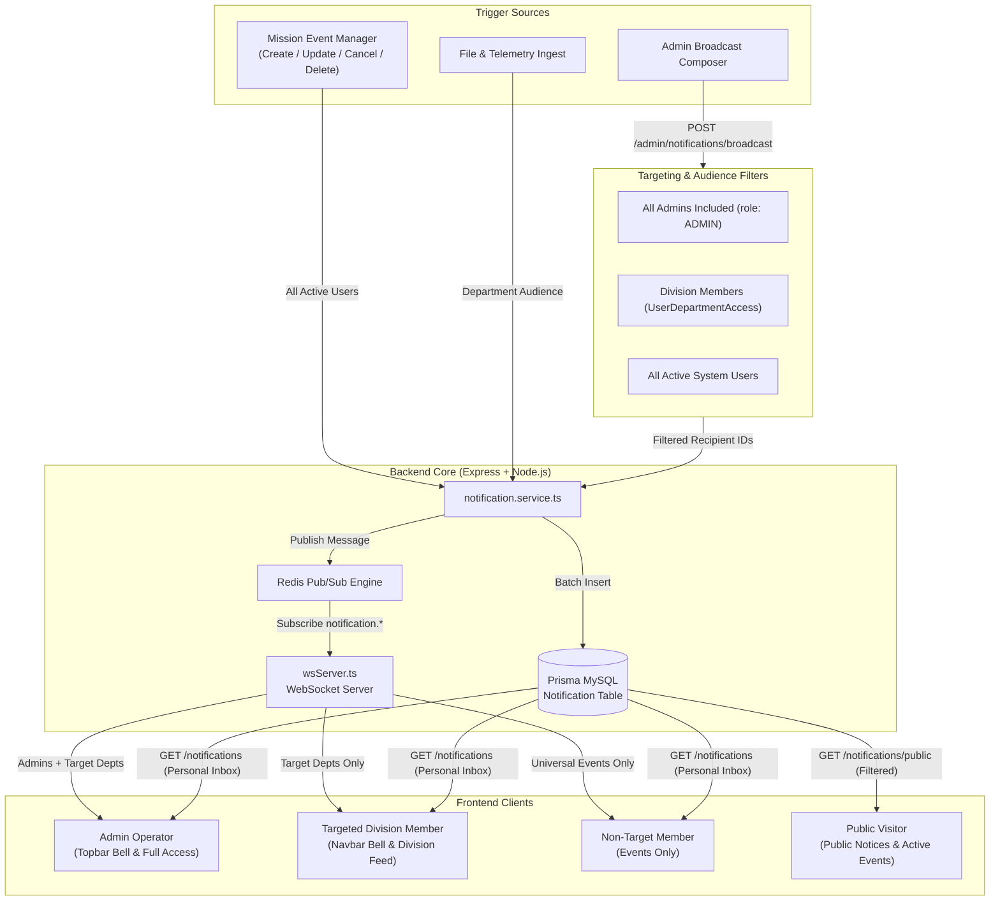

# ISTRAC-SIMS Notification System Architecture & Operational Guide

## 1. Executive Summary & Core Principles

The ISTRAC-SIMS Notification System is designed for real-time telemetry alerts, operational notices, and mission pass schedules. It operates on two distinct delivery streams with strict role-based access control and confidentiality boundaries:

1. **Targeted Operational Broadcasts**:
   - Transmitted **strictly to Administrators and the specified target audience** (e.g., specific divisions or all divisions).
   - Users outside the target audience have zero visibility (no database records created, no WebSocket delivery, excluded from active banners and public feeds).
2. **Universal Mission Events**:
   - Flight events, orbit passes, schedule updates, and mission cancellations are dispatched to **all logged-in personnel** across the ground station network.
   - All timestamps across the pipeline adhere strictly to **Indian Standard Time (IST, UTC+05:30)**.



---

## 2. The Dual-Stream Delivery Architecture

| Feature / Dimension | Stream A: Targeted Broadcasts | Stream B: Mission Events |
| :--- | :--- | :--- |
| **Triggered By** | Administrators via Broadcast Notification Composer | Admins/Controllers via Mission Event Manager |
| **Audience Scope** | **Admins + Target Audience Only** (Specific Divisions, All Divisions, or All Users) | **All Active Logged-in Users** |
| **Database Persistence** | Created **only** for `userId`s matching Admins and target division members | Created for **all active users** (`status: 'ACTIVE'`) |
| **WebSocket Distribution** | Filtered by `role === 'ADMIN'` or `payload.departmentIds.includes(client.deptId)` | Broadcast to **all authenticated connections** (`sendToAll`) |
| **Active Banner Behavior** | Filtered in `GET /events/active-banner` by user's division access | Always visible to all logged-in users and front-page ticker |
| **Public Feed Visibility** | **Hidden** from `GET /notifications/public` if targeted to divisions | Milestone events are visible on public calendar and banner |
| **Default Category** | `BROADCASTS` | `EVENTS` |

---

## 3. Detailed Data Flow & Processing Pipeline

### Step 1: Dispatch & Recipient Resolution
When an Administrator submits a broadcast in `frontend/src/pages/BroadcastNotification.tsx`:
1. Payload contains `{ message, type, category, target, departmentIds }`.
2. `backend/src/routes/notification.routes.ts` evaluates the target:
   - **Specific Divisions (`target: 'departments'`)**: Queries `prisma.userDepartmentAccess` for users in `departmentIds`. Simultaneously queries `prisma.user` for all users with `role: 'ADMIN'`. Merges both sets into a deduplicated `recipientIds` array.
   - **All Divisions (`target: 'all_departments'`)**: Queries all users with non-deleted division access + all Admins.
   - **All ISRO Personnel (`target: 'all'`)**: Queries all active users in the system.

### Step 2: Database Persistence
In `backend/src/services/notification.service.ts`:
- Executes `prisma.notification.createMany({ data })` where each record is explicitly addressed to one `userId`.
- Users outside the target audience **never have rows created in the database**, guaranteeing zero data leakage through standard user inbox queries (`GET /api/notifications`).

### Step 3: Real-Time WebSocket Filtering
In `backend/src/ws/wsServer.ts`:
- The server maintains a memory registry `Map<string, ConnectedClient[]>` indexed by `userId`. Each client record stores `{ userId, role, deptIds, ws }`.
- When a message arrives on the Redis channel `notification.broadcast`:
  - **Events** (`category === 'event'` or `type === 'EVENT' | 'PASS'`): Delivered globally to all active sockets (`sendToAll`).
  - **Department Broadcasts**: Iterates over connected clients; sends the socket frame **only** if `client.role === 'ADMIN'` or `payload.departmentIds.some(d => client.deptIds.includes(d))`.
  - **All-Division Broadcasts**: Delivered to clients with `client.role === 'ADMIN'` or `client.deptIds.length > 0`.

### Step 4: Active Banner Session Evaluation
In `backend/src/routes/event.routes.ts` (`GET /events/active-banner`):
- Uses `optionalAuthMiddleware` to inspect the caller's JWT token:
  - **Admins**: Granted full visibility of all recent system and division broadcasts.
  - **Logged-in Operators**: Filtered against their active division memberships (`prisma.userDepartmentAccess`). Division broadcasts outside their membership are discarded before the response is serialized.
  - **Unauthenticated Visitors**: Targeted division broadcasts are stripped; only untargeted system notices and mission events are returned.

---

## 4. Frontend UI/UX & Normalization Engine

### 4.1 Unified Bell Icon & Modal
Both the Public Navbar (`Navbar.tsx`) and the Authenticated Topbar (`Topbar.tsx`) share a unified notification experience:
- If logged in, the client requests:
  1. `eventsApi.getActiveBanner()` (Live events & allowed broadcasts)
  2. `notificationsApi.getNotifications({ limit: 50 })` (Personal database inbox)
  3. `notificationsApi.getPublicNotifications()` (Fallback baseline)
- Notifications are merged without duplicates based on `id` and `message`.

### 4.2 Category Normalizer Engine
Raw database categories (`PASS`, `MISSION_PASS`, `LAUNCH`, `system`, `broadcast`, `FILE_UPLOAD`) are transformed into standardized operational categories inside `NotificationsModal.tsx`:

```typescript
export function normalizeCategory(cat?: string, type?: string): string {
  const raw = `${cat || ''} ${type || ''}`.toUpperCase().trim()
  if (['EVENT', 'PASS', 'MISSION_PASS', 'LAUNCH', 'MANEUVER', 'ORBIT_MANEUVER', 'MISSION'].some((k) => raw.includes(k))) {
    return 'EVENTS'
  }
  if (['BROADCAST', 'NOTICE', 'ANNOUNCEMENT', 'SYSTEM', 'STATION'].some((k) => raw.includes(k))) {
    return 'BROADCASTS'
  }
  if (['FILE', 'FILE_UPLOAD', 'DOCUMENT', 'REPORT', 'INGEST'].some((k) => raw.includes(k))) {
    return 'FILES'
  }
  if (['CRITICAL', 'ALERT', 'URGENT', 'WARNING'].some((k) => raw.includes(k))) {
    return 'CRITICAL'
  }
  if (['MAINTENANCE', 'TELEMETRY', 'CONFIG'].some((k) => raw.includes(k))) {
    return 'MAINTENANCE'
  }
  if (['SECURITY', 'ACCESS', 'ACCOUNT'].some((k) => raw.includes(k))) {
    return 'SECURITY'
  }
  return (cat || type || 'BROADCASTS').toUpperCase().trim()
}
```

### 4.3 Stacking Order & Visual Hierarchy
To eliminate dropdown and banner clipping:
- **`NotificationsModal`**: Positioned at `fixed inset-0 z-[200]` with `bg-page/85 backdrop-blur-md` overlay, ensuring it renders above all headers and banners.
- **`Topbar`**: Root `<header>` has `relative z-50`.
- **`Bell & User Dropdowns`**: Positioned at `absolute top-full right-0 z-[60]` with `z-40` backdrop click-outs.

---

## 5. Database Schema

The notification entity is defined in Prisma MySQL schema (`backend/prisma/schema.prisma`):

```prisma
model Notification {
  id           BigInt    @id @default(autoincrement())
  userId       String
  user         User      @relation(fields: [userId], references: [id], onDelete: Restrict)
  type         String    // 'BROADCAST', 'EVENT', 'PASS', 'CRITICAL', 'NOTICE', 'FILE_UPLOAD'
  actorId      String?   // User ID of the sender / controller
  resourceType String?   // 'mission_event', 'file', 'user', 'department'
  resourceId   String?   // UUID of the affected entity
  message      String    // Human-readable broadcast or event text
  metadata     Json?     // { target: 'departments' | 'all_departments' | 'all', departmentIds: [...] }
  category     String    // 'event', 'system', 'broadcast', 'file'
  readAt       DateTime? // Acknowledgment timestamp
  dismissedAt  DateTime? // Soft-dismissal timestamp
  createdAt    DateTime  @default(now())
  deletedAt    DateTime? // Audit retention soft-delete

  @@index([userId, readAt, createdAt])
  @@index([userId, type, createdAt])
}
```

---

## 6. API Reference

### 6.1 `POST /api/admin/notifications/broadcast`
* **Access**: Administrator (`authMiddleware`, `adminMiddleware`)
* **Request Body**:
```json
{
  "message": "[CRITICAL] TTC Ground Station Port Blair maintenance window active",
  "type": "CRITICAL",
  "category": "system",
  "target": "departments",
  "departmentIds": ["fdd-uuid-1", "ttc-uuid-2"]
}
```
* **Response**: `201 Created` with confirmation message.

### 6.2 `GET /api/notifications`
* **Access**: Authenticated Operator (`authMiddleware`)
* **Query Parameters**:
  - `unread`: `true` | `false`
  - `page`: integer (default: `1`)
  - `limit`: integer (default: `20`, max: `100`)
* **Response**:
```json
{
  "data": [
    {
      "id": "104",
      "type": "EVENT",
      "category": "event",
      "message": "New Mission Event: Aditya-L1 Pass (IDSN Byalalu 32m)",
      "readAt": null,
      "createdAt": "2026-09-09T16:20:00.000Z"
    }
  ],
  "total": 1,
  "page": 1,
  "limit": 20
}
```

### 6.3 `GET /api/events/active-banner`
* **Access**: Public / Optional Authenticated (`optionalAuthMiddleware`)
* **Response**:
```json
{
  "data": {
    "events": [
      {
        "id": "ev-uuid-1",
        "title": "Aditya-L1 Daily Tracking Pass",
        "eventType": "MISSION_PASS",
        "eventDate": "2026-09-09T18:30:00.000Z",
        "endDate": "2026-09-09T20:15:00.000Z",
        "location": "IDSN Byalalu (32m)",
        "urgency": "NORMAL",
        "status": "UPCOMING"
      }
    ],
    "broadcasts": [
      {
        "id": "102",
        "message": "High-gain antenna calibration in progress",
        "createdAt": "2026-09-09T15:45:00.000Z"
      }
    ]
  }
}
```

### 6.4 `GET /api/notifications/public`
* **Access**: Public (Unauthenticated)
* **Behavior**: Automatically filters out any notification where `metadata.target === 'departments'` or `metadata.target === 'all_departments'`. Only universal station bulletins and public milestones are returned.

---

## 7. Operational Verification Checklist

- [x] Admin sends broadcast to **Division A** -> Admins and Division A members receive it; members of Division B do not see it.
- [x] Admin sends broadcast to **All Divisions** -> Admins and all division members receive it; guest public feed does not display it.
- [x] Admin creates/updates/cancels a **Mission Event** -> All logged-in users receive the event notification in their personal inbox and live WebSocket stream.
- [x] Header Bell modal opens cleanly above banners and navbars at `z-[200]`.
- [x] Filter chips consistently display normalized groups (`ALL`, `EVENTS`, `BROADCASTS`, `FILES`, `MAINTENANCE`, `CRITICAL`).
- [x] All displayed timestamps format in Indian Standard Time (**IST**).
