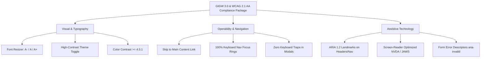
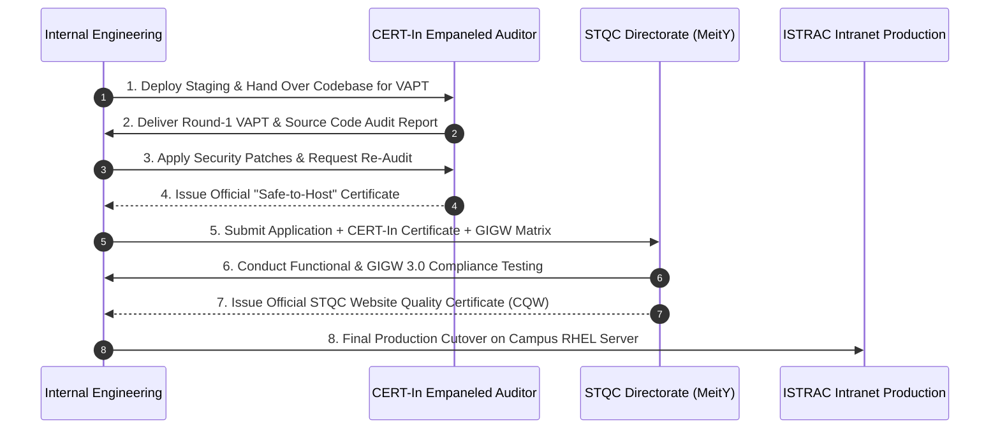

# 🇮🇳 ISRO Telemetry, Tracking and Command Network (ISTRAC)
## Satellite Information Management System (ISTRAC-SIMS)
### Remaining Compliance, Feature Implementation & Certification Roadmap

---

**Document ID:** `ISRO/ISTRAC/SIMS/ROADMAP/2026/08-V1.0`  
**Date:** 28 August 2026  
**Reference Evaluation:** `ISRO/ISTRAC/SIMS/EVAL/2026/08-V1.0`  
**Target Milestone:** 100% GIGW 3.0, WCAG 2.1 Level AA, CERT-In Safe-to-Host & STQC CQW Certification  
**Author:** Akash Vishwakarma & Technical Architecture Team  
**Classification:** `OFFICIAL / RESTRICTED — INTERNAL IMPLEMENTATION GUIDE`

---

## 1. Executive Summary

This document defines the **exact remaining development tasks, technical specifications, and external audit protocols** required to transition the ISTRAC-SIMS codebase from its current 88.5% specification alignment to **100% full production certification readiness**.

```
┌──────────────────────────────────────────────────────────────────────────────────────────────────┐
│ REMAINING WORKSTREAM                           │ TECHNICAL SCOPE              │ EST. EFFORT      │
├────────────────────────────────────────────────┼──────────────────────────────┼──────────────────┤
│ 1. Bilingual Layer (English + Hindi / राजभाषा) │ i18next, Catalogs, Switcher  │ 1.5 Sprints      │
│ 2. GIGW 3.0 & WCAG 2.1 AA Accessibility        │ Font Sizer, High-Contrast    │ 1.5 Sprints      │
│ 3. Security Hardening (CERT-In Readiness)      │ Rate Limits, Anomaly Alerts  │ 1.0 Sprint       │
│ 4. CI/CD & Automated Test Suites (STQC Ready)  │ GitHub Actions, Vitest/Jest  │ 1.0 Sprint       │
│ 5. External Audit & Directorate Certification  │ CERT-In VAPT + STQC CQW Test │ 4–6 Weeks (Govt) │
└────────────────────────────────────────────────┴──────────────────────────────┴──────────────────┘
```

---

## 2. Module 1: Bilingual & Rajbhasha Localization Layer

### 2.1 Mandatory Requirement & Scope
Per **GIGW 3.0 Guideline 2.1 (Bilingual Content Mandate)** and **Official Languages Act 1963 (Rajbhasha)**, the entire portal UI, operational notifications, and CMS content must be accessible in both **English and Hindi** with a one-click persistent switcher.

### 2.2 Technical Implementation Steps
1. **Core i18n Dependencies:**
   - Package: `i18next` and `react-i18next` with `I18nextProvider`.
   - Store active language (`en` or `hi`) in `localStorage` under key `istrac_lang`.
2. **Translation String Catalogs:**
   - Directory: `frontend/src/locales/en/` and `frontend/src/locales/hi/`.
   - Namespaces:
     - `common.json`: Navigation, buttons, breadcrumbs, search placeholder, date/time labels.
     - `auth.json`: Login, registration, password reset, account approval alerts.
     - `missions.json`: Satellite fleet names, passes, operational telemetry codes.
     - `files.json`: Ingestion pipeline, report categories, checksums, download labels.
     - `alerts.json`: Station broadcasts, emergency banners, maintenance notices.
3. **Devanagari Web Fonts (Offline Air-gapped):**
   - Embed `Noto Sans Devanagari` (Regular, Medium, Bold) in `frontend/public/fonts/`.
   - Configure `@font-face` in `index.css` with fallback to `sans-serif` (0% CDN reliance).
4. **Topbar Language Switcher Component:**
   - Add `<LanguageSwitcher />` in `frontend/src/layouts/Topbar.tsx`.
   - Seamless instant language swap without page reload or state loss.

---

## 3. Module 2: 100% WCAG 2.1 Level AA & GIGW 3.0 Accessibility

### 3.1 Mandatory Requirement & Scope
Full compliance with **W3C WCAG 2.1 Level AA** standards and MeitY **GIGW 3.0 Accessibility Quality Criteria**.



### 3.2 Technical Implementation Steps
1. **Top-Bar Font Resizer Widget:**
   - Add font control buttons (`A-`, `A`, `A+`) to `Topbar.tsx`.
   - State managed via `uiStore.ts`: `fontScale: 'sm' | 'base' | 'lg'` applying `fontSize: 14px | 16px | 18px` to root `<html>` element.
2. **High-Contrast Accessibility Mode:**
   - Dedicated toggle button (`🌓 Contrast`) in Topbar.
   - Dark High-Contrast mode (`bg-black text-white border-yellow-400 focus:ring-yellow-400`).
   - Light High-Contrast mode (`bg-white text-black border-black focus:ring-black`).
3. **Skip to Main Content Link:**
   - Hidden anchor tag at top of `AppShell.tsx`:
     ```html
     <a href="#main-content" className="sr-only focus:not-sr-only focus:absolute focus:top-2 focus:left-2 focus:z-50 focus:px-4 focus:py-2 focus:bg-accent focus:text-white rounded-md">
       Skip to main content / मुख्य सामग्री पर जाएं
     </a>
     ```
   - Target container `<main id="main-content" tabIndex={-1}>`.
4. **ARIA & Semantic Landmarks Audit:**
   - Ensure all modal dialogs have `aria-modal="true"`, `role="dialog"`, and `aria-labelledby`.
   - Ensure tables have proper `<caption>`, `<th scope="col">`, and `<th scope="row">`.

---

## 4. Module 3: Security Hardening (CERT-In Audit Readiness)

### 4.1 Mandatory Requirement & Scope
Hardening against **OWASP Top 10 Web & API vulnerabilities** to guarantee first-time clearance during the **CERT-In Empaneled VAPT Audit**.

### 4.2 Technical Implementation Steps
1. **Download Rate Limiting (Chapter 10.4 / Page 33–34):**
   - Implement per-user sliding window limiter in `backend/src/middleware/rateLimiter.middleware.ts`.
   - Threshold: Maximum **100 file downloads per rolling 60-minute window** per authenticated user.
   - Response: `429 Too Many Requests` with `Retry-After: <seconds>` header.
2. **Bulk Download Anomaly Alerting:**
   - Trigger condition: If a user downloads **> 50 files within 10 minutes**, generate an immediate high-priority audit event `DOWNLOAD_RATE_LIMIT_EXCEEDED`.
   - Dispatch real-time in-app broadcast and email notification to the Super Admin.
3. **Audit Log CSV Export Endpoint (Chapter 16.2 / Page 57):**
   - Route: `GET /api/v1/admin/audit-logs/export`.
   - Streams CSV formatted audit log history filtered by date range and department with immutable audit record.
4. **CSRF Header Enforcement (Chapter 7.2.2 / Page 21):**
   - Enforce `X-CSRF-Token` validation on all state-mutating requests (`POST /auth/refresh`, `POST /auth/logout`).
   - Rotate CSRF tokens alongside JWT refresh tokens on every successful cycle.

---

## 5. Module 4: CI/CD Pipeline & Automated Testing (STQC Readiness)

### 5.1 Mandatory Requirement & Scope
Establish automated quality gates per **Chapter 14 (Testing Strategy / Page 47–50)** to verify regression safety before STQC Directorate submission.

### 5.2 Technical Implementation Steps
1. **GitHub Actions / GitLab CI Workflow (`.github/workflows/ci.yml`):**
   - Step 1: Code Linting (`eslint . --ext .ts,.tsx`).
   - Step 2: Full TypeScript Type Check (`tsc --noEmit` on backend and frontend).
   - Step 3: Automated Unit Test Suite (`npm run test` with coverage report).
   - Step 4: Production Build Validation (`npm run build`).
2. **Unit Test Coverage (80% Line Target):**
   - Test framework: `vitest` (frontend) and `jest` (backend).
   - Core test suites:
     - `auth.service.test.ts`: Password hashing, token signing, expiration, lockout.
     - `file.service.test.ts`: Upload compensation rollback, SHA-256 verification, magic byte checks.
     - `search.service.test.ts`: Scoped department queries, operator parsing (`type:pdf`).
     - `permission.service.test.ts`: 5-level role resolution hierarchy tests.

---

## 6. Module 5: External Certification & Government Process



1. **CERT-In Empaneled Security Agency:**
   - Duration: 3–4 Weeks (2 audit iterations).
   - Expected Output: Formal **VAPT Report** and **"Safe to Host" Certificate**.
2. **STQC Directorate (Ministry of Electronics & IT):**
   - Duration: 4–6 Weeks.
   - Expected Output: **Certificate of Quality for Website (CQW)** valid for 3 years.

---

## 7. Sprint-Wise Execution Plan & Action Items

| Sprint | Duration | Deliverables & Milestone |
| :---: | :---: | :--- |
| **Sprint 1** | **Week 1–2** | • Bilingual i18n framework (`react-i18next`) + Hindi Devanagari fonts<br>• GIGW 3.0 Font Resizer (`A-/A/A+`) & High-Contrast Mode toggle<br>• Skip-to-content accessibility navigation link |
| **Sprint 2** | **Week 3–4** | • Translation catalog completion (400+ keys in `en` and `hi`)<br>• Download Rate Limiter (100 DL/hr) & Anomaly Alert trigger<br>• Audit Logs CSV Export endpoint (`GET /admin/audit-logs/export`) |
| **Sprint 3** | **Week 5–6** | • Automated CI/CD Workflow (`.github/workflows/ci.yml`)<br>• Vitest & Jest Unit Test Suites (80% coverage on core services)<br>• Internal Pre-Audit Security & Axe-Core Accessibility scans |
| **Sprint 4** | **Week 7–10**| • CERT-In Empaneled Auditor VAPT testing & fix verification<br>• Submission of documentation package to STQC Directorate<br>• Official Safe-to-Host & STQC CQW Certification |

---

## 8. Summary Checklist for Engineering Kickoff

- [x] Architecture Specification audited (88.5% existing compliance verified).
- [x] Remaining technical items specified with exact file locations.
- [ ] **Task 1:** Install `i18next` / `react-i18next` and add Topbar Language Switcher.
- [ ] **Task 2:** Add Topbar Accessibility Font Resizer (`A-`, `A`, `A+`) and High-Contrast Theme.
- [ ] **Task 3:** Implement 100 DL/hr Download Rate Limiting & Anomaly Trigger in Backend.
- [ ] **Task 4:** Add `.github/workflows/ci.yml` Automated CI Pipeline.
- [ ] **Task 5:** Add Audit Logs CSV Export API.

---

*This document is maintained under version control in the project documentation directory at `documents/REMAINING_COMPLIANCE_AND_IMPLEMENTATION_ROADMAP.md`.*
