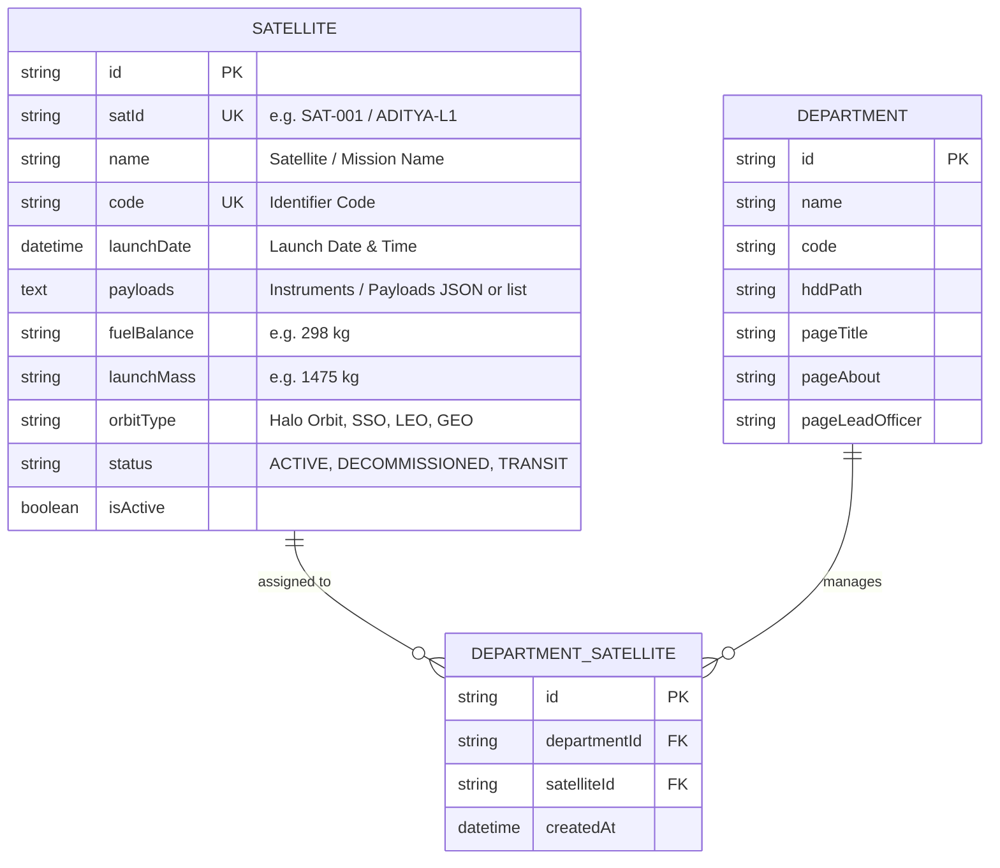
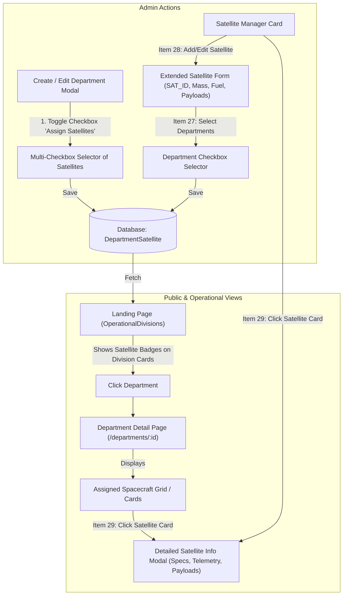

# 🛰️ Specification & Implementation Plan: Satellite Configuration & Department Multi-Selector

**Document Version:** 1.0  
**Target:** ISTRAC-SIMS Full-Stack Architecture (`backend/`, `frontend/`, `prisma/schema.prisma`)  
**Feature Scope:** 
- **Requirement 8: Satellite Configuration** (Items 27, 28, 29)
- **Department ↔ Satellite Multi-Selector** on Creation, Editing, Department Detail Page, and Landing Page Showcase.

---

## 1. Requirement Understanding & Traceability

Based on your prompt, here is the breakdown of what is required and how each requirement maps to the architecture:

| Req # | Requirement Title | Detailed Description | Target Components |
| :---: | :--- | :--- | :--- |
| **27** | **Department Checkbox Selector on Satellite** | When creating or editing a Satellite in the Satellite Registry, admin can select multiple associated operational departments via a checkbox-based selector. | `SatelliteManager.tsx`, `satellite.routes.ts`, `schema.prisma` |
| **28** | **Extended SQL-Backed Satellite Attributes** | Add SQL schema fields for comprehensive telemetry attributes: `satId` (e.g. `SAT-001`), `name`, `launchDate`, `payloads`, `fuelBalance` (e.g. `298 kg`), `launchMass` (e.g. `1,475 kg`), `orbitType`, and `status`. | `schema.prisma`, `satellite.routes.ts`, `SatelliteManager.tsx` |
| **29** | **Detailed Satellite Info View** | Link Satellite Cards to open a dedicated, aerospace-grade **Satellite Details Modal/View** showing all flight attributes, payload breakdown, linked operational departments, and status. | `SatelliteInfoModal.tsx`, `SatelliteManager.tsx`, `DepartmentDetail.tsx` |
| **Extra** | **Department Creation/Editing Satellite Multi-Selector** | When creating or editing a department (in `CreateDeptModal.tsx` or `DepartmentDetail.tsx`), an optional checkbox enables a multi-checkbox selector of all active satellites. | `CreateDeptModal.tsx`, `DepartmentDetail.tsx`, `department.routes.ts` |
| **Extra** | **Department Detail & Landing Page Showcase** | Display the selected satellites on the Department Page (`DepartmentDetail.tsx`) as interactive cards with telemetry badges; clicking any card opens the detailed Satellite Info view. Also reflect associated satellite badges on the Landing Page (`OperationalDivisions.tsx`). | `DepartmentDetail.tsx`, `OperationalDivisions.tsx` |

---

## 2. Database Schema Design (`prisma/schema.prisma`)

Currently, `Department` has a single `satelliteId String` foreign key. To support an operational directorate managing multiple satellites (e.g., MOX commanding both *Aditya-L1* and *Chandrayaan-3*), we introduce an explicit Many-to-Many junction model `DepartmentSatellite` while extending `Satellite` with the required telemetry fields.



### Proposed Prisma Schema Updates:

```prisma
// ============================================================
// SATELLITE (EXTENDED)
// ============================================================
model Satellite {
  id          String    @id @default(uuid())
  satId       String?   @unique // e.g. "SAT-001", "ADITYA-L1"
  name        String
  code        String?   @unique
  description String?   @db.Text

  // SQL Data Entry Fields (Item 28)
  launchDate  DateTime?
  payloads    String?   @db.Text // Comma-separated or JSON list of scientific instruments
  fuelBalance String?   // e.g. "298 kg" or "84%"
  launchMass  String?   // e.g. "1,475 kg"
  orbitType   String?   // e.g. "Halo Orbit (L1)", "Sun-Synchronous (SSO)", "Geostationary (GEO)"
  status      String    @default("ACTIVE") // ACTIVE, DECOMMISSIONED, IN_TRANSIT

  isActive    Boolean   @default(true)

  deletedAt   DateTime?
  createdAt   DateTime  @default(now())
  updatedAt   DateTime  @updatedAt

  // Junction relationship for M:N with Department
  departmentSatellites DepartmentSatellite[]
  departments          Department[] // Legacy fallback
  events               MissionEvent[]

  @@index([name])
  @@index([satId])
  @@index([deletedAt])
}

// ============================================================
// DEPARTMENT ↔ SATELLITE JUNCTION
// ============================================================
model DepartmentSatellite {
  id           String     @id @default(uuid())
  departmentId String
  satelliteId  String

  department   Department @relation(fields: [departmentId], references: [id], onDelete: Cascade)
  satellite    Satellite  @relation(fields: [satelliteId], references: [id], onDelete: Cascade)

  createdAt    DateTime   @default(now())

  @@unique([departmentId, satelliteId])
  @@index([departmentId])
  @@index([satelliteId])
}
```

---

## 3. Backend API Contract Updates

### 1. `Satellite Routes` (`backend/src/routes/satellite.routes.ts`)
- **`GET /satellites` (Public/Member):** Returns active satellites with `satId`, `name`, `code`, `launchDate`, `payloads`, `fuelBalance`, `launchMass`, `orbitType`, and `status`.
- **`GET /admin/satellites`:** Returns all satellites including assigned departments list and counts.
- **`POST /admin/satellites` & `PUT /admin/satellites/:id`:**
  - Accepts:
    ```json
    {
      "satId": "ADITYA-L1",
      "name": "Aditya-L1 Solar Observatory",
      "code": "ADITYA-L1",
      "description": "Space-based solar coronagraph and heliospheric observatory.",
      "launchDate": "2023-09-02T06:20:00.000Z",
      "payloads": "VELC, SUIT, ASPEX, PAPA, SoLEXS, HEL1OS, MAG",
      "fuelBalance": "298 kg",
      "launchMass": "1,475 kg",
      "orbitType": "Sun-Earth L1 Halo Orbit",
      "status": "ACTIVE",
      "departmentIds": ["dept-uuid-1", "dept-uuid-2"]
    }
    ```
  - Automatically manages entries in `DepartmentSatellite`.

### 2. `Department Routes` (`backend/src/routes/department.routes.ts`)
- **`POST /admin/departments` & `PUT /admin/departments/:deptId`:**
  - Accepts optional `satelliteIds: string[]`.
  - When provided, replaces/syncs the records in `DepartmentSatellite`.
- **`GET /departments/:deptId` & `GET /departments/public`:**
  - Includes linked satellites:
    ```json
    "satellites": [
      {
        "id": "...",
        "satId": "ADITYA-L1",
        "name": "Aditya-L1",
        "code": "ADITYA-L1",
        "launchDate": "2023-09-02",
        "payloads": "VELC, SUIT, ASPEX, PAPA",
        "fuelBalance": "298 kg",
        "launchMass": "1,475 kg",
        "orbitType": "Halo L1",
        "status": "ACTIVE"
      }
    ]
    ```

---

## 4. Frontend Component & Flow Architecture

### Flow Diagram



### UI Component Implementations:

1. **`CreateDeptModal.tsx` & `DepartmentDetail.tsx` (Edit Modal):**
   - Add checkbox toggle: `[ ] Link Operational Spacecraft & Satellites`
   - When checked, fetches available satellites from `satellitesApi.getAllAdminSatellites()` and renders a searchable checkbox grid.
   - Admin can select/deselect any number of satellites.

2. **`SatelliteManager.tsx`:**
   - **Extended Form Fields:**
     - `SAT_ID` (text input, e.g. `SAT-001`, `ADITYA-L1`)
     - `Satellite Name` (text input)
     - `Launch Date` (datetime/date input)
     - `Payloads` (comma-separated or chips list)
     - `Fuel Balance` (text input, e.g. `298 kg`)
     - `Launch Mass` (text input, e.g. `1,475 kg`)
     - `Orbit Type` (select or text: LEO, GEO, Halo L1, SSO, etc.)
     - `Status` (Active, In Transit, Decommissioned)
     - **Item 27:** Checkbox selector for assigning departments.
   - **Satellite Card:**
     - Displays `SAT_ID`, `Launch Date`, `Fuel`, `Mass`, and `Departments count`.
     - Clicking the card or clicking a **"View Mission Specs"** button triggers the Satellite Info Modal.

3. **New Reusable Component: `SatelliteInfoModal.tsx` (Item 29):**
   - High-fidelity Aerospace telemetry modal:
     - Header: SAT_ID, Name, Mission Code, Status Badge.
     - Telemetry Specs Strip: Launch Date, Orbit Regime, Launch Mass, Fuel Balance.
     - Scientific Payloads Section: Individual badges with payload acronyms and descriptions.
     - Associated Operational Divisions: Clickable tags navigating directly to each division's showcase page.

4. **`DepartmentDetail.tsx`:**
   - Adds a dedicated section: **"Assigned Spacecraft & Mission Programs"** below the hero section.
   - Shows interactive cards for all satellites linked to this department.
   - Clicking any satellite opens `SatelliteInfoModal`.

5. **`OperationalDivisions.tsx` (Landing Page):**
   - Displays satellite program badges (e.g. `ADITYA-L1`, `CHANDRAYAAN-3`) on each division card.
   - Clicking a badge or card navigates to the division page where full satellite specs are viewable.

---

## 5. Execution Steps

1. **Prisma Schema & Database Migration:**
   - Update `schema.prisma` with extended `Satellite` fields and `DepartmentSatellite` model.
   - Run `npx prisma db push` or generate migration.
2. **Backend Services & Routes:**
   - Update `backend/src/routes/satellite.routes.ts` (CRUD with SQL data entry & department relations).
   - Update `backend/src/routes/department.routes.ts` (handle `satelliteIds` sync in create/update & include satellites in responses).
3. **Frontend API Clients:**
   - Update `satellites.api.ts` and `departments.api.ts` with new types.
4. **Create `SatelliteInfoModal.tsx`:**
   - Build aerospace-styled modal view for satellite inspection.
5. **Update `SatelliteManager.tsx`:**
   - Implement extended fields and department checkbox selector in the creation/edit modal.
   - Connect cards to `SatelliteInfoModal`.
6. **Update `CreateDeptModal.tsx` & `DepartmentDetail.tsx`:**
   - Add the satellite inclusion checkbox and multi-select list.
   - Add the Spacecraft & Satellites showcase section in `DepartmentDetail.tsx`.
7. **Update `OperationalDivisions.tsx`:**
   - Show linked satellite badges on the homepage division cards.
8. **End-to-End Build & Validation:**
   - Run `npm run build` on frontend and backend to verify TypeScript types, then test creation and linking.
