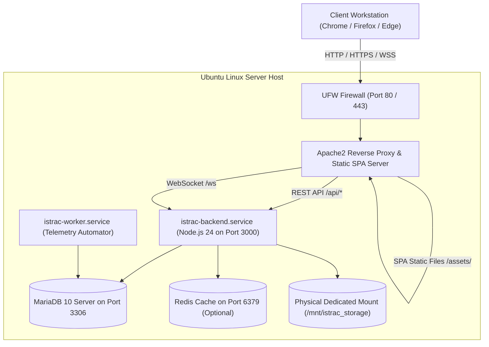

# 🛰️ ISTRAC-SIMS — Ubuntu Linux Production Deployment & Operations Guide

> **System:** ISRO Telemetry, Tracking and Command Network — Satellite Information Management System (ISTRAC-SIMS)  
> **Target OS:** Ubuntu Linux 22.04 LTS / 24.04 LTS Server or Desktop (x86_64)  
> **Deployment Model:** Single-Host Ground Station Appliance or Clustered Node  
> **Version:** 2.0.0 (Production Baseline)  

---

## 📑 Table of Contents

1. [Architecture Overview & Hosted Services](#1-architecture-overview--hosted-services)
2. [Hardware & Software Prerequisites](#2-hardware--software-prerequisites)
3. [Method A: 1-Click Automated Setup (`setup-ubuntu.sh`)](#3-method-a-1-click-automated-setup-setup-ubuntush)
4. [Method B: Step-by-Step Manual Setup](#4-method-b-step-by-step-manual-setup)
   - [4.1 System Update & APT Toolchain](#41-system-update--apt-toolchain)
   - [4.2 Node.js 24 LTS Installation](#42-nodejs-24-lts-installation)
   - [4.3 MariaDB Database Provisioning](#43-mariadb-database-provisioning)
   - [4.4 Redis In-Memory Cache (Optional)](#44-redis-in-memory-cache-optional)
   - [4.5 Storage Volume Mount & Permissions](#45-storage-volume-mount--permissions)
   - [4.6 Backend Application & Database Migrations](#46-backend-application--database-migrations)
   - [4.7 Frontend Production Build](#47-frontend-production-build)
   - [4.8 Native Systemd Services](#48-native-systemd-services)
   - [4.9 Apache2 Web Server & Reverse Proxy](#49-apache2-web-server--reverse-proxy)
   - [4.10 UFW Firewall Network Rules](#410-ufw-firewall-network-rules)
5. [SSL/TLS Certificate Installation (HTTPS)](#5-ssltls-certificate-installation-https)
6. [Daily Operations & Service Management (`manage-services-ubuntu.sh`)](#6-daily-operations--service-management-manage-services-ubuntush)
7. [Backup, Recovery & Maintenance](#7-backup-recovery--maintenance)
8. [Troubleshooting & Diagnostics](#8-troubleshooting--diagnostics)

---

## 1. Architecture Overview & Hosted Services

All services required by ISTRAC-SIMS run locally on the Ubuntu server:



---

## 2. Hardware & Software Prerequisites

| Component | Minimum Specification | Recommended Specification |
|:---|:---|:---|
| **Operating System** | Ubuntu 22.04 LTS | Ubuntu 24.04 LTS Server (`x86_64`) |
| **CPU** | 4 Cores | 8+ Enterprise Cores (Xeon / EPYC) |
| **RAM** | 8 GB | 16 GB - 32 GB ECC |
| **Root Disk (OS/Apps)**| 60 GB SSD | 120 GB NVMe |
| **Storage Volume Mount**| 100 GB | 2 TB - 10 TB Enterprise RAID-10 |

---

## 3. Method A: 1-Click Automated Setup (`setup-ubuntu.sh`)

```bash
# 1. Navigate to deployment directory
cd /opt/istrac-fms

# 2. Make script executable
chmod +x deploy/setup-ubuntu.sh

# 3. Execute setup
sudo ./deploy/setup-ubuntu.sh
```

---

## 4. Method B: Step-by-Step Manual Setup

### 4.1 System Update & APT Toolchain
```bash
sudo apt update && sudo apt upgrade -y
sudo apt install -y apache2 mariadb-server mariadb-client curl wget tar gzip ufw
```

### 4.2 Node.js 24 LTS Installation
```bash
# Extract official Node.js 24 tarball
sudo tar -xf node-v24.21.0-linux-x64.tar.xz -C /opt/
sudo mv /opt/node-v24.21.0-linux-x64 /opt/node
sudo ln -sf /opt/node/bin/node /usr/bin/node
sudo ln -sf /opt/node/bin/npm /usr/bin/npm
```

### 4.3 MariaDB Database Provisioning
```bash
sudo systemctl enable --now mariadb

sudo mysql -e "
CREATE DATABASE IF NOT EXISTS istrac_fms CHARACTER SET utf8mb4 COLLATE utf8mb4_unicode_ci;
CREATE USER IF NOT EXISTS 'istrac_user'@'127.0.0.1' IDENTIFIED BY 'IstracSecurePass123!';
GRANT ALL PRIVILEGES ON istrac_fms.* TO 'istrac_user'@'127.0.0.1';
FLUSH PRIVILEGES;
"
```

### 4.4 Redis In-Memory Cache (Optional)
```bash
sudo apt install -y redis-server
sudo systemctl enable --now redis-server
```
*(Note: If Redis is not installed, the application automatically uses in-memory caching).*

### 4.5 Storage Volume Mount & Permissions
```bash
sudo mkdir -p /mnt/istrac_storage
sudo useradd -r -s /bin/false -d /opt/istrac-fms istrac || true
sudo chown -R istrac:istrac /mnt/istrac_storage
sudo chmod -R 770 /mnt/istrac_storage
```

### 4.6 Backend Application & Database Migrations
```bash
cd /opt/istrac-fms/backend
node ./node_modules/prisma/build/index.js migrate deploy
node dist/prisma/seed.js
```

### 4.7 Frontend Production Build
Compiled frontend assets are copied to DocumentRoot:
```bash
sudo mkdir -p /opt/istrac-fms/frontend/dist
sudo cp -rf dist/* /opt/istrac-fms/frontend/dist/
sudo chmod -R 755 /opt/istrac-fms/frontend/dist
```

### 4.8 Native Systemd Services
Create `/etc/systemd/system/istrac-backend.service`:
```ini
[Unit]
Description=ISTRAC FMS Backend API Server
After=network.target mariadb.service
Wants=mariadb.service

[Service]
Type=simple
User=istrac
Group=istrac
WorkingDirectory=/opt/istrac-fms/backend
ExecStart=/usr/bin/node dist/src/index.js
Restart=always
RestartSec=5
LimitNOFILE=65535
EnvironmentFile=/opt/istrac-fms/backend/.env

[Install]
WantedBy=multi-user.target
```

Create `/etc/systemd/system/istrac-worker.service`:
```ini
[Unit]
Description=ISTRAC FMS Background Telemetry Worker
After=network.target mariadb.service istrac-backend.service
Wants=mariadb.service

[Service]
Type=simple
User=istrac
Group=istrac
WorkingDirectory=/opt/istrac-fms/backend
ExecStart=/usr/bin/node dist/src/worker.js
Restart=always
RestartSec=10
LimitNOFILE=65535
EnvironmentFile=/opt/istrac-fms/backend/.env

[Install]
WantedBy=multi-user.target
```

Enable and start services:
```bash
sudo systemctl daemon-reload
sudo systemctl enable --now istrac-backend istrac-worker
```

### 4.9 Apache2 Web Server & Reverse Proxy
```bash
sudo a2enmod proxy proxy_http proxy_wstunnel rewrite headers
```

Create `/etc/apache2/sites-available/istrac-fms.conf`:
```apache
<VirtualHost *:80>
    ServerName localhost
    DocumentRoot /opt/istrac-fms/frontend/dist

    ProxyPreserveHost On
    ProxyRequests Off
    ProxyTimeout 120

    RewriteEngine On
    RewriteCond %{HTTP:Upgrade} =websocket [NC]
    RewriteCond %{HTTP:Connection} upgrade [NC]
    RewriteRule ^/ws/(.*) ws://127.0.0.1:3000/ws/$1 [P,L]
    RewriteRule ^/ws/?$   ws://127.0.0.1:3000/ws [P,L]

    ProxyPass        /api http://127.0.0.1:3000/api retry=0 timeout=120
    ProxyPassReverse /api http://127.0.0.1:3000/api

    ProxyPass        /media http://127.0.0.1:3000/media retry=0 timeout=60
    ProxyPassReverse /media http://127.0.0.1:3000/media

    <Directory "/opt/istrac-fms/frontend/dist">
        Options Indexes FollowSymLinks
        AllowOverride All
        Require all granted
        RewriteEngine On
        RewriteBase /
        RewriteRule ^index\.html$ - [L]
        RewriteCond %{REQUEST_FILENAME} !-f
        RewriteCond %{REQUEST_FILENAME} !-d
        RewriteRule . /index.html [L]
    </Directory>
</VirtualHost>
```

Enable configuration:
```bash
sudo a2dissite 000-default.conf
sudo a2ensite istrac-fms.conf
sudo systemctl restart apache2
```

### 4.10 UFW Firewall Network Rules
```bash
sudo ufw allow 22/tcp
sudo ufw allow 80/tcp
sudo ufw allow 443/tcp
sudo ufw enable
```

---

## 5. SSL/TLS Certificate Installation (HTTPS)

```bash
sudo apt install -y certbot python3-certbot-apache
sudo certbot --apache -d sims.istrac.gov.in
```

---

## 6. Daily Operations & Service Management (`manage-services-ubuntu.sh`)

```bash
# Check status
sudo /opt/istrac-fms/manage-services-ubuntu.sh status

# View live backend logs
sudo /opt/istrac-fms/manage-services-ubuntu.sh logs

# Restart all components
sudo /opt/istrac-fms/manage-services-ubuntu.sh restart

# Take database snapshot backup
sudo /opt/istrac-fms/manage-services-ubuntu.sh backup
```

---

## 7. Backup, Recovery & Maintenance

Automated daily backup cron job in `/etc/cron.daily/istrac-backup`:
```bash
#!/bin/bash
mkdir -p /var/backups/istrac-sims
mysqldump -u istrac_user -p"IstracSecurePass123!" istrac_fms > /var/backups/istrac-sims/istrac_backup_$(date +%Y%m%d).sql
```
Make executable: `sudo chmod +x /etc/cron.daily/istrac-backup`

---

## 8. Troubleshooting & Diagnostics

- **Apache proxy test:** `curl http://localhost/api/health`
- **Check backend journal:** `sudo journalctl -u istrac-backend -n 50 --no-pager`
- **Check Apache logs:** `tail -f /var/log/apache2/error.log`
